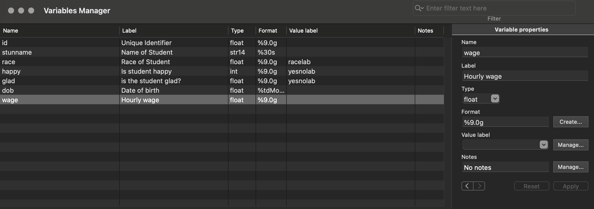
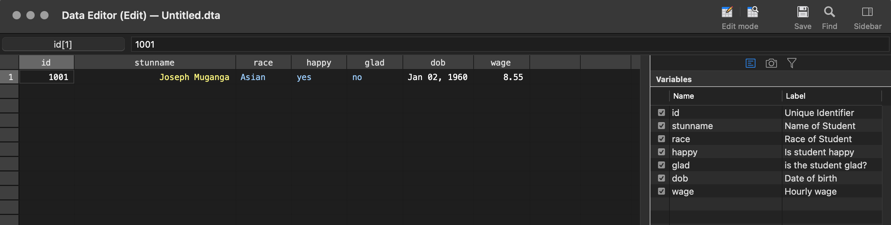

## Overview
There is a gap between raw data and statistical analysis. That gap, called data management.

> It has been said that data collection is like garbage collection: before you collect it you should have in mind what you are going to do with it.
-Russel Fox, Gorbuny, and Robert Hooke

To allow you to replicate the examples in this book, the datasets are available for download. You can download all the dataset used in this book into your current working directory from within Stata by typing the following commands

```
net from https://www.stata-press.com/data/dmu2
net get dmus1
net get dmus2
```
## Keywords and Notes
### Listing observation in this book
I frequently use the `list` command to illustrate the effect of commands. Sometimes, I add options to the `list` command to maximize the clarity of the output.

For files with many observations, it can be useful to list a subset of observations. I frequently use the `in` specification to show selected observation from a dataset. 

For example
```
list idcode age hour wage in 1/5
```
Sometimes variables names are so long that they get abbreviated by the `list` command. This can make the listings more compact but also make the abbreviated heading harder to understand.

For example, the listing below shows the variables `idcode, married, marriedyrs and nevermarried` for the first five observation. Note how `marriedyrs` and `nevermarried` are abbreviated. 

```
list idcode married marriedyrs nevermarried in 1/5
```

The `abbreviated()` options can be used to indicated the minimum number of character the `list` command will use when abbreviating variables.

For example, specifying `abbreviate(20)` means that none of the variables will be abbreviated to a length any shorter than 20 characters. This function can be abbreviated as `abb()`. For example `abb(20)`

```
list idcode married marriedyrs nevermarried in 1/5, abb(20)
```
When the variable listing is too wide for the page, the listing will wrap on the page. As shown below, this listing is hard to follow, and so I avoid it in this book.

Sometimes, I add the `noobs` option to avoid such wrapping. The `noobs` option suppresses the display of the observation numbers, which occasionally saves just enough room to keep the listing from wrapping on the page.

```
list idcode ccity hours uniondues married marriedyrs nevermarried in 1/3, abb(20) noobs
```


```
* Which contains 10 observation about the TV-watching habits of four kids 
use tv1
```
```
list
```

Note how a separator line is displayed after every five observations. This helps make the output easier to read. Sometime, thought, I am pinched for space and suppress that separator to keep the listing on one page. The `separator(10)` option (which it can be abbreviate to `sep(0)`) omits the display of these separators.

```
list,sep(0)
```
In other cases, the separator can be especially helpful in clarifying the grouping of observations. In the dataset, there are multiple observation per kid, and we can add the `sepby(kidid)` option to request that a separator be included between each level of `kidid`. This helps us clearly see the grouping of observatios by `kid`

```
list,sepby(kidid)
```

>>Resource
For more help type
```
help internet
help videos
```

>> More online resources
* [Stata resources and support](https://www.stata.com/support/)
* [Resources for learning Stata](https://www.stata.com/links/resources-for-%20learning-stata/)
* [Stata Videos](https://www.youtube.com/user/statacorp)
* [Stata FAQs](https://www.stata.com/support/faqs/)
* [Statalist](https://www.statalist.org/.)
* [Stata Journal](https://www.stata-journal.com/)
* [Stata Blog](https://blog.stata.com/)

### Chapter 2 | Reading and importing data files

>> Stata rhymes with data 
An old Stata FAQ

#### Introduction
Before you can analyze the data in Stata, you must first read the data into Stata.This section describes how you can read several common types of data files into Stata.

##### Changing directories
To read a data file, you first nee to know the directory or folder in which it is located and how to get there.

Say that you are using Windows and you have a folder names `mydata` that is located in your `Documents` folder. Using `cd` command shown below changes the current working directory to the `mydata` folder withing your `Documents` folder

```
cd /Documents/mydata
```

Say that you are using Unix (for example Linux or macOs) and your data files are stored in a directory named `~/statadata`. You could go to that directory by typing

```
cd /statadata
```

Consider the partially complete `cd` command shown below
```
cd "/
```
After typing the forward slash, we can pres the Tab key to activate tab completion, showing a list of possible folders that can be chosen via keystrokes or mouse clicks

#### What kind of file are you reading?
There are several data files that you can read and import into Stata. Additionally, Stata can import data saved in other file formats, including, Excell files(`.xls` and `.xlsx`), SAS files, IBM SPSS files, and dBase files (`.dbf`).

> `Reading versus importing`. In both instances, you are retrieving an external file and placing it into memory

#### 2.2 Reading Stata datasets
This section illustrate how to read Stata datasets.

```
/* Tis dataset contain information from a survey of five dentists, including
whether they recommed Quaddent gum to their patients who chew gum.
*/
use dentists
list
```

If you get the error message `"no; dataset in memory has changed since las saved` then you need to first use `clear` command to clear out any data you currently have in memory.

In addition to reading datasets from your computer, you can also read Stata datasets stored on remote web servers. For example below.

```
* reading stata data from remote location
use "https://www.stata-press.com/data/dmus2/dentists.dta"
list

```
Imagine you want to read only a subset of observation from `dentists.dta`

```
* reading ony the subset of observation 
use dentists if years >=10
list
```
We can even combine these to read just the variable `name` and `years` for those dentists who have worked at least 10 years, as shown below.

```
* combine use and reading two variables
use name years using dentists if years >= 10
list
```
The above command can help on memory usage.

The `sysuse` command allows you to find and use datasets that ship with Stata. The `sysuse dir` command lists all the examples datasets that ship with Stata.

Below the `sysuse` command read the examples dataset that you specify `auto.dta` is one of the commmonly used example datasets that ships with Stata. You can use this dataset by typing

```
* Reading dataset that comes with Stata
sysuse auto

* See all the datasets that comes with stata-press
sysuse dir
```
Theare are many other examples datasets used in Stata manuals but not shipped with Stata. You can list these example datasets by typing `help dta contents` or selecting `File` and then `Example datasets ...` from the main menu.

```
* Other datasets used in Stata manuals but not shipped with Stata
help dta contents
```

The `webuse` command reads the dataset you specify over the Internet.

```
* Reading the dataset specify over the Internet
webuse fullauto
```

#### 2.3 Importing Excel SpreadSheets
We can import Excel file using the `import excel` command as shown below. Note that I included the `firstrow` option, which indicates that the Excel spreadsheet contains the names of the variables in the firstrow

```
import excel dentists.xls, firstrow
```

Consider a different Excel file with more than one sheets, if the workbook contain more than one worksheet the first worksheet will be selected if you use the above command.

We can import the contents of other sheets by specifying the worksheet we want, using the option `sheet('dentists')`

You can also import data from excel file by specifying the range of cells you want by using the command `cellrange(A1:D6)

```
clear
* Importing data from excell file by specifying the cell range
import excel dentists3, firstrow cellrange(A1:D6)

```
#### 2.4  Importing SAS files
#### 2.5 Importing SPSS files
#### 2.6 Importing dBase files
#### 2.7 Importing raw data files
Raw data come in many formats, including comma-separated, tab-separated, space-separated and fixed-format files.

Comma-separated files, sometimes referred to as `CSV` (Comma-separated-values) files, are commonly used for storing raw data.Such files often originated from spreadsheet programs and may be given a filename extension of `.csv`.Below, we see an example of a comma-separated file named `dentists1.txt`

The `type` command is used to show this file
```
* comma-separated file
type dentists1.txt
```
A related file is a tab-separated file. Instead of separating the variables (columns) with commas, a tab is used. The `dentists2.txt` file (shown below) is an examples of such a file

```
* tab-separated file
type dentists2.txt
```
Raw data can also be stored as a space-separated file. Such file use one(or possibly more) spaces to separate the variables (columns)

```
* space separated file
type dentists5.txt
```

Raw data files can also be stored as a fixed-column file.In these files, the variables are identified by their column position withing the raw data file

```
* fixed-column file
type dentists7.txt

```

##### Importing comma-separated and tab-separated files
Raw data can be stored in several ways. If the variables are separated by commas, the file is called `comma-separated file`; if the variables are separated by tabs, the file is called `tab-separated file`.

Such file can be read using the `import delimited` command.If the data file contains the names of the variables in the first row of teh data, Stata will detect and use them for naming the variables.

```
* comma-separated file
type dentists1.txt
import delimited using dentists1.txt
list
```

Another common format is a tab-separated file, where each variable is separated by a tab. the file `dentists2.txt is a tab-separated version of the dentists file

You might have a comma-separated or tab-separated file that does not have the variable names contained in the data file.The data file `dentists3.txt` is an example of a comma-separated file that does not have the variable names in the first row of data.

```
type dentists3.txt
```

You might have a comma-separated or tab-separated file that does not have the variable names contained in the data file. The data file `dentists3.txt` is an example of a comma-separated file that does not have the variable names in the first row of data

```
* file without have variable names at the top row of the data files
type dentists3.txt
```

You have two choices when importing such a file: you can either let Stata assign temporary variable names for you or provide the names when you read the file.

The following example show how you can read the file and let Stata name the variables for you, v1,v2,v3...

```
import delimited using dentists3.txt
```
You can then use the rename command or the Variable Manager to rename the variables. 

>Tip! What about files with other separators
Stata can read files with other separators as well. The file `dentists4.txt use a colon(:) as a separator(delimiter) between the variable.

You can add the `delimiters(":")` option to the import `import delimited` command to read file. For example

```
import delimited using dentists4.txt, delimiters(":)
```

##### 2.7.2 Importing space-separated files
Another common format for storing raw data is a space-separated file. In such a file, variables are separated by one (or more) spaces, and if a string variable contain spaces, it is enclosed in quotes. The file `dentists5.txt` is an example of such a file with information about five dentists

```
type dentists5.txt
```
You can use the `infile` command to read this file. Because the file did not include variable names, you need to specify the variable names with `infile` command.In addition, because the variable `name` is a string variable, you need to tell Stata that this file is a string variable by prefacing `name` with `str17`, which informs Stata that this is a sting variable that may be as wide as 17 characters. 

```
* infile command to read files
infile str17 name years full rec using dentists5.txt
list
```
The `infile` command does not read files with the variable names in the first row. To read the file we use `import delimited` command, adding option `delimiter("")`

```
import delimited using dentists5.txt, delimiters(" ")
```
Sometimes, you might need to read a space-separated file that has dozens or even hundreds of variables, but you are interested only in some of those variables. Reading some of the variable and skip other variables to save time when reading datasets using `infile`

```
* skip variable when reading space separated files
infile a _skip(22) x _skip(2) using abc.txt
```
Using `if` and `infile` to read some of the observations you want

```
infile a _skip(22) x _skip(2) using abc.txt if (a<=5>)
```
> TIp | Reading consecutive variables
```
infile id age bp1 bp2 bp3 bp4 bp5 pu1 pu2 pu3 pu4 pu5 using cardio1.txt
* the following command is the shortcut of the above
infile id age bp1-bp5 pu1-pu5 using cario1.txt

```

##### 2.7.3 Importing fixed -column files
Fixed-column files can be confusing because the variables are pushed togethr without spaces, commas, or tabs separated them.

In this file, the `name of the dentist` occupies `columns 1-17`, the `years` in practice occupies `column 18-22`, whether the dentist is `full time` is in `column 23`, whether the dentist `recommends Quaddent` is in `column 24`. Knowing the column locations, you can read this file using the `infix` command like this:

```
infix str name 1-17 years 18-22 fulltime 23 recom 24 using dentists7.txt
list
```
You do not have to read all the variables in a `fixed-column data` file. You can read just some few variable as shown on the command below

```
infix str name 1-17 fulltime 23 using dentists7.txt
list
```

Likewise, you  do not have to read all the observation in the data file. You can specify an `in` qualifier or an `if` qualifier to read just a subset of the observation

```
infix years 18-22 fulltime 23 using dentists7.txt in 1/3
infix years 18-22 fulltime 23 using dentists7.txt if fulltime == 1
```

To be  continued ...

#### 2.8 Common errors when reading and importing files
This section describes and explains two common error messages you may see when reading or importing data into Stata. These error messages are `no; datasets in memory has changes since last saved` and `you must start with an empty dataset`.

To understand these error message better, let's first briefly explore the mode that Stata uses for reading, modifying and saving datasets.

Stata datasets can be read into memory and modified, and if you like the changes, they can be saved. The dataset in memory is called the `working dataset`. The changes to the working dataset are temporary until saved. If you were careless, you could lose the changes you made. Fortunately, stata helps you avoid this.

> The `no; dataset in memory has changed since last saved` error message

When you seek to use or import a dataset into Stata that will `replace` the working dataset in memory and you have unsaved changes made to the working dataset, reading a new file would cause you to lose your unsaved changes. Stata wants to help you avoid losing unsaved changes by displaying the error message.

If you try to `use` Stata dataset while you have unsaved changes to the working dataset, you will receive the following error message:

```
use dentists
no; dataset in memory has changed since last saved
```

This error message is saying that you would lose the changes to the dataset in memory if the new dataset were to be read into memory, so stata refused to read the new dataset.

If you care about the dataset in memory, use the `save` command to save your dataset. If you do not care about the working dataset, you can throw it away using the `clear` command.

> Tip The clear command versus the clear option
Rather than using the `clear` command, most (if not all) commands permit you to specify the `clear` option. For example, you can type

```
use dentist, clear
```
instead of typing 

```
clear
use dentists
```
Likewise, you can add the `clear` to other commands like `infile`, `infix` and import. The choice of which to use is up to you.

> The `you must start with an empty dataset` error message

When importing a raw dataset (using, for example, the `infile`, `infix`, or `import delimited` command), there cannot be a working dataset in memory in the currently selected data frame.

if you have data in the current frame(saved or not), issuing one of these commands will give you the following error message.

```
import delimited using dentists1.txt
you must start with an empty dataset
```

This error message is saying that you first need to clear the data currently in memory in the current data frame before you may issue the command.Being sure that you have saved the dataset in memory if you care about it, you would the issue the `clear` command. That clear any data currently in memory.

> Tip! missing data in raw data file

Raw data files frequently use numeric codes for missing data. For example, `-7` might be the code for `don't know`, `-8`, the code for `refused` and `-9`, the code for `not applicable`

#### 2.9 Entering data directly into the Stata Data Editor
When considering how to enter your data, I would encourage you to think about who how much work you invest in cleaning and preparing the data for analysis.

Ideally, a data entry tool is used that allows only valid values to be entered for each row and column for data. For example, [REDCap](https://www.project-redcap.org/) offers many features for verifying the integrity of the data as they are entered. Or there are mobile apps (like REDCap) that allow data collection and entry in a mobile app on an iPhone, iPad, or Android phone or tablet.

Another option is to use Forms in `Access`, which validate data as they are entered. Any of these solutions, which check data integrity as they are entered and collected, can save your great amounts of effort cleaning data because problems like out of range values were prevented at the data entry and collection phase.

Another strategy I see used is entering data into spreadsheet program, like Excel. With programming, Excel can be customized to catch many data entry errors.It can be surprising how much time it can take to clean a dataset where no data integrity checks have been imposed.

What if you feel like yor only viable data entry option is a spreadsheet like Excel, and you do not know how to program it to check for basic data integrity? I suggest that you consider entering data directly into Stata using Data Editor.

It is surprising how much time can be saved by having these basic data checks in place.

In this section we are illustrating how you can enter Data using Data Editor in Stata. Before you are read to enter data into the Data Editor, you first need to create a `codebook` for your data.

The process of entering data into the Data Editor is a four step process. This involves `(step 1)` entering data for the first student, `(step 2)` labelling the variables and values, `(step 4)` entering the data for the rest of the observations. 

Before we can start, we need to `clear` the working dataset with the `clear` command.

> Step 1: `Enter the data for the first observation`

Open the Stata Data Editor with `edit` command, then start entering data, the first row without its variable, just the data.

```
* open Data Editor
clear
edit
```

> Step 2 : `Label the variables`

The second step is to label the variables based on the information shown on the codebook. You can open the Variables Manager window from the main menu by clicking `Data` then `Variable Manager` (or by clicking on the `Variables Manager` icon from the toolbar)

The first variable `var1`, should already be selected (if not, click on it). We will use the Variable properties pane (at the right) to supply the information contained in the codebook. Focusing on the first variable, change `Name` to be `id` and `Label` to be `Unique Identifier`. Click on the Apply button, and the left pane reflects these changes, continue with the rest of the variable

Note: `type : str10`, specify that this variable is a string variable that can hold as many as 10 characters. `Format: %30s` a variable will be displayed as a string with width up to `30`.

> Label values

Before doing anything(even before specify the name or label for this variable race), let's enter the information for the coding scheme `racelab`. We can do this by clicking on `Manage` button next to `value label`. Then in the Manage value labels dialog box, click on `Create label`. For the `Label name`, enter `racelab` and then enter a value of `1` and `Label` of `White`; then, click on Add. Enter the values and labels for three remaining race groups, click on `Add` after each group.


> Format of dob

Now we have arrived at date of birth `(dob)`. (Remember that we entered a temporary value of 1 for this variable and will fix it in step 3). For `Name`, enter `dob` and for `label`, enter `Date of birth`. To the right of `Format`, click on the `Create` button. Under `Type of data`, choose `Daily` (because this a date variable). The `samples` box at the right shows examples of how this date variable can be displayed. You can choose whichever format you prefer; I will choose `April 7, 2021`. Then, click on `OK` to chose the Create format dialog box.

```
format %tdMon_DD,_CCYY var6
```
After I entered all the information for all the variable, my Variable Manager and Data Editor will looks as a below

> Variable Manager



> Data Editor



> Note! `Yellow and blue values`

In the Data Editor, the values of student name are shown in `yellow`, that is to emphasize that `stunname` is a string variable.

Note how the variales `race, happy, and glad` display labelled values in blue. The color `blue` signifies that the variables is `numeric`.

`If you prefer to see the actual values`, then you can go to the main menu and choose `View` and then `Data Editor` and then `Value label` then `Hide all value labels`.


> Step 3: `Fix date variables`
In the Data Editor, click on the column for `dob`. At the right, you can select the format in which you would like to type dates into the Data Editor.
The `Format` is like what you set it in `Step 2`.

After investing all this effort, now is a great time to save these data. Data Editor, go to the main menu and click on `File` and then `save as...`and save the file as `studentsurvey`


```
list 
describe
```
`describe` command shows the names, variable labels, and value labels specified in step 2.

Now that we have successfully entered the first observation for this dataset and labelled this dataset, we are ready for the fourth step, entering the rest of the observations.

> Step 4 : `Enter the data for rest of the observations`
You can return to the Data Editor and continue entering data for the rest of the students in the survey.

Once you are done entering the data for all the students, you can `save` the file and close the Data Editor and the Variable Manager. You can then later retrieve the file by going to the main menu, selecting `File` and then `Open`, navigating to the folder in which you saved the file, and then choosing the file you saved.

You can, of course, also read the data with `use` command. You can resume entering data using the `edit` command. Just like a spreadsheet, the data typed into Editor  are not saved until you save them.

> For more help entering data using the Stata `Data Editor` see

```
help edit
```

> Tips

1. It is better that the name of the variable and the name of the value label to be different.

2. Stata will automatically will increase the size of a string variable to accommodate larger values as the are entered.

3. Note that you can tab from field to field and press Enter after each value tag pair gets entered.

### Chapter 3 | Saving and exporting data files
#### 3. Introduction
Within Stata, you can save data in many formats. The most common command for saving data is the `save` command, which saves the datasets currently in memory as a Stata dataset.

The resulting dataset is saved using `.dta` format for the current version of Stata.

You can use the `export excel` command to export the dataset currently in memory as an Excel file. The `export excel` command can save `.xls` files or `.xlsx` files. 

> Note! Saving versus exporting

Both instances, you are taking the dataset currently in memory and storing it into an external file. In general, I will talk about saving a Stata dataset and exporting data into other file format (such as Excel, SAS, dBase, or raw data files)

````
* exporting SAS XPORT Version 8 file 
export sasxport8
* exporting SAS XPORT Version 5 file
export sasxport5
* exporting dBase file
export dbase
````
#### Saving Stata datasets

```
* importing file
import delimited using dentists1.txt,clear

* saving the files
save mydentists
```
If the file already exists, then you can add the `replace` option to indicate that it is okay to overwrite the existing file, as shown below

```
* saving the files, if the file exists
save mydentists, replace
```
Saving file for to be open by other older versions of Stata, `saveold` command, also adding an option `version(12)` which specify the verison.
```
saveold dentisold, version(12)
```

You can use `keep` or `drop` command to select the variables you want to retain and use the the `keep if` or `drop if` command to select the observations to retain. 

Say that we want to save a dataset with just the dentists who recommend Quaddent (if `recom` is `1`) and just the variable `name` and `years`. We can do this as illustrated below

```
use dentists
list
keep if recom == 1
keep name years
save dentist_subset
```

Using the `keep if` command selected the observations we wanted to keep. (We also could ahve used `drop if` to select the observations to drop). The `keep` command selected the variables we wanted to keep. (We also could have used the `drop` command to select the observation to drop)

> Tip! Compress before save

Before you save a Stata dataset, you might want to first use the `compress` command. The `compress` command stores each variable in the current dataset using the most parsimonious data type possible, which assuring that you never lose precision.

#### 3.3 Exporting Excel files

```
* reading Stata file
use dentlab,clear
*exporting file
export excel dentlab.xls
```

The `export excel` command indicates that the file `dentlab.xlsx` has been saved. By default, `export excel` does not export the variables names in the first row.

You must add the `firstrow(variables)` options to the `export excel` command. If the file already existed, you must add an option `replace`

```
use dentlab,clear
list
export excel dentlab.xlsx, firstrow(variables) replace
```

Looking at the Excel file, I realize that Stata exported the labeled values for `fulltime` and `recom`. This is the default behavior for the `export excel` command. I would prefer to display the unlabelled value for `fulltime` and `recom`. By adding the `nolabel` option, as shown below, the `export excel` command will export the unlabelled values of variables that have value labels.

```
export excel dentlab.xlsx, firstrow(variables) nolabel replace
```
So now I have decided that I actually would like to export both the unlabeled version and the labelled version of the data.I would like to add a new sheet to that file that contains the labeled version of the data, and I want that sheet to be named 'labeled'. 

I add the `sheet("Labeled")` option to the `export excel` command. Note that I removed the `replace` option. If I include the `replace` option, the entire Excel file will be replaced, losing the contents of `sheet1`.

```
* Note the omission of the replace option
export excel dentlab.xlsx, firstrow(variables) sheet("Labeled")
```

After looking at the sheet named `Labeled`, I decide that I want do not want that version to include the variable in the first row. I omit the `firstrow(variables)` and repeat the command below. However, I receive an error message

```
export excel dentlab.xlsx, sheet("labeled")
//worksheet Labeled alread exists, must specify sheet(...,modify) or sheet(...,replace)
```
This error messge is informative. It says that the sheet names `labeled` already exists. I need to add either the `modify` or the `replace` suboption within the `sheet()` option. Because I want to replace that sheet, I will add `replace`.

```
export excel dentlab.xlsx, sheet("labeled",replace)

//Expected output: file dentlab.xlsx saved

```
> Note! Worksheet limits of .xls versus .xlsx files
When exporting dta to Excel, remember the worksheet size limits of `.xls` versus `.xlsx` files. For an `.xls` file, the worksheet size limit is 65,536 rows by 256 columns.

By contrast, for an `.xlsx` file, the worksheet size limit is 1,048,576 rows by 16,384 columns. Furthermore, strings are limited to 255 characters in an `.xls` file versus 32,767 in an `.xlsx` file.

#### 3.4 Exporting SAS XPORT Version 8 files
#### 3.5 Exporting SAS XPORT Version 5 files
#### 3.6 Exporting dBase files
#### 3.7 Exporting comma-separated and tab-sepearated files
Sometimes, you may want to save a dataset as comma-separated or tab-separated file. Such files can be read by many other programs, including spreadsheets.

The `export delimited` command is used below to write a comma-separated file called `dentists_comma.csv` (the default extension is `.csv`). Note that the labels for `fulltime` and `recom` are output, not their values

```
use dentlab
list
export delimited using dentists_comma
//file dentists_comma.csv saved

* reading the export file
type dentiststs_comma.csv
```

To see values of the variables, not the labels, the `no label` option is added. I also add the `replace` option because I am overwritting the same file I wrote above.

```
export delimited using dentists_comma, nolabel replace
// (note: file dentists_comma.csv not found)
//file dentists_comma.csv saved

type dentists_comma.csv
```
If quotes are wanted around the names of the dentists, I could add the `quotes` option. This would be advisable if the names could have commas in them.

```
export delimited using dentists_comma, nolabel quote replace
//(note file dentists_comma.csv not found)
//file dentists_comma.csv saved

type dentists_comma.csv
```

By default, the names of variables are written in the first row of the raw data file. Sometimes you might want to omit the names from the raw data file. Specifying the `novarnames` option omits the names from the first row of the data file.

```
export delimited using dentists_comma, nolabel quote novarnames replace
//note : file dentists_comma.csv not found
//file dentists_comma.csv saved

type dentists_comma.csv
```
Setting a fixed format for a variable before exporting it to avoid confusion.
In the example below, I have applied a display `format` to `years` saing that it should be displayed using a fixed format with a total width of 5 and 2 decimal places. 

The, on the `export delimited` command, I added the `datafmt` option to indicate that the data should be exported according to the formatted values.
```
* 
format years %5.2f
export delimited using dentists_comma, quote replace datafmt
type dentists_comma.csv
```

in these example, the option were illustrated in the context of creating comma-separated files. These options work equally well when creating `tab-separated` files. 

> For more about about `export delimited`
```
help export delimited

```

#### 3.8 Exporting space-separated files
There may be times that you want to save a dataset from Stata as a `space-separated` file. Such files are sometimes referred to as free-format files and can be read by many programs.

```
use dentlab
list
```
The `outfile` command shown below writes a space-separated file called `dentists_space.raw` (the default extension is `.raw`). Note how the labels for `fulltime` and `recom` are output, not their values.

```
outfile using dentists_space
type dentists_space.raw
```

To display the values, not the labels, for `fulltime` and `recom`, we can add the `nolabel` option. We aslo add the `replace` option because we are overwritting the file from above.

```
outfile using dentists_space, nolabel replace
type dentists_space.raw
```
Suppose we aslo have `years2` (years squared) and `years3` (years cubed) in the dataset. In this case, when we write the raw data file, it will exceed 80 columns, and Stata wraps the file to make sure that no lines exceed 80 columns.

```
outfile using dentists_space, nolabel replace
type dentists_space.raw
```
To avoid this wrapping, we could use the `wide` option. When using the `wide` option, one line of raw data is written in the space-separated file for every observation in the working dataset.

```
outfile using dentists_space, nolabel replace wide
```
> Note ! For more about `outfile`
```
help outfile
```

#### 3.9 Exporting Excel files revisted: Creating reports
### Chapter 4 | Data Cleaning

GIGO - Garbage In; Garbage Out

#### 4.1 Introduction
Once you have read a dataset into Stata, it is tempting to immediately start analyzing the data. But the data are not ready to be analyzed until you have taken reasonable steps to clean them (you know the old saying: garbage in, garbage out). Even when you are given a dataset that is supposed to have been cleaned, it is useful to examine and check the variables.

This chapter divides up the process of `data cleaning` into two components: checking data (searching for possible errors in the data) and correcting data (applying corrections based on confirmed errors).

Data checking is a thought-intensive process in which you imagine ways to test the integrity of your data beyond simple tabulations of frequencies. This chapter emphasizes this thought-intensive process, encouraging you to be creative in the ways that you check your data for implausible values.

Checking for some implausible values and implausible combinations of values in the data. You may find in the data, some of the parents were as young as 7 years old, men who had given birth to children.Children who were older than their mothers. Parents who were 14 years old, recorded as having graduated college and so forth.

Types of problem that you can find in the dataset, some problems concerned implausible values (for example, parents who where 7 years old)

Some problems may be discovered only by checking variables against each other, which revealed impossible (or improbable) combinations of values. For example, mens who had given birth in the dataset.

`section 4.2` The first data-cleaning strategy I will illustrate is dobule data entry. This proactive method of cleaning identifies data entry errors by entering the data twice and then comparing the two datasets. Conflicts between the two datasets indicate likely data entry errors, which can be identified and corrected by referring to the original source of the data. If you are entering data you have collected yourself, this is an excellent way to combine data entry and data cleaning into one step.

`section 4.3` Covers techniques for checking invdividual variables for implausible values (for example, parents who are 7 years old).

`section 4.4` covers checking categorical by categorical variables, such as gender aganist whether one has given birth.

`section 4.5` covers checking categorical by continuous variable (for example, checking age broken down by whether one is a college graduate)

`section 4.6` covers checking continuous by continuous variables (for example, mom's age compared with child age)

`section 4.7` shows some of the nuts and bolts of how to correct problems, after identifying some problems in your data.

`section 4.8` shows some of the Stata tools for identifying duplicates in your dataset and describes how to eliminate them.

`section 4.9` final thoughts on data cleaning.

`seciton 10.4` illustrates how the data-checking tasks describes in this chapter can be automated.


