## Overview

There is a gap between raw data and statistical analysis. That gap, called data management.

> It has been said that data collection is like garbage collection: before you collect it you should have in mind what you are going to do with it.
> -Russel Fox, Gorbuny, and Robert Hooke

To allow you to replicate the examples in this book, the datasets are available for download. You can download all the dataset used in this book into your current working directory from within Stata by typing the following commands

```
net from https://www.stata-press.com/data/dmu2
net get dmus1
net get dmus2
```

## Keywords and Notes

## Listing observation in this book

I frequently use the `list` command to illustrate the effect of commands. Sometimes, I add options to the `list` command to maximize the clarity of the output.

For files with many observations, it can be useful to list a subset of observations. I frequently use the `in` specification to show selected observation from a dataset.

For example

```
list idcode age hour wage in 1/5
```

Sometimes variables names are so long that they get abbreviated by the `list` command. This can make the listings more compact but also make the abbreviated heading harder to understand.

For example, the listing below shows the variables `idcode, married, marriedyrs and nevermarried` for the first five observation. Note how `marriedyrs` and `nevermarried` are abbreviated.

```
list idcode married marriedyrs nevermarried in 1/5
```

The `abbreviated()` options can be used to indicated the minimum number of character the `list` command will use when abbreviating variables.

For example, specifying `abbreviate(20)` means that none of the variables will be abbreviated to a length any shorter than 20 characters. This function can be abbreviated as `abb()`. For example `abb(20)`

```
list idcode married marriedyrs nevermarried in 1/5, abb(20)
```

When the variable listing is too wide for the page, the listing will wrap on the page. As shown below, this listing is hard to follow, and so I avoid it in this book.

Sometimes, I add the `noobs` option to avoid such wrapping. The `noobs` option suppresses the display of the observation numbers, which occasionally saves just enough room to keep the listing from wrapping on the page.

```
list idcode ccity hours uniondues married marriedyrs nevermarried in 1/3, abb(20) noobs
```

```
* Which contains 10 observation about the TV-watching habits of four kids
use tv1
```

```
list
```

Note how a separator line is displayed after every five observations. This helps make the output easier to read. Sometime, thought, I am pinched for space and suppress that separator to keep the listing on one page. The `separator(10)` option (which it can be abbreviate to `sep(0)`) omits the display of these separators.

```
list,sep(0)
```

In other cases, the separator can be especially helpful in clarifying the grouping of observations. In the dataset, there are multiple observation per kid, and we can add the `sepby(kidid)` option to request that a separator be included between each level of `kidid`. This helps us clearly see the grouping of observatios by `kid`

```
list,sepby(kidid)
```

> > Resource
> > For more help type

```
help internet
help videos
```

> > More online resources

- [Stata resources and support](https://www.stata.com/support/)
- [Resources for learning Stata](https://www.stata.com/links/resources-for-%20learning-stata/)
- [Stata Videos](https://www.youtube.com/user/statacorp)
- [Stata FAQs](https://www.stata.com/support/faqs/)
- [Statalist](https://www.statalist.org/.)
- [Stata Journal](https://www.stata-journal.com/)
- [Stata Blog](https://blog.stata.com/)

### Chapter 2 | Reading and importing data files

> > Stata rhymes with data
> > An old Stata FAQ

### Introduction

Before you can analyze the data in Stata, you must first read the data into Stata.This section describes how you can read several common types of data files into Stata.

#### Changing directories

To read a data file, you first nee to know the directory or folder in which it is located and how to get there.

Say that you are using Windows and you have a folder names `mydata` that is located in your `Documents` folder. Using `cd` command shown below changes the current working directory to the `mydata` folder withing your `Documents` folder

```
cd /Documents/mydata
```

Say that you are using Unix (for example Linux or macOs) and your data files are stored in a directory named `~/statadata`. You could go to that directory by typing

```
cd /statadata
```

Consider the partially complete `cd` command shown below

```
cd "/
```

After typing the forward slash, we can pres the Tab key to activate tab completion, showing a list of possible folders that can be chosen via keystrokes or mouse clicks

### What kind of file are you reading?

There are several data files that you can read and import into Stata. Additionally, Stata can import data saved in other file formats, including, Excell files(`.xls` and `.xlsx`), SAS files, IBM SPSS files, and dBase files (`.dbf`).

> `Reading versus importing`. In both instances, you are retrieving an external file and placing it into memory

### 2.2 Reading Stata datasets

This section illustrate how to read Stata datasets.

```
/* Tis dataset contain information from a survey of five dentists, including
whether they recommed Quaddent gum to their patients who chew gum.
*/
use dentists
list
```

If you get the error message `"no; dataset in memory has changed since las saved` then you need to first use `clear` command to clear out any data you currently have in memory.

In addition to reading datasets from your computer, you can also read Stata datasets stored on remote web servers. For example below.

```
* reading stata data from remote location
use "https://www.stata-press.com/data/dmus2/dentists.dta"
list

```

Imagine you want to read only a subset of observation from `dentists.dta`

```
* reading ony the subset of observation
use dentists if years >=10
list
```

We can even combine these to read just the variable `name` and `years` for those dentists who have worked at least 10 years, as shown below.

```
* combine use and reading two variables
use name years using dentists if years >= 10
list
```

The above command can help on memory usage.

The `sysuse` command allows you to find and use datasets that ship with Stata. The `sysuse dir` command lists all the examples datasets that ship with Stata.

Below the `sysuse` command read the examples dataset that you specify `auto.dta` is one of the commmonly used example datasets that ships with Stata. You can use this dataset by typing

```
* Reading dataset that comes with Stata
sysuse auto

* See all the datasets that comes with stata-press
sysuse dir
```

Theare are many other examples datasets used in Stata manuals but not shipped with Stata. You can list these example datasets by typing `help dta contents` or selecting `File` and then `Example datasets ...` from the main menu.

```
* Other datasets used in Stata manuals but not shipped with Stata
help dta contents
```

The `webuse` command reads the dataset you specify over the Internet.

```
* Reading the dataset specify over the Internet
webuse fullauto
```

### 2.3 Importing Excel SpreadSheets

We can import Excel file using the `import excel` command as shown below. Note that I included the `firstrow` option, which indicates that the Excel spreadsheet contains the names of the variables in the firstrow

```
import excel dentists.xls, firstrow
```

Consider a different Excel file with more than one sheets, if the workbook contain more than one worksheet the first worksheet will be selected if you use the above command.

We can import the contents of other sheets by specifying the worksheet we want, using the option `sheet('dentists')`

You can also import data from excel file by specifying the range of cells you want by using the command `cellrange(A1:D6)

```
clear
* Importing data from excell file by specifying the cell range
import excel dentists3, firstrow cellrange(A1:D6)

```

### 2.4 Importing SAS files

### 2.5 Importing SPSS files

### 2.6 Importing dBase files

### 2.7 Importing raw data files

Raw data come in many formats, including comma-separated, tab-separated, space-separated and fixed-format files.

Comma-separated files, sometimes referred to as `CSV` (Comma-separated-values) files, are commonly used for storing raw data.Such files often originated from spreadsheet programs and may be given a filename extension of `.csv`.Below, we see an example of a comma-separated file named `dentists1.txt`

The `type` command is used to show this file

```
* comma-separated file
type dentists1.txt
```

A related file is a tab-separated file. Instead of separating the variables (columns) with commas, a tab is used. The `dentists2.txt` file (shown below) is an examples of such a file

```
* tab-separated file
type dentists2.txt
```

Raw data can also be stored as a space-separated file. Such file use one(or possibly more) spaces to separate the variables (columns)

```
* space separated file
type dentists5.txt
```

Raw data files can also be stored as a fixed-column file.In these files, the variables are identified by their column position withing the raw data file

```
* fixed-column file
type dentists7.txt

```

#### Importing comma-separated and tab-separated files

Raw data can be stored in several ways. If the variables are separated by commas, the file is called `comma-separated file`; if the variables are separated by tabs, the file is called `tab-separated file`.

Such file can be read using the `import delimited` command.If the data file contains the names of the variables in the first row of teh data, Stata will detect and use them for naming the variables.

```
* comma-separated file
type dentists1.txt
import delimited using dentists1.txt
list
```

Another common format is a tab-separated file, where each variable is separated by a tab. the file `dentists2.txt is a tab-separated version of the dentists file

You might have a comma-separated or tab-separated file that does not have the variable names contained in the data file.The data file `dentists3.txt` is an example of a comma-separated file that does not have the variable names in the first row of data.

```
type dentists3.txt
```

You might have a comma-separated or tab-separated file that does not have the variable names contained in the data file. The data file `dentists3.txt` is an example of a comma-separated file that does not have the variable names in the first row of data

```
* file without have variable names at the top row of the data files
type dentists3.txt
```

You have two choices when importing such a file: you can either let Stata assign temporary variable names for you or provide the names when you read the file.

The following example show how you can read the file and let Stata name the variables for you, v1,v2,v3...

```
import delimited using dentists3.txt
```

You can then use the rename command or the Variable Manager to rename the variables.

> Tip! What about files with other separators
> Stata can read files with other separators as well. The file `dentists4.txt use a colon(:) as a separator(delimiter) between the variable.

You can add the `delimiters(":")` option to the import `import delimited` command to read file. For example

```
import delimited using dentists4.txt, delimiters(":)
```

#### 2.7.2 Importing space-separated files

Another common format for storing raw data is a space-separated file. In such a file, variables are separated by one (or more) spaces, and if a string variable contain spaces, it is enclosed in quotes. The file `dentists5.txt` is an example of such a file with information about five dentists

```
type dentists5.txt
```

You can use the `infile` command to read this file. Because the file did not include variable names, you need to specify the variable names with `infile` command.In addition, because the variable `name` is a string variable, you need to tell Stata that this file is a string variable by prefacing `name` with `str17`, which informs Stata that this is a sting variable that may be as wide as 17 characters.

```
* infile command to read files
infile str17 name years full rec using dentists5.txt
list
```

The `infile` command does not read files with the variable names in the first row. To read the file we use `import delimited` command, adding option `delimiter("")`

```
import delimited using dentists5.txt, delimiters(" ")
```

Sometimes, you might need to read a space-separated file that has dozens or even hundreds of variables, but you are interested only in some of those variables. Reading some of the variable and skip other variables to save time when reading datasets using `infile`

```
* skip variable when reading space separated files
infile a _skip(22) x _skip(2) using abc.txt
```

Using `if` and `infile` to read some of the observations you want

```
infile a _skip(22) x _skip(2) using abc.txt if (a<=5>)
```

> TIp | Reading consecutive variables

```
infile id age bp1 bp2 bp3 bp4 bp5 pu1 pu2 pu3 pu4 pu5 using cardio1.txt
* the following command is the shortcut of the above
infile id age bp1-bp5 pu1-pu5 using cario1.txt

```

#### 2.7.3 Importing fixed -column files

Fixed-column files can be confusing because the variables are pushed togethr without spaces, commas, or tabs separated them.

In this file, the `name of the dentist` occupies `columns 1-17`, the `years` in practice occupies `column 18-22`, whether the dentist is `full time` is in `column 23`, whether the dentist `recommends Quaddent` is in `column 24`. Knowing the column locations, you can read this file using the `infix` command like this:

```
infix str name 1-17 years 18-22 fulltime 23 recom 24 using dentists7.txt
list
```

You do not have to read all the variables in a `fixed-column data` file. You can read just some few variable as shown on the command below

```
infix str name 1-17 fulltime 23 using dentists7.txt
list
```

Likewise, you do not have to read all the observation in the data file. You can specify an `in` qualifier or an `if` qualifier to read just a subset of the observation

```
infix years 18-22 fulltime 23 using dentists7.txt in 1/3
infix years 18-22 fulltime 23 using dentists7.txt if fulltime == 1
```

To be continued ...

### 2.8 Common errors when reading and importing files

This section describes and explains two common error messages you may see when reading or importing data into Stata. These error messages are `no; datasets in memory has changes since last saved` and `you must start with an empty dataset`.

To understand these error message better, let's first briefly explore the mode that Stata uses for reading, modifying and saving datasets.

Stata datasets can be read into memory and modified, and if you like the changes, they can be saved. The dataset in memory is called the `working dataset`. The changes to the working dataset are temporary until saved. If you were careless, you could lose the changes you made. Fortunately, stata helps you avoid this.

> The `no; dataset in memory has changed since last saved` error message

When you seek to use or import a dataset into Stata that will `replace` the working dataset in memory and you have unsaved changes made to the working dataset, reading a new file would cause you to lose your unsaved changes. Stata wants to help you avoid losing unsaved changes by displaying the error message.

If you try to `use` Stata dataset while you have unsaved changes to the working dataset, you will receive the following error message:

```
use dentists
no; dataset in memory has changed since last saved
```

This error message is saying that you would lose the changes to the dataset in memory if the new dataset were to be read into memory, so stata refused to read the new dataset.

If you care about the dataset in memory, use the `save` command to save your dataset. If you do not care about the working dataset, you can throw it away using the `clear` command.

> Tip The clear command versus the clear option
> Rather than using the `clear` command, most (if not all) commands permit you to specify the `clear` option. For example, you can type

```
use dentist, clear
```

instead of typing

```
clear
use dentists
```

Likewise, you can add the `clear` to other commands like `infile`, `infix` and import. The choice of which to use is up to you.

> The `you must start with an empty dataset` error message

When importing a raw dataset (using, for example, the `infile`, `infix`, or `import delimited` command), there cannot be a working dataset in memory in the currently selected data frame.

if you have data in the current frame(saved or not), issuing one of these commands will give you the following error message.

```
import delimited using dentists1.txt
you must start with an empty dataset
```

This error message is saying that you first need to clear the data currently in memory in the current data frame before you may issue the command.Being sure that you have saved the dataset in memory if you care about it, you would the issue the `clear` command. That clear any data currently in memory.

> Tip! missing data in raw data file

Raw data files frequently use numeric codes for missing data. For example, `-7` might be the code for `don't know`, `-8`, the code for `refused` and `-9`, the code for `not applicable`

### 2.9 Entering data directly into the Stata Data Editor

When considering how to enter your data, I would encourage you to think about who how much work you invest in cleaning and preparing the data for analysis.

Ideally, a data entry tool is used that allows only valid values to be entered for each row and column for data. For example, [REDCap](https://www.project-redcap.org/) offers many features for verifying the integrity of the data as they are entered. Or there are mobile apps (like REDCap) that allow data collection and entry in a mobile app on an iPhone, iPad, or Android phone or tablet.

Another option is to use Forms in `Access`, which validate data as they are entered. Any of these solutions, which check data integrity as they are entered and collected, can save your great amounts of effort cleaning data because problems like out of range values were prevented at the data entry and collection phase.

Another strategy I see used is entering data into spreadsheet program, like Excel. With programming, Excel can be customized to catch many data entry errors.It can be surprising how much time it can take to clean a dataset where no data integrity checks have been imposed.

What if you feel like yor only viable data entry option is a spreadsheet like Excel, and you do not know how to program it to check for basic data integrity? I suggest that you consider entering data directly into Stata using Data Editor.

It is surprising how much time can be saved by having these basic data checks in place.

In this section we are illustrating how you can enter Data using Data Editor in Stata. Before you are read to enter data into the Data Editor, you first need to create a `codebook` for your data.

The process of entering data into the Data Editor is a four step process. This involves `(step 1)` entering data for the first student, `(step 2)` labelling the variables and values, `(step 4)` entering the data for the rest of the observations.

Before we can start, we need to `clear` the working dataset with the `clear` command.

> Step 1: `Enter the data for the first observation`

Open the Stata Data Editor with `edit` command, then start entering data, the first row without its variable, just the data.

```
* open Data Editor
clear
edit
```

> Step 2 : `Label the variables`

The second step is to label the variables based on the information shown on the codebook. You can open the Variables Manager window from the main menu by clicking `Data` then `Variable Manager` (or by clicking on the `Variables Manager` icon from the toolbar)

The first variable `var1`, should already be selected (if not, click on it). We will use the Variable properties pane (at the right) to supply the information contained in the codebook. Focusing on the first variable, change `Name` to be `id` and `Label` to be `Unique Identifier`. Click on the Apply button, and the left pane reflects these changes, continue with the rest of the variable

Note: `type : str10`, specify that this variable is a string variable that can hold as many as 10 characters. `Format: %30s` a variable will be displayed as a string with width up to `30`.

> Label values

Before doing anything(even before specify the name or label for this variable race), let's enter the information for the coding scheme `racelab`. We can do this by clicking on `Manage` button next to `value label`. Then in the Manage value labels dialog box, click on `Create label`. For the `Label name`, enter `racelab` and then enter a value of `1` and `Label` of `White`; then, click on Add. Enter the values and labels for three remaining race groups, click on `Add` after each group.

> Format of dob

Now we have arrived at date of birth `(dob)`. (Remember that we entered a temporary value of 1 for this variable and will fix it in step 3). For `Name`, enter `dob` and for `label`, enter `Date of birth`. To the right of `Format`, click on the `Create` button. Under `Type of data`, choose `Daily` (because this a date variable). The `samples` box at the right shows examples of how this date variable can be displayed. You can choose whichever format you prefer; I will choose `April 7, 2021`. Then, click on `OK` to chose the Create format dialog box.

```
format %tdMon_DD,_CCYY var6
```

After I entered all the information for all the variable, my Variable Manager and Data Editor will looks as a below

> Variable Manager


> Data Editor


> Note! `Yellow and blue values`

In the Data Editor, the values of student name are shown in `yellow`, that is to emphasize that `stunname` is a string variable.

Note how the variales `race, happy, and glad` display labelled values in blue. The color `blue` signifies that the variables is `numeric`.

`If you prefer to see the actual values`, then you can go to the main menu and choose `View` and then `Data Editor` and then `Value label` then `Hide all value labels`.

> Step 3: `Fix date variables`
> In the Data Editor, click on the column for `dob`. At the right, you can select the format in which you would like to type dates into the Data Editor.
> The `Format` is like what you set it in `Step 2`.

After investing all this effort, now is a great time to save these data. Data Editor, go to the main menu and click on `File` and then `save as...`and save the file as `studentsurvey`

```
list
describe
```

`describe` command shows the names, variable labels, and value labels specified in step 2.

Now that we have successfully entered the first observation for this dataset and labelled this dataset, we are ready for the fourth step, entering the rest of the observations.

> Step 4 : `Enter the data for rest of the observations`
> You can return to the Data Editor and continue entering data for the rest of the students in the survey.

Once you are done entering the data for all the students, you can `save` the file and close the Data Editor and the Variable Manager. You can then later retrieve the file by going to the main menu, selecting `File` and then `Open`, navigating to the folder in which you saved the file, and then choosing the file you saved.

You can, of course, also read the data with `use` command. You can resume entering data using the `edit` command. Just like a spreadsheet, the data typed into Editor are not saved until you save them.

> For more help entering data using the Stata `Data Editor` see

```
help edit
```

> Tips

1. It is better that the name of the variable and the name of the value label to be different.

2. Stata will automatically will increase the size of a string variable to accommodate larger values as the are entered.

3. Note that you can tab from field to field and press Enter after each value tag pair gets entered.

## Chapter 3 | Saving and exporting data files

#### 3. Introduction

Within Stata, you can save data in many formats. The most common command for saving data is the `save` command, which saves the datasets currently in memory as a Stata dataset.

The resulting dataset is saved using `.dta` format for the current version of Stata.

You can use the `export excel` command to export the dataset currently in memory as an Excel file. The `export excel` command can save `.xls` files or `.xlsx` files.

> Note! Saving versus exporting

Both instances, you are taking the dataset currently in memory and storing it into an external file. In general, I will talk about saving a Stata dataset and exporting data into other file format (such as Excel, SAS, dBase, or raw data files)

```
* exporting SAS XPORT Version 8 file
export sasxport8
* exporting SAS XPORT Version 5 file
export sasxport5
* exporting dBase file
export dbase
```

#### Saving Stata datasets

```
* importing file
import delimited using dentists1.txt,clear

* saving the files
save mydentists
```

If the file already exists, then you can add the `replace` option to indicate that it is okay to overwrite the existing file, as shown below

```
* saving the files, if the file exists
save mydentists, replace
```

Saving file for to be open by other older versions of Stata, `saveold` command, also adding an option `version(12)` which specify the verison.

```
saveold dentisold, version(12)
```

You can use `keep` or `drop` command to select the variables you want to retain and use the the `keep if` or `drop if` command to select the observations to retain.

Say that we want to save a dataset with just the dentists who recommend Quaddent (if `recom` is `1`) and just the variable `name` and `years`. We can do this as illustrated below

```
use dentists
list
keep if recom == 1
keep name years
save dentist_subset
```

Using the `keep if` command selected the observations we wanted to keep. (We also could ahve used `drop if` to select the observations to drop). The `keep` command selected the variables we wanted to keep. (We also could have used the `drop` command to select the observation to drop)

> Tip! Compress before save

Before you save a Stata dataset, you might want to first use the `compress` command. The `compress` command stores each variable in the current dataset using the most parsimonious data type possible, which assuring that you never lose precision.

### 3.3 Exporting Excel files

```
* reading Stata file
use dentlab,clear
*exporting file
export excel dentlab.xls
```

The `export excel` command indicates that the file `dentlab.xlsx` has been saved. By default, `export excel` does not export the variables names in the first row.

You must add the `firstrow(variables)` options to the `export excel` command. If the file already existed, you must add an option `replace`

```
use dentlab,clear
list
export excel dentlab.xlsx, firstrow(variables) replace
```

Looking at the Excel file, I realize that Stata exported the labeled values for `fulltime` and `recom`. This is the default behavior for the `export excel` command. I would prefer to display the unlabelled value for `fulltime` and `recom`. By adding the `nolabel` option, as shown below, the `export excel` command will export the unlabelled values of variables that have value labels.

```
export excel dentlab.xlsx, firstrow(variables) nolabel replace
```

So now I have decided that I actually would like to export both the unlabeled version and the labelled version of the data.I would like to add a new sheet to that file that contains the labeled version of the data, and I want that sheet to be named 'labeled'.

I add the `sheet("Labeled")` option to the `export excel` command. Note that I removed the `replace` option. If I include the `replace` option, the entire Excel file will be replaced, losing the contents of `sheet1`.

```
* Note the omission of the replace option
export excel dentlab.xlsx, firstrow(variables) sheet("Labeled")
```

After looking at the sheet named `Labeled`, I decide that I want do not want that version to include the variable in the first row. I omit the `firstrow(variables)` and repeat the command below. However, I receive an error message

```
export excel dentlab.xlsx, sheet("labeled")
//worksheet Labeled alread exists, must specify sheet(...,modify) or sheet(...,replace)
```

This error messge is informative. It says that the sheet names `labeled` already exists. I need to add either the `modify` or the `replace` suboption within the `sheet()` option. Because I want to replace that sheet, I will add `replace`.

```
export excel dentlab.xlsx, sheet("labeled",replace)

//Expected output: file dentlab.xlsx saved

```

> Note! Worksheet limits of .xls versus .xlsx files
> When exporting dta to Excel, remember the worksheet size limits of `.xls` versus `.xlsx` files. For an `.xls` file, the worksheet size limit is 65,536 rows by 256 columns.

By contrast, for an `.xlsx` file, the worksheet size limit is 1,048,576 rows by 16,384 columns. Furthermore, strings are limited to 255 characters in an `.xls` file versus 32,767 in an `.xlsx` file.

### 3.4 Exporting SAS XPORT Version 8 files

### 3.5 Exporting SAS XPORT Version 5 files

### 3.6 Exporting dBase files

### 3.7 Exporting comma-separated and tab-sepearated files

Sometimes, you may want to save a dataset as comma-separated or tab-separated file. Such files can be read by many other programs, including spreadsheets.

The `export delimited` command is used below to write a comma-separated file called `dentists_comma.csv` (the default extension is `.csv`). Note that the labels for `fulltime` and `recom` are output, not their values

```
use dentlab
list
export delimited using dentists_comma
//file dentists_comma.csv saved

* reading the export file
type dentiststs_comma.csv
```

To see values of the variables, not the labels, the `no label` option is added. I also add the `replace` option because I am overwritting the same file I wrote above.

```
export delimited using dentists_comma, nolabel replace
// (note: file dentists_comma.csv not found)
//file dentists_comma.csv saved

type dentists_comma.csv
```

If quotes are wanted around the names of the dentists, I could add the `quotes` option. This would be advisable if the names could have commas in them.

```
export delimited using dentists_comma, nolabel quote replace
//(note file dentists_comma.csv not found)
//file dentists_comma.csv saved

type dentists_comma.csv
```

By default, the names of variables are written in the first row of the raw data file. Sometimes you might want to omit the names from the raw data file. Specifying the `novarnames` option omits the names from the first row of the data file.

```
export delimited using dentists_comma, nolabel quote novarnames replace
//note : file dentists_comma.csv not found
//file dentists_comma.csv saved

type dentists_comma.csv
```

Setting a fixed format for a variable before exporting it to avoid confusion.
In the example below, I have applied a display `format` to `years` saing that it should be displayed using a fixed format with a total width of 5 and 2 decimal places.

The, on the `export delimited` command, I added the `datafmt` option to indicate that the data should be exported according to the formatted values.

```
*
format years %5.2f
export delimited using dentists_comma, quote replace datafmt
type dentists_comma.csv
```

in these example, the option were illustrated in the context of creating comma-separated files. These options work equally well when creating `tab-separated` files.

> For more about about `export delimited`

```
help export delimited

```

### 3.8 Exporting space-separated files

There may be times that you want to save a dataset from Stata as a `space-separated` file. Such files are sometimes referred to as free-format files and can be read by many programs.

```
use dentlab
list
```

The `outfile` command shown below writes a space-separated file called `dentists_space.raw` (the default extension is `.raw`). Note how the labels for `fulltime` and `recom` are output, not their values.

```
outfile using dentists_space
type dentists_space.raw
```

To display the values, not the labels, for `fulltime` and `recom`, we can add the `nolabel` option. We aslo add the `replace` option because we are overwritting the file from above.

```
outfile using dentists_space, nolabel replace
type dentists_space.raw
```

Suppose we aslo have `years2` (years squared) and `years3` (years cubed) in the dataset. In this case, when we write the raw data file, it will exceed 80 columns, and Stata wraps the file to make sure that no lines exceed 80 columns.

```
outfile using dentists_space, nolabel replace
type dentists_space.raw
```

To avoid this wrapping, we could use the `wide` option. When using the `wide` option, one line of raw data is written in the space-separated file for every observation in the working dataset.

```
outfile using dentists_space, nolabel replace wide
```

> Note ! For more about `outfile`

```
help outfile
```

### 3.9 Exporting Excel files revisted: Creating reports

## Chapter 4 | Data Cleaning

GIGO - Garbage In; Garbage Out

### 4.1 Introduction

Once you have read a dataset into Stata, it is tempting to immediately start analyzing the data. But the data are not ready to be analyzed until you have taken reasonable steps to clean them (you know the old saying: garbage in, garbage out). Even when you are given a dataset that is supposed to have been cleaned, it is useful to examine and check the variables.

This chapter divides up the process of `data cleaning` into two components: checking data (searching for possible errors in the data) and correcting data (applying corrections based on confirmed errors).

Data checking is a thought-intensive process in which you imagine ways to test the integrity of your data beyond simple tabulations of frequencies. This chapter emphasizes this thought-intensive process, encouraging you to be creative in the ways that you check your data for implausible values.

Checking for some implausible values and implausible combinations of values in the data. You may find in the data, some of the parents were as young as 7 years old, men who had given birth to children.Children who were older than their mothers. Parents who were 14 years old, recorded as having graduated college and so forth.

Types of problem that you can find in the dataset, some problems concerned implausible values (for example, parents who where 7 years old)

Some problems may be discovered only by checking variables against each other, which revealed impossible (or improbable) combinations of values. For example, mens who had given birth in the dataset.

`section 4.2` The first data-cleaning strategy I will illustrate is dobule data entry. This proactive method of cleaning identifies data entry errors by entering the data twice and then comparing the two datasets. Conflicts between the two datasets indicate likely data entry errors, which can be identified and corrected by referring to the original source of the data. If you are entering data you have collected yourself, this is an excellent way to combine data entry and data cleaning into one step.

`section 4.3` Covers techniques for checking invdividual variables for implausible values (for example, parents who are 7 years old).

`section 4.4` covers checking categorical by categorical variables, such as gender aganist whether one has given birth.

`section 4.5` covers checking categorical by continuous variable (for example, checking age broken down by whether one is a college graduate)

`section 4.6` covers checking continuous by continuous variables (for example, mom's age compared with child age)

`section 4.7` shows some of the nuts and bolts of how to correct problems, after identifying some problems in your data.

`section 4.8` shows some of the Stata tools for identifying duplicates in your dataset and describes how to eliminate them.

`section 4.9` final thoughts on data cleaning.

`seciton 10.4` illustrates how the data-checking tasks describes in this chapter can be automated.

### 4.2 Double data entry

Double data entry is like paying a small price now (expend extra effort to clean data as part of the data entry process), rather than doing single data entry and paying a much bigger price later (check all the variables for errors and inconsistencies).

If you are doing your own entry for a questionnaire or other original data that you ahve collected, I higly recommend double data entry. This section describes how you can do double data entry using Stata.

> > Tip ! Bypassing data entry.

The double data entry paradigm assumes that data are collected and stored on a paper form and then the responses on the paper form are later typed into the computer. The responses need to be typed twice to account for data entry errors.

An alternative to this is to directly record responses during data collection. For example, you can use a mobile app (like REDCap) that allows data collection or entry on an iPhone, iPad, or Android phone or tablet.

> >

As the name implies, the data are typed twice into two datasets. The datasets are then compared aganist each other. Discrepancies between the datasets identify error in the data entry that can be resolved by examining the original data (for example, the original questinnaire form) to determine the correct value. The absence of discrepancies does not necessarily prove that the data are correct; it is possible that the data were entered in error the same way both times.

In most cases, the idea that an error occurred the same way two times borders on the ridiculous, but this is not always the case. A number 4 might be misread as a number 9 the first time, and then upon seeing that same written value, the smape person might again be inclined to read it as a 9. This points to a couple of practices for double data entry that can reduce the chances of repeated data entry errors.

The questionnaires should be reviewd before data entry to remove all possible ambiguites. The job of the person doing data entry is not to interpret but simply and solely to type in the data.

Ambiguites in paper questionnaires can arise from poor handwritting, multiple answers being selected, stray marks, and so forth. One or more people should first review all the original forms to identify and resolve any ambiguites so there is no discreation left to the person doing the data entry.

Even after this process has been completed, it still may be prudent to avoid having the same person do the double data entry because that person may have one interpretation of the data, while a second person may have a different interpretation.

The `first step` in the double data entry process is to enter the data. First, even if you have an existing ID variable (1,2,3, etc) that numbers each questionnaire form. This supplements (not replaces) any existing Id variable assinged to each questionnaire form. This sequentional ID should be directly written onto the questionnaire forms before data entry begins.

`Second`, enter the data for first observation and label the data as descibed in steps 1, 2, and 3 in `section 2.9`. After this is completed, save two copies of hte dataset. If two people were doing the data entry, you would then give one person one of the datasets and the ohter person the other dataset. Each person would enter the data until completion.

Once the data entry is completed, the verfication process begins by checking that each dataset has the same number of observations.

> If the two datasets have differeing number of observations, the likely cuprit is eithr an observation that was entered twice or an observation that was overlooked and not entered.

Duplicattes are found most easily by seaching based on your ID variables. For example, if you have an ID variable named `studentid`, you can list plicates on thi variable with commmand.

```
* list duplicates based on studentid
duplicates list studentid
```

if you expect to find many duplicates, you may prefer to use the `duplicates tag` command (which goes into more detail about identifying duplicates)

Suppose you find that observation numbers 13 and 25 are duplicates of each other. You can first view the data with the Data Editor to see if there is one observation that you prefer to drop (perhaps one case was a duplicate because it was never full entered). Say that you decide to drop observation qe. You can then type

```
drop in 13
```

and that observation is removed from the dataset. You can repeat this process to eliminate all duplicates observations.

Finding an omitted observation is much trickier. This is why I recommended also including a sequential ID. Say that you named this variable `seqid`. You can identify any gaps in `seqid` with these commands:

```
sort seqid
list sequid if sequid != (sequid[_n-1] + 1) in 2/L
```

If all values are in sequence, the current values of `seqid` will be the same as the previous value of `seqid` with 1 added to it.This command list the observations in which the current value of `seqid` is not equal to the previous value of `seqid + 1`. Even if this command is a bit confusing, it will quickly list any observation where there are gaps in `seqid`. Once you identify gaps, the omitted observaton can be added using the Stata Data Editor.

Once you have successfully eliminated any duplicate observation and filled in any gaps, you two datasets should have the same number of observation. Now, you are ready to compare the datasets. The `cf` (compare files) command compares two Stata datasets observation by observation and shows any discrepancies it finds. Because the datasets are compared for each observation, the datasets should first be sorted so that the observations are in the same order. Suppose that your datasets are `survey1.dta` and `survey2.dta` and that the observations are identified by `studentid`. I would first sort the two datasets on studentid and save them.

```
use survery 1, clear
sort studentid
save survery 1, replace

use survey2, clear
sort studentid
save survery2, replace
```

Now, we are ready to compare the two datasets. I would start by ensuring that the `studentid` variable is the same across the two datasets. We can do this by using `cf` (compare files) command, like this:

```
use survery1, clear
cf studentid using survey2, verbose
```

The firs command uses `survey1.dta`. Then, the `cf` command compares the values of the `studentid` variable in the current dataset with the values of `studentid` in `survey2.dta`. The value of `studentid` for the first observation from the current dataset is compared with the value of `studentid` for the first observation `survey2.dta`. This process is repeated untill all observation have been compared.

Because we included the `verbose` option, the `cf` command will display message for each observation where a discrepancy is found. This message shows the observation number in the discrepancy, followed by the values from the master dataset (for example, `survey1.dta`) and the value from the using dataset (for example, `survey2.dta`)

You an note any disscrepancies and use the Data Editor to view the datasetts and resolve any discrepancies. If all values of `studentid` are the same Stata will display the word `match` to indicate that all values match.

> Tip! Comparing datasets with frames

There is another way that you can compares values entered from the two datasets that arose from double data Entry. `Explain more on section 12.3`, the advantage of this method is that if accomodates datasets with differing numbers of observations.

After resolving any discrepancies based on the ID variables, we are ready to examine all the variables for discrepancies using `cf` command

```
use survey1, clear
cf _all using survey2, all verbose

```

In contrast with the previous example, where we just compared the `studentid` variables, this command specifies that we want to compare all variables (indicated by `_all`) between `survey1.dta` and `survey2.dta`.

Stata will list the name of each varialbe. If all the values for variable match, it will display the word `match`. Otherwise, for each discrepancy found for the variable, Stata will list the observation number along with the value from the master dataset(for example `survey1.dta`) and the value from the using dataset (for example, `survey2.dta`)

You can then take this list of discrepancies and refer back to the original data forms to identify correct values. You can select the dataset (among the two) that you feel is more accurate and apply the corrections based on the origninal data forms. Or if you wish to be completely fastidious, you can corrent both datasets and then use the `cf` command to demonstrate that the two corrected datasets are completely equivalent.

Once you have completed this process of double data entry, you can feel confident that your dataset has few, if any, data entry errors. Of course, your dataset could still prossibly have inconsistent or bizarre responses. For example, a man could have indicated that he has given birth to three children.

Double data entry does not prevent people from giving bizarre or inconsistent answers, but id does help you to know that such answers are likely because of factors other than errors in data entry.

Following sections discuss data cleaning(that is, checking your data for problems and correcting problems that you identify)

> Shout - out! Stata Cheat sheets!

[Excellent Cheat Sheets by data pracitioners Dr. Tim Essam and Dr. Laura Hughes](https://www.stata.com/bookstore/stata-cheat-sheets/)

### 4.3 Checking individual variables

This section will illustraate how you can check the values of individual variables searching for possible errors or problems in your data.

This and the following section will use a dataset called `wws.dta` (Working Women Survey), which is a purely hypothetical dataset with 2,246 observation. Let first read in this dataset

```
use wws
```

We use the `describe` command to list the variables in the dataset.

```
describe
```

This dataset contains several demographic variables about these women
and information about their work life. Let's start checking the variables, focusing on variables that are `categorical`. The easiest way to check categorical variable is by using the `tabulate` command (including the `missing` option to include missing values as part of the tabulation)

Let check the variable `collgrad` which is a dummy variable indication whether the woman graducated from college. The `tabulate` command shows, as we would expect, that all values are either `0` or `1`. We can also see that is variable has no missing values.

```
tabulate collgrad, missing
```

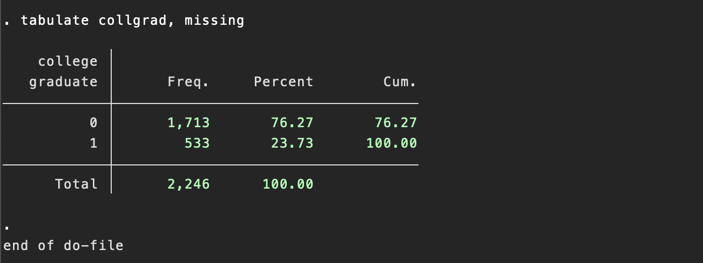

The variable `race` should range from `1 to 3`, but below we see that there is one woman who is coded with a 4.

```
tabulate race, missing
```


We see that is erroneous value for `race` belongs to the woman with an `idcode` value of `543`. We could then try and determine what her read value of `race` should be

```
list idcode race if race == 4
```


The `summarize` command is useful for inspection continuous variable.

Lets inspect the variable `unempins`, the amount of underempployment or unemployment insuarance the woman receive last week. Suppose that prior knowledge tells us this variable should range from about 0 to 300 dollars. The results below are consistent with our expectations.

```
summarize unempins
```

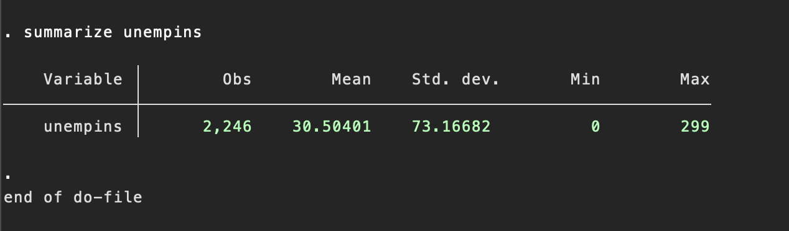

The `summarize` command (below) is used to inspect variable `wage` which contain the hourly wage for the previous week.

```
summarize wage
```

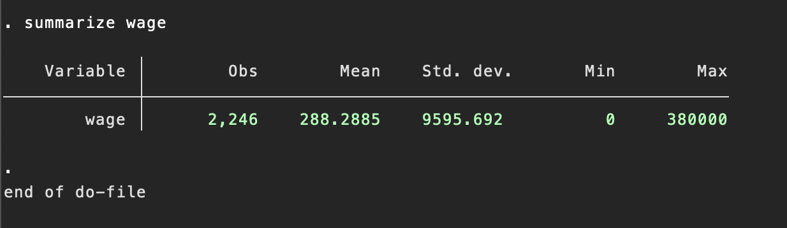

The maximum for this was `380,000`, which seems a little bit high, so we can add the `detail` option to get more information.

```
summarize wage, detail
```


It seems that the two largeest values were enterented erroneously; perhaps the respondent gave an annual wage instead of an hourly wage. Below, we identify these women by showing observations with wages over 100,000. We could try to ascertain what their hourly wage should have been

```
list idcode wage if wage > 100000
```

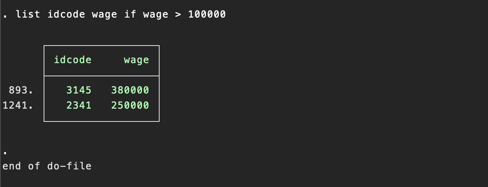

Suppose that, based on prior knowledge, we know that the ages for this sample shound range from `21 to about 50`. We can use the `summarize` command to check this.

```
summarize age
```

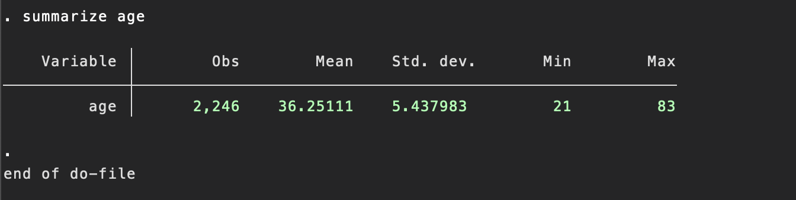

Seeing that the maximum age is `83`, we can get more information using the `tabulate` command. But rather than tabulating all values, we create a tabulation of ages for those who are 45 and older.

```
tabulate age if age >= 45
```


The age of `54` and `83` seem suspicious. Below, we list the `idcode` for thse cases

```
list idcode age if age > 50
```

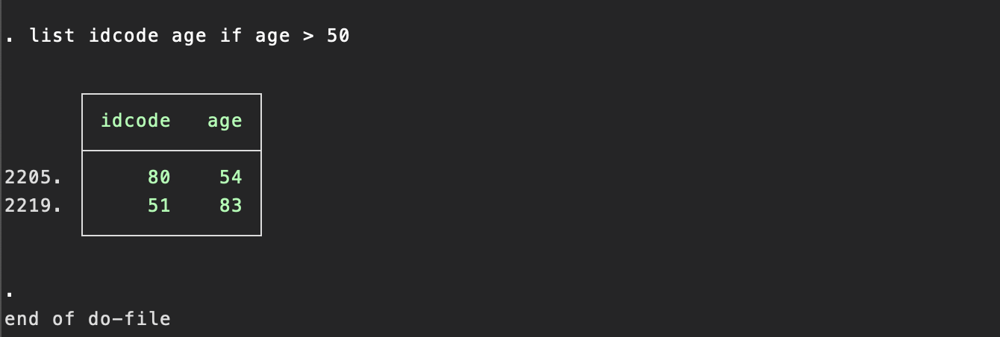

We could then look up the original data for these two observations to verify their values of `age`.

As shown in the section, the `tabulate` and `summarize` commands are useful for searching for out of range values in dataset.

Once out of range valus is found, the `list` command can be used to identify the actual observation with the out of range values so that we can further investigate the suspicious data.

Section `4.7` illustrate how to correct values taht are found to be in error.

### 4.4 Checking categorical by categorical variables

This section shows how you can check the values of `one categorical variable aganist another categorical variable`.

This draws upon a skill that you are probably familiar with and often use: creating cross tabulations. We again use `wws.dta` for this section

To check categorical variables againist each other, I look at my dataset and try to find implausible combinations among categorical variables.

For example, conside the variable `metro` and `ccity`. The variable `metro` is a dummy variable taht is `1` if the woman lives in a `metropolitan area`, while the dummy variable `ccity` measures whether the womain lives in a `city center`.

If a woman lives in a city center, then she must live inside a `metropolitan area`. We tabulate the variables and see this is indeed true in our data. So far, so good.

```
tabulate metro ccity, missing
```

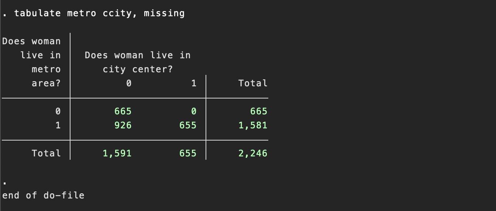

Another way that we could have approached this would have been to count up the number of cases where a woman lived in a `city center` but not in a metropolitan area and to have verified that this count was `0`.

The `&` represent `and`, and the `==` represents is equal to

```
count if metro == 0 & ccity == 1
```

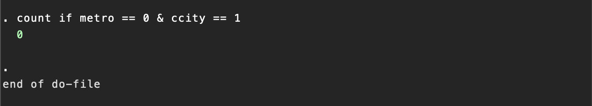

Consider the variables `married` and `nevermarried`. Although it seems obvious, if you are currently married, your value for `nevermarried` should always be `0`. When we tabulate these variabls, we see that there are two cases that fail this test.

```
tabulate married nevermarried
```

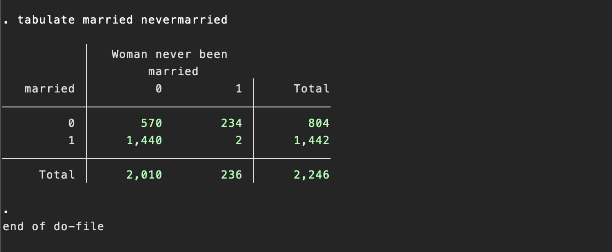

Rather than using the `tabulate` command, we can use the `count` command to count up the number of problematic cases, as shown below

```
count if married == 1 & nevermarried == 1
```

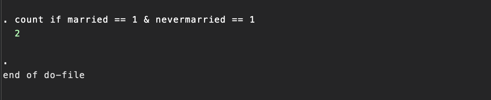

Below, we find the cases that fail this test by listing the cases where the person is married and has never been married. We see that women with `id` values of `22` and `1,758` have this problematic data pattern. We could then investigate these two cases to try to identify which variables may have been entered incorrectly.

```
list idcode married  nevermarried if married == 1 & nevermarried == 1
```

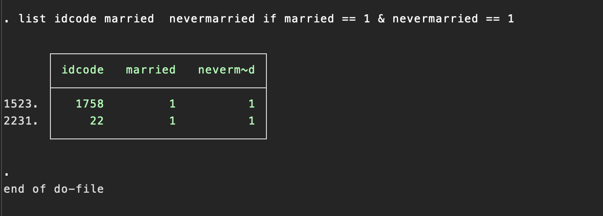

Lets conside one more example by checking the variable `collgrad` (did you graduate college?) aganist `yrschool` (how many years have you been in school?). The `table` command is used here because it produces more concise output than the `tabulate` command.

```
table collgrad yrschool
```

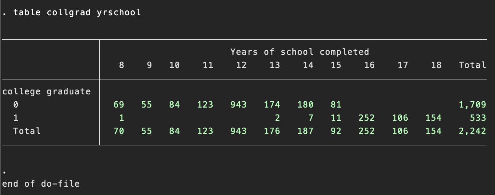

Among the college graduate, `2` woment reported `13` years of school and `7` reported `14` years of school. These women may have skipped one or two grades or graduated hight school early: this these values might merit some further investigation, but they are not completely implausible.

However, the woman with 8 years of education who graducated college either is the greatest genius or has an error on one of these variables.

`Cross-tabulations` using the `tabulate` or the `table` command are useful for checking `categorical variables aganiist each other`.

### 4.5 Checking categorical by continous variables

When checking continous variables by categorical variables, `cross-tabulations` are less practical because the continuous variable likely contains many values. Instead, we will focus on creating `summary statics` for the continuous variable broken down by the categorical variables. Let's explore this with `wws.dta`.

```
use wws
```

This dataset has a categorical (dummy) variable named `union` that is `1` if the woman belongs to a union (and `0` otherwise). Theres is also a variable called `uniondues`, which is the amount of union dues paid by the woman in the last week. If a woman is in a uninon, they many not require union dues; however, if a woman is not in a union, it would not amke sense for her to be paying unino dues.

One way to check for problems here is by using the `summarize` command to get `summary statistics` on `uniondues` for women who are not in a union.For women who are not in a uinon, I expect that the mean value of `uniondues` would be `0`. If the value is more than `0`, then it suggests that one or more `nonunion` women paid union dues. As the result below shows, one or more nonunion women paid dues.

```
summarize uniondues if union == 0
```

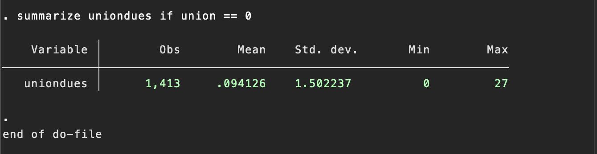

If we add `bysort union:` before the `summarize` command, we get summary statics for `uniondues` by each leve of `union`. This is another way of showing that some nonunion women paid union dues.

```
bysort union: summarize uniondues
```

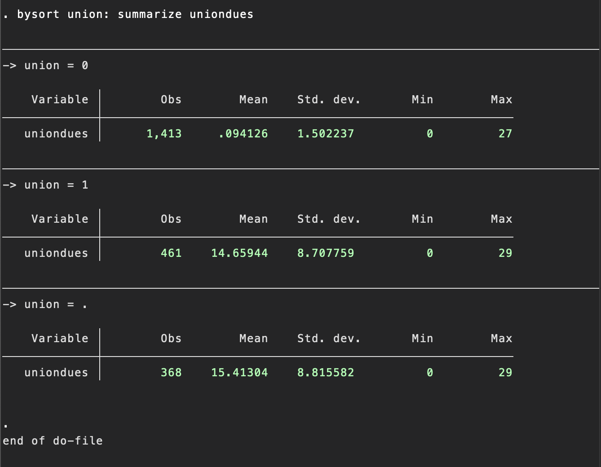

We can obtain the same output in a more concise fasion by using the `tabstat` comand, as shown below.

```
tabstat uniondues, by(union) statistics (n mean sd min max) missing
```

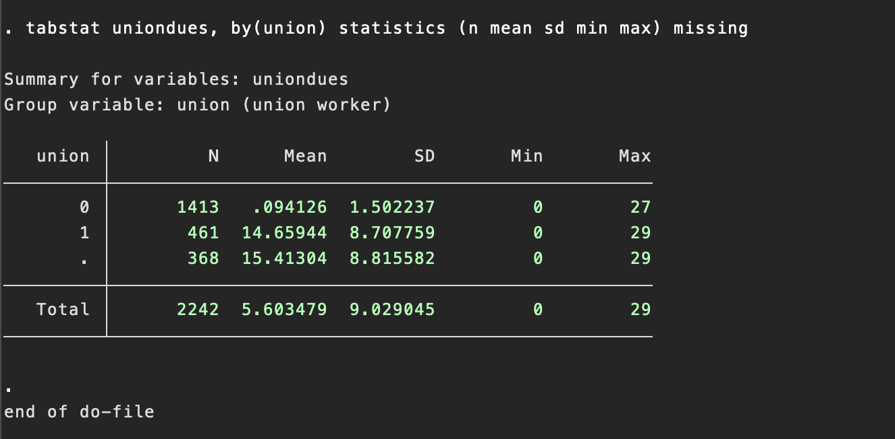

However we obtain the output, we see that there is at least one woman who was not in a union who paid some union dues. Let's use the `recode` command to create a dummy variable names `paysdues` that is `0` if a woman paid no union dues and `1` if she paid some dues.

```
recode uniondues (0=0) (1/max=1), generate(paysdues)
```

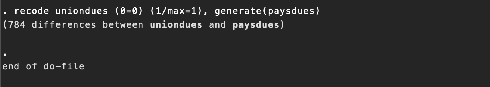

We can now create a table of `uninon` by `paysdues` to see the cross-tabulation of union membership by whether one paid union dues.

```
tabulate union paysdues, missing
```

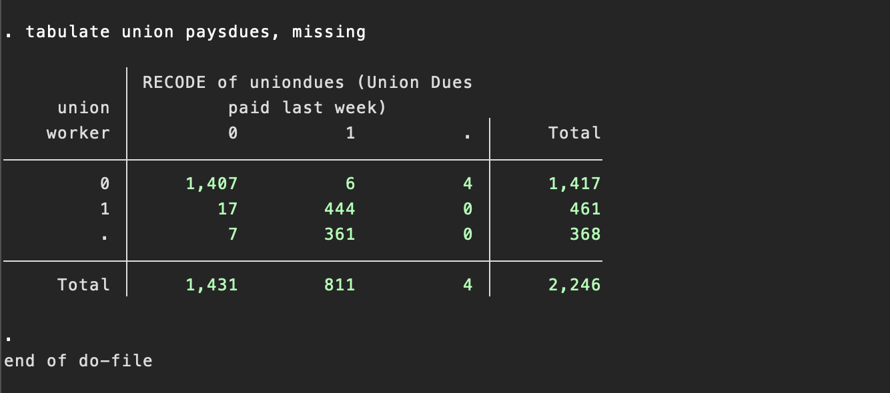

The `tabulate` command shows that six nonunion women paid union dues. We can display those cases, as shown below.

```
list idcode union uniondues if union == 0 & (uniondues > 0) & !missing(uniondues), abb(20)
```

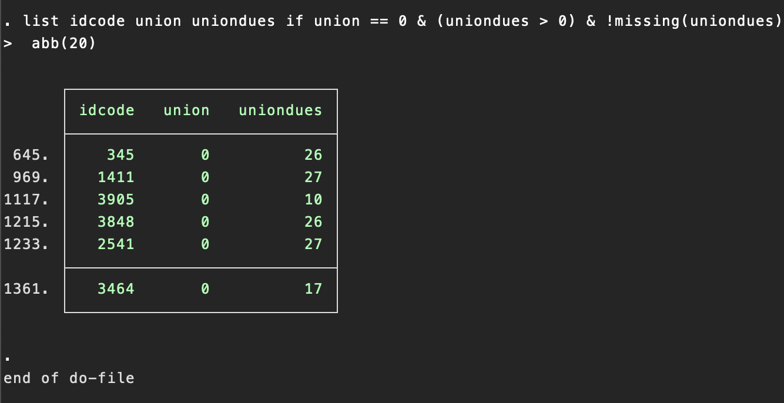

We included `! missing(unindues)` as part of our `if` qualifier that excluded missing values from the display.We could investigate further, tryting to determine the appropriate values for these two variables for these six observations.

Let's turn to the variable `married` (coded 0 if not married, 1 if married) and `marriedyrs` ( how many years you have been married, rounded to the nearest year). If one has been married for less than half a year, the `marriedyrs` would be coded 0. Let's use the `tabstat` command to get summary statistics for `marriedyrs` for each level of `married` and see if these results makes sense.

```
tabstat marriedyrs, by(married) statistics (n mean sd min max) missing
```

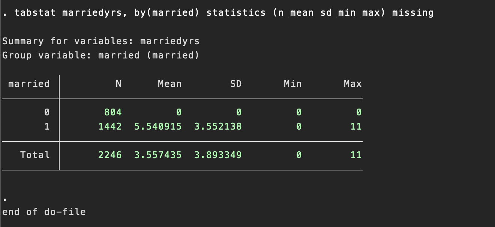

As we would hope, the `804` women who were not married all have the appropriate value of `marriedyrs`, they are all `0`. Among those who are married, some may have been married for less than six months and thus also have a value of `0`. These two variables appear to be consistent with each other.

Let's checkt the variable `everworked` (`0` if never worked, `1` if worked) aganist the variable `currexp` (time at current job) and `prevexp` (tima at previous job). If one had never worked, the current and previous work experience should be `0`. We check this below for current experience and find this to be the case.

```
tabstat currexp, by(everworked) statistics(n mean sd min max) missing
```

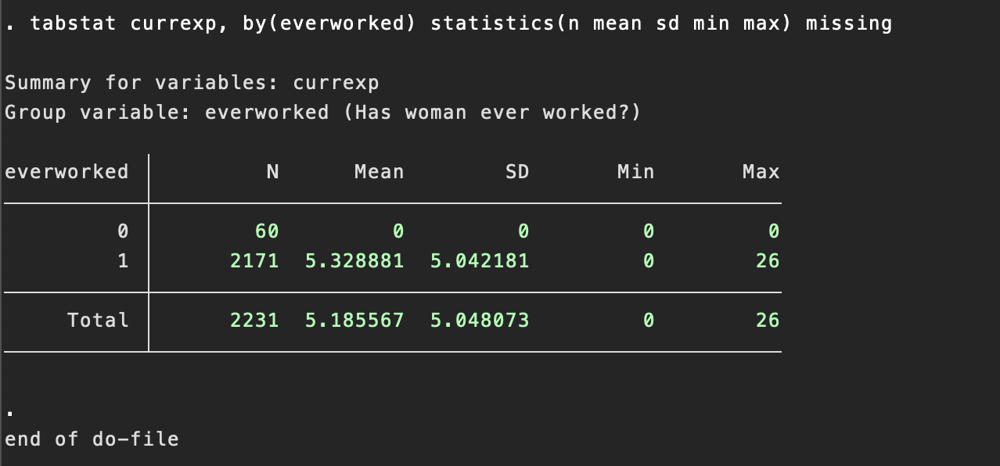

Also as we would expect, those who never worked have no previous work experience

```
tabstat prevexp, by(everworked) statistics(n mean sd min max) missing
```

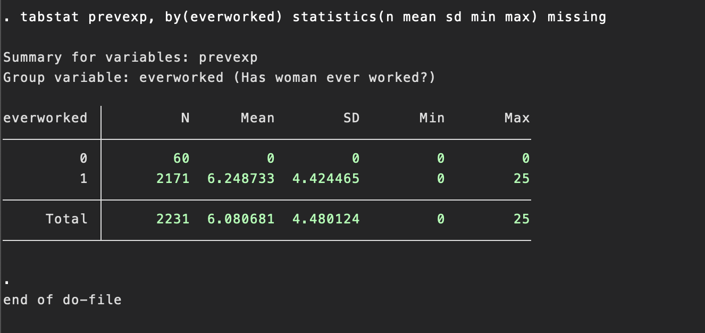

Let's check the `everworked` variable aganist the woman's total work experience. To do this, we can create a variable called `totexp`, which is a woman's total work experience, and then check that aganist `everworked`. As we see below, if a woman has never worked, her total work experience is always 0, and if the woman has worked, her minimun total work exprience is 1. This is exactly as we would expect

```
generate totexp = currexp + prevexp
tabstat totexp , by(everworked) statistics(n mean sd min max) missing
```


This section illustrated how we can check `continuos variable` aganist `categorical variable` using the `bysort` prefix with the `summarize` command or using the `tabstat` command.

We can also `recode` the continuous variable into categorical variable and then use the `cross-tabulations` for checking the categorical variable aganist the recoded version of the continuos variable. The next section illustrates how to check two continuos variabe.

### 4.5 Checking continuous by continuous variables

This section explores how we can check one `continuous variable` aganist `continuous variable`. Like the previous section this section uses `wws.dta`

Consider the variables `hours` (hours worked last week) and `unempins` (amount of under and unemployment insurance received last week). Suppose that only those who worked 30 or fewer hours per week would be eligible for under and unemployment insurance. If so, all values of `unempins` should be `0` when a woman works over `30 hours` in a week.

The `summarize` command below checks this by showing descriptive statistics for `unempins` for those who worked over 30 hours in a week and did not have missing values for their work hours. If all women who worked more than 30 hours did not get under- and unemployment insurance, then mean and maximum for `unemins` in the output below would be `0`.

But as the result show, these values are not all 0, so at least one woman receive under and unemployment insurance payments when working over 30 hours.

```
summarize unempins if hours > 30 & !missing(hours)
```

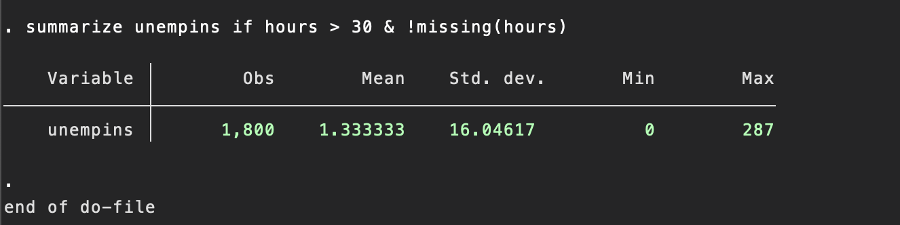

Although the previous `summarize` command shows that there is at least one woman who receive unemployment insurance though she worked more than 30 hours, it does not show us how many women had such a pattern of data. We can use the `count` command to count up the number of women who worked over `30 hours` and received under- and unemployment insurance. This reveals that `19 women` fit this criteria.

```
count if (hours>30) & !missing(hours) & (unempins>0) & !missing(unempins)
```

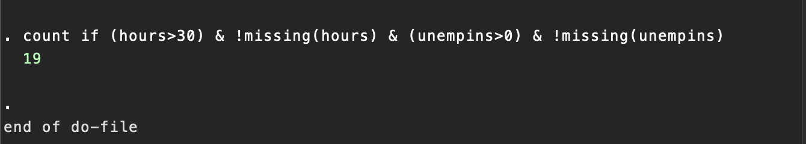

We can use the list command to identify the observations with these conflicting values so that we can investigate further.

```
list idcode hours unempins if (hours > 30) & !missing(hours) & (unempins>0) & !missing(unempins)
```

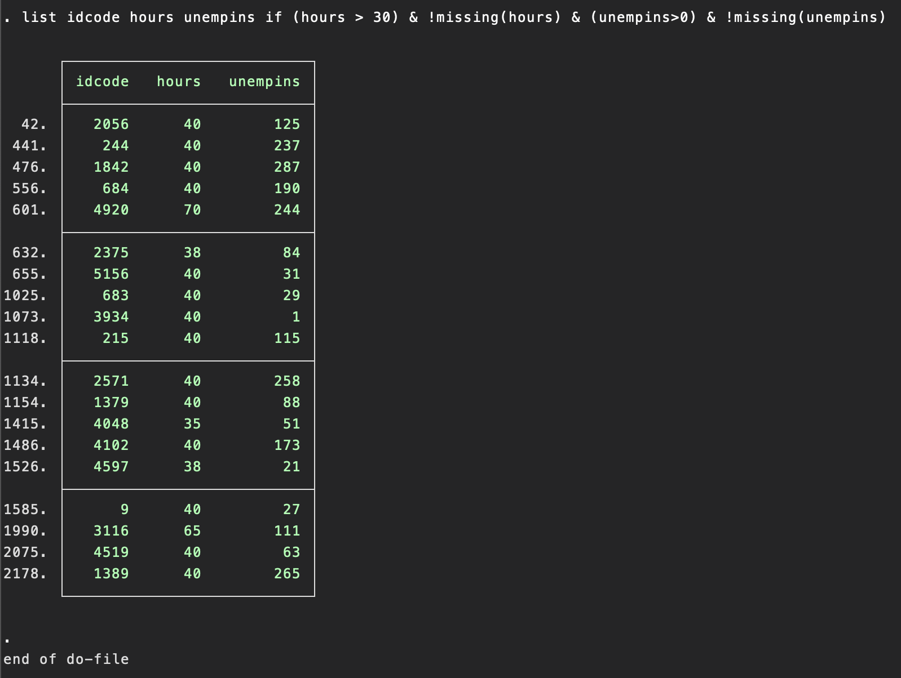

Let's say that e wanted to check the variable `age` aganist the amount of time married, `marriedyrs`. One way to compare these variables aganist each other is to create a new variable that is the age when the woman was married. This new variable can then be inspected for anomalous values. Below, the `generate` command create `agewhenmarried`.

```
generate agewhenmarried = age - marriedyrs
```

We can use the `tabulate` command to look for worrisome values in the new `agewhenmarried` variable. For the sake of space of values that might merit further investigate, such as the woman who was married when she was 13 years old.

```
tab agewhenmarried  if agewhenmarried < 18
```

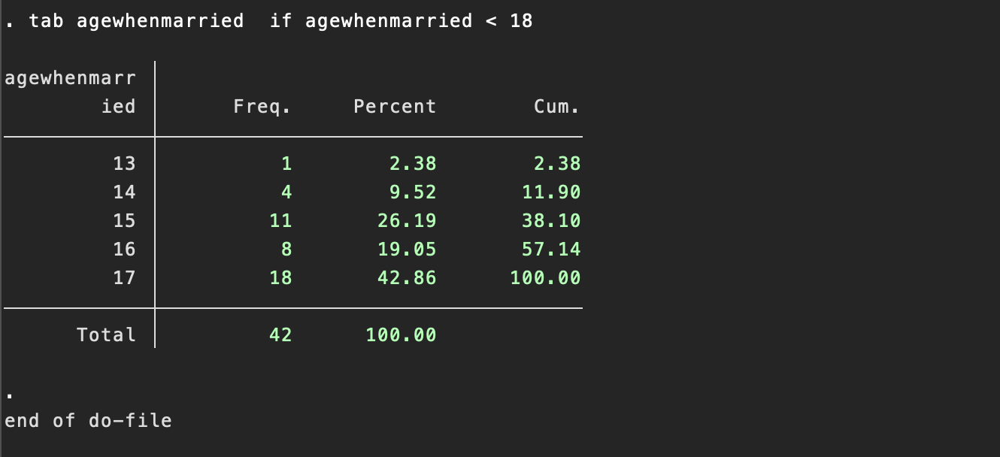

We can use the same strategy to check the woman's age aganist her total work experience. We can create a variable, `agewhenstartwork`, that is the woman's age minus her previous plus current work experience. Like the previous example, we can then `tabulate` these values and restrict it to values less than 18 to save space. This reveals three cases when implied age the women started working was at age 8, 9 and 12. These cases seem to merit further investigation.

```
generate agewhenstartwork = age - (prevexp + currexp)
tab agewhenstartwork if agewhenstartwork < 18
```

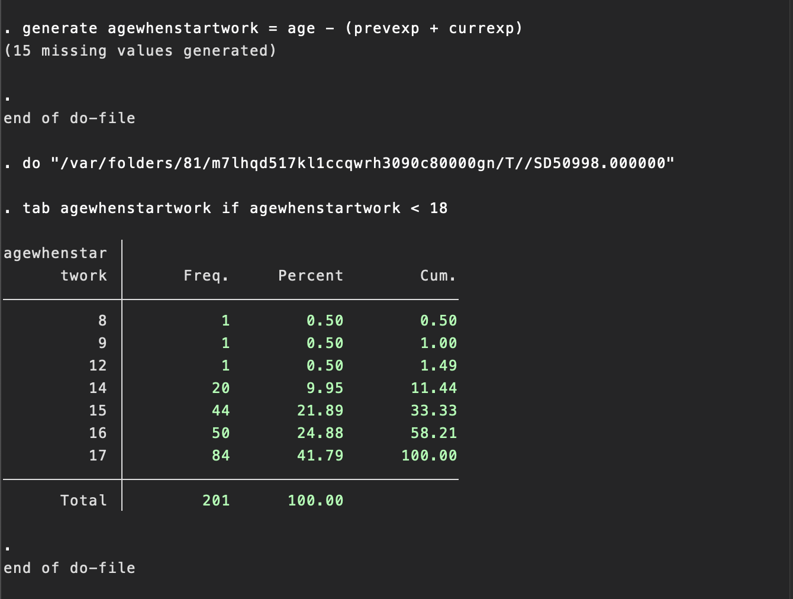

The dataset has a variable, `numkids`, that contains the number of children the woman has as well as the ages of the first, second, and third child stored in `kidage1`, `kidage2` and `kidage3`. For the women with three kids, lets compare the ages of the second and third using the `table` command below. As we would expect the third child is never older than the second child.

```
table kidage2 kidage3 if numkids == 3
```

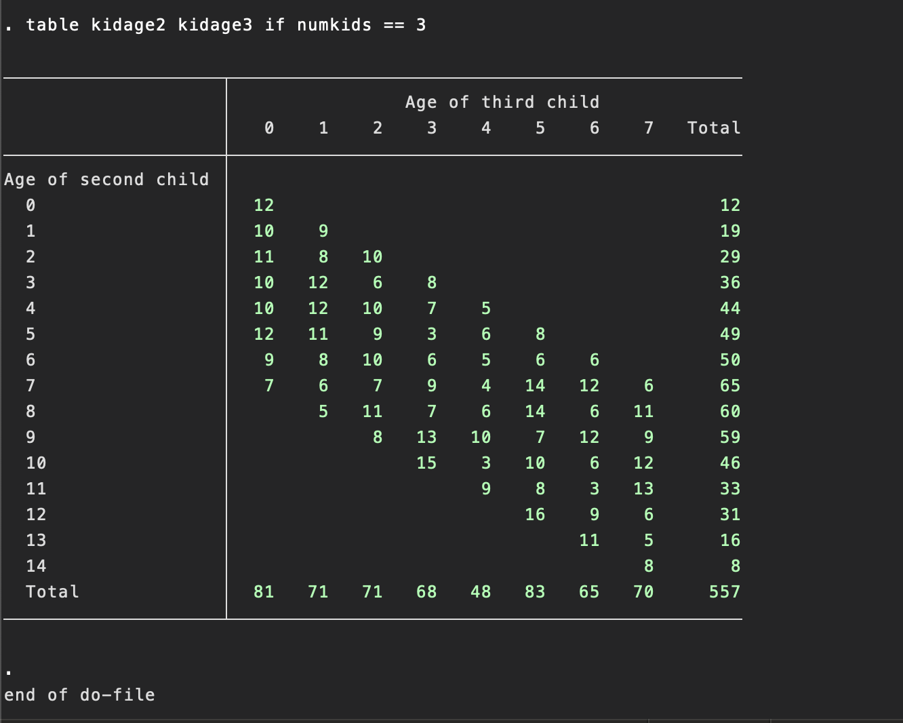

Although not as concrete, you can also use the `count` command to verify this. Below we count the number of times the age of the third child is greater than the age of the second child when there are three children, being sure to exclude observation where `kidage3` is missing. As we would expect based on the result of the `table` command above, there are no such children.

```
count if (kidage3 > kidage2) & (numkids == 3) & !missing(kidage3)
```

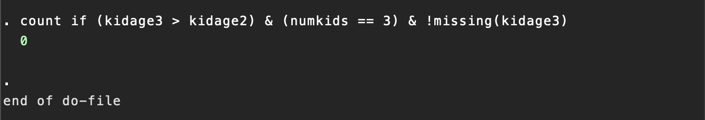

Likewise, we count the number os second childrent whose ages are greater than the age of the first child if the woman has two or more children, being sure to exclude observations where `kidage2` is missing. As we would hope, there are no such cases

```
count if (kidage2 > kidage1) & (numkids >= 2) & !missing(kidage2)
```

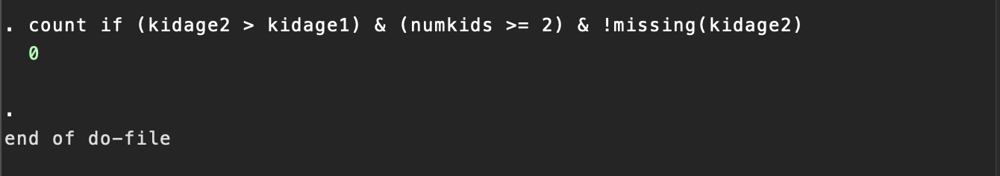

Another check we might perform is comparing the age of the woman with the age of her oldest child to determine the womans's age when she had her first child. We can create `agewhenfirstkid`, child. We then tabulate `agewhenfirstkid`. This reveals either cases that need further investigation or fodder for the tabloids about the girl who gave birth at age 3.

```
generate agewhenfirstkid = age - kidage1
tabulate agewhenfirstkid if agewhenfirstkid < 18
```

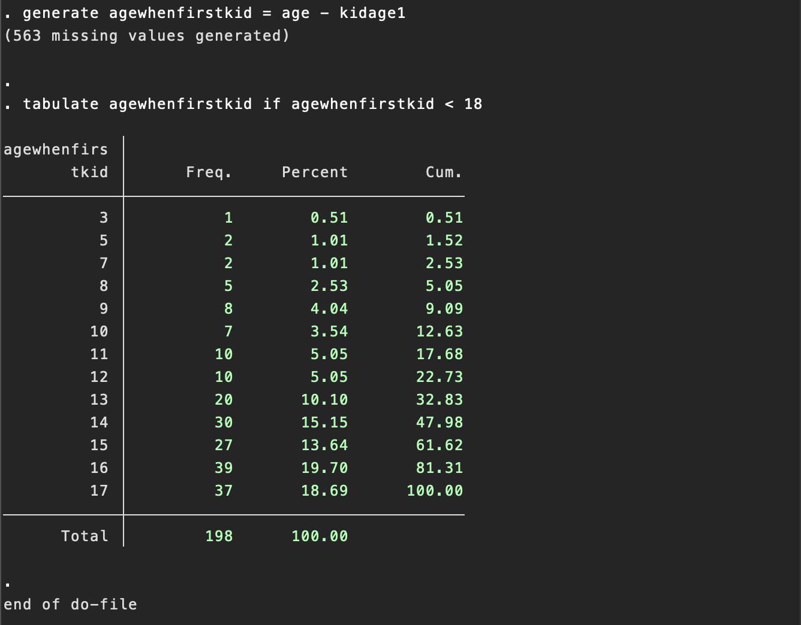

Checking continuous variables aganist each other can be challenging. It sometimes takes a little extra work and some creativity to come up with ways to check one continuous variable aganist another. But such checks can reveal inconsistencies between the variables that would not be revealed by checking each variable individually.

### 4.7 Correction errors in data

The previous sections have shown how to check for problems in your data. Now, lets consider strategies you migh use to correct problems. This sections assumes that you entered the data yourself and that you have access to the original data, or that you some relationship with the people who provided you with the data where they could investigate anomalies in the data.

In either case, providing clear information about the problem is key. Below are some examples of problems and how you migh document them.

In section `4.3`, we saw that `race` was suppose to have the value `1, 2, 3,` but there was one case where `race` was `4`. We want to not only document that we found a case where `race` was `4` but also note the `idcode` and some other identifying demographic variables for this case. We can do this with simple `list` command

```
* women has race coded 4
use www, clear
list idcode age yrschool race wage if race == 4
```

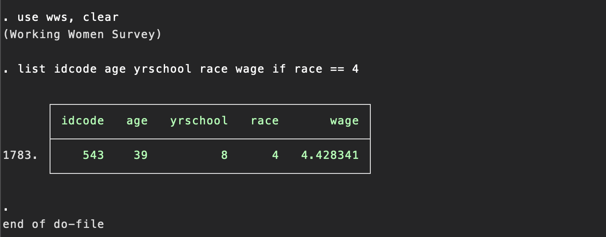

In section `4.3` we also saw two cases where the values for hourly income seemed outrageously high. The same strategy we just employed can be used to document those possibly probelmatic cases.

```
* hourly income seems too high
list idcode age yrschool race wage if wage > 50
```

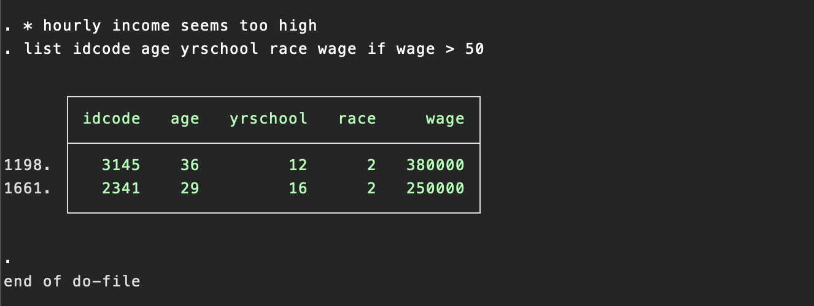

In sections `4.4-4.6`, we uncovered problems by checking variables aganist each other. In these cases, we did not find values that were intrinsically problematic, but we did find conflicts in the values among two or more variables.

In these cases, documenting the problem involves noting how the values between the variables do not make sense.

For example, insection `4.4` there was a woman who graduated college who had reported only eight years of school completed. This can be documented using a cross tabulation

```
* some conflicts between college graduate and years of school
table collgrad yrschool
```

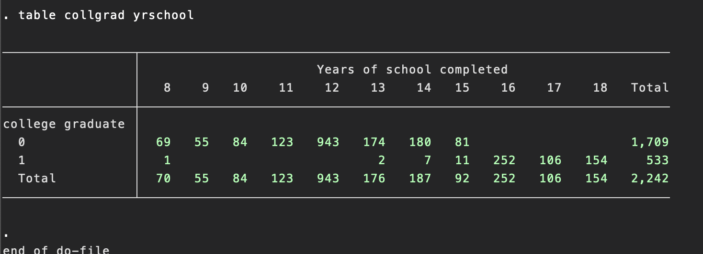

This documentation can be supplemented with a listing showing more information about the potentially problematic cases:

```
* college grad with 8 years of school completed, seems like a problem
list idcode collgrad yrschool if yrschool == 8 & collgrad == 1
```

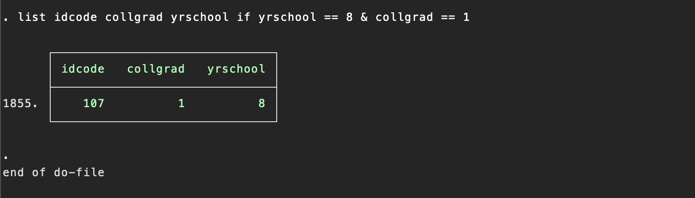

```
* college grad with 13, 14, 15 years of school completed, is this a problem?
list idcode collgrad yrschool if inlist(yrschool,13, 14,15)
```

> output omitted, too long

One important part about this process is distinguish between clearly incongruent values and values that simply merit some further investigation. I try to prioritize problems, creating terminology that distinguishes clear conflicts (for example, the college grad with eight years of education) from observation that merely might be worth looking into.For example, a college grad with 13 years of eduction could be a gifted woman who skipped several years of school.

> Note

Sometimes, resources for data checking are not infinite. It may be important to prioritize efforts to focus on data values that are likely to change the result of the analysis. such as the women with hourly income that exceed $300 an hour. If there is only a `finite amount` of time for `investigation problems`, imagine the `analyses you will be doing` and imagine the `impact various mistake will have on th data`.

Once you discover corrections that need to be made to the data, it might be tempting to open up the Stata Data Editor and just start typing in corrections, but I highly recommend aganist this strategy for two reasons:

It does not document the changes that you made to the data in a systematic way, and it does not integrate into a `data-checking` strategy. Once you mend a problem in the data, you want to then use the same procedures that uncovered the problem to verify that you have indeed remedied the problem.

Instead of correcting problems using the Data Editor. I recommend using the command `replace` combined with an `if` qualifier that uniquely identifies the observation to be mended.

For example, consider the problem with `race` described earlier in this section, where one values was coded as a `4`. After investigation, we learned that the observation in error had a unique `idcode` of `543` and that the value of `race` should have been `1`. You can change the value of `race` to `1` for `idcode 543` like this:

```
* correcting idcode 543 where race of 4 should have been 1
replace race = 1 if idcode == 543
tab race
```

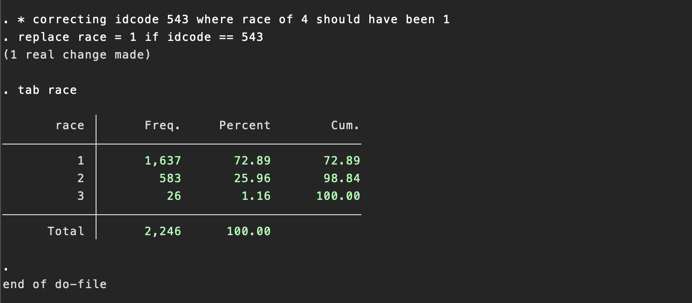

Note that the replacement was based on `if idcode == 543` and not if `race == 4`. When corrections are identified based on an observation, the replacement should also be based on a variable that uniquely identifies the observation(for example, `idcode`)

It would be useful to add a note to the dataset to indicate that this value was corrected. We can do so by using the `note` command.

```
note race: race changed to 1 (from 4) for idcode 543
```

Likewise, we might be told that `case 107`, with the woman who appeared to be a college graduate with only `eight years` of school, was not a college graduate; that was a typo. We make this correction and document it below.

```
replace collgrad = 0 if idcode == 107
note collgrad: collgrad changed from 1 to 0 for idcode 107
```

After applying this correction, the cross-tabulation of `collgrad` by `yrschool` looks okay

```
table collgrad yrschool
```

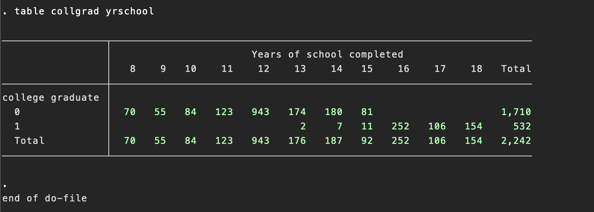

In `section 4.3` we saw two women whose ages were higher than expected (over 50)

```
list idcode age if age > 50
```

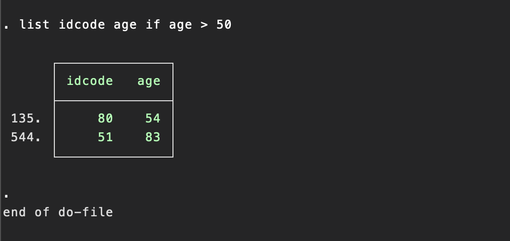

After further inquires, we found that the digits in these numbers were transposed. We can correct them and include notes of the corrections, as shown below

```
replace age = 38 if idcode == 80

replace age = 45 if idcode = 80

note age: the value of 83 was corrected to be 38 for idcode 51

note age: the value of 54 was corrected to be 45 for idcode 80
```

Having corrected the values, we again list the women who are over 50 years old.

```
list idcode age if age > 50
```


As we would hope, this output is now empty because there are no such women. We can see the notes of all the corrections that we made by using the `notes` command.

```
notes
```

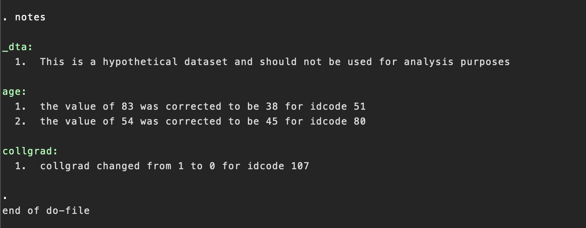

After we made a `correction to the data`, we `checked` it again to ensure that the `correction did the trick`. In other words, `data cleaning and data correcting` are, ideally, an `integraded process`. To this end, this process is best done as part of a Stata do-file, where the commands for checking, and rechecking each variable are saved and an easily be executed.

### 4.8 Identifying duplicates

This section shows how you can identify `duplicates in your dataset`. `Duplicates` can arise for many reasons, including the same obseration being entered `twice during data entry`.

Because finding and eliminating duplicates observations is a `common problem`, Stata has an entire set of commands for `identifying`, `describing` and `elminating duplicates`. This section illustrates the use of these commands, first using a tiny dataset and then using a more realistic dataset.

First let's consider a variation of `dentists.dta` called `dentists_dups.dta`. Looking at a listing of the observation in this dataset shows that there are duplicate observations.

```
use dentists_dups
list
```

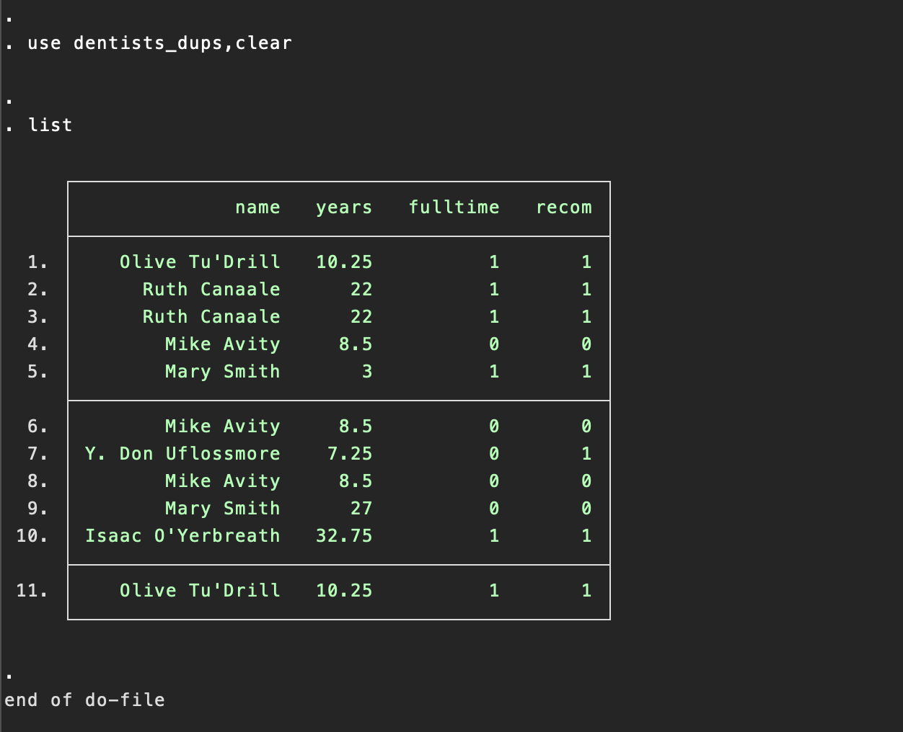

We can use the `duplicates list` command to list the duplicates contained in this dataset.

```
duplicates list
```

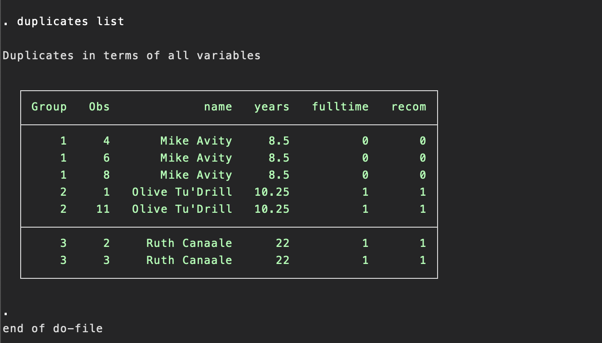

The above command `shows every observation` that contains a duplicates. For example, `three observation` are shown for the dentist `Mike Avity`.

Rather than listing every duplicate, we can list one instance of each duplicates by using the `duplicates examples` command. The column labeled `#` shows the `total number of duplicates` (for example, Mike Avity has three duplicate observations)

```
duplicates examples
```

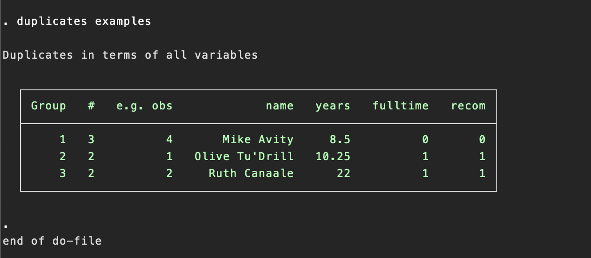

The `duplicates report` command creates a report (like the `tabulate` command) that tabulates the number of copies for each observation.

```
duplicates report
```

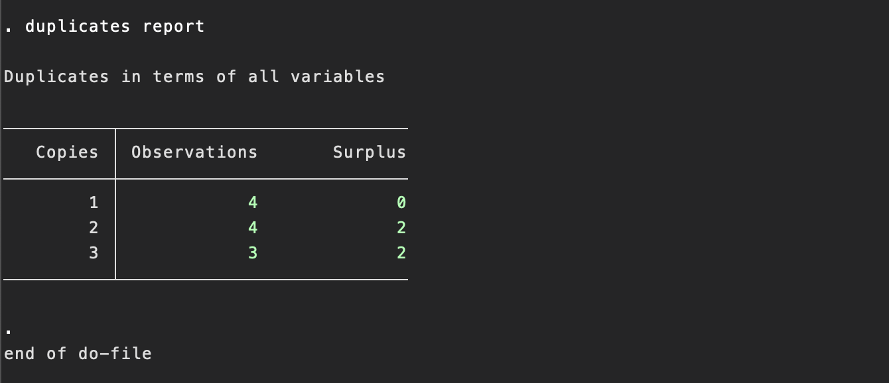

The output above shows that there are `four observation` in this dataset that are `unique` ( that is, have only one copy).

There are four observation in which there are `two copies of the observation`. These correspond to the observation for `Olive` and for `Ruth`, each of which had `two copies`. The report also shows that there are `three observations` that have `three copies;` these are the `three observations` for Mike

This report shows useful information about the prevelance of duplicates in the dataset, but it does not `identify the duplicates`.

This is where the `duplicates tag` command is useful. This command creates a variable that indicates for each observation how many dupliates that observation has. We use this command to create the variable `dup`

```
duplicates tag, generate(dup)
```


The listing below shows the number of duplicates(dup) for each observation

```
list, sep(0)
```


To make this output easier to follow, let's sort the data by `name` and `years` and then list the observations, separating them into groups based on `name` and `years`

```
sort name years
list, sepby(name years)
```

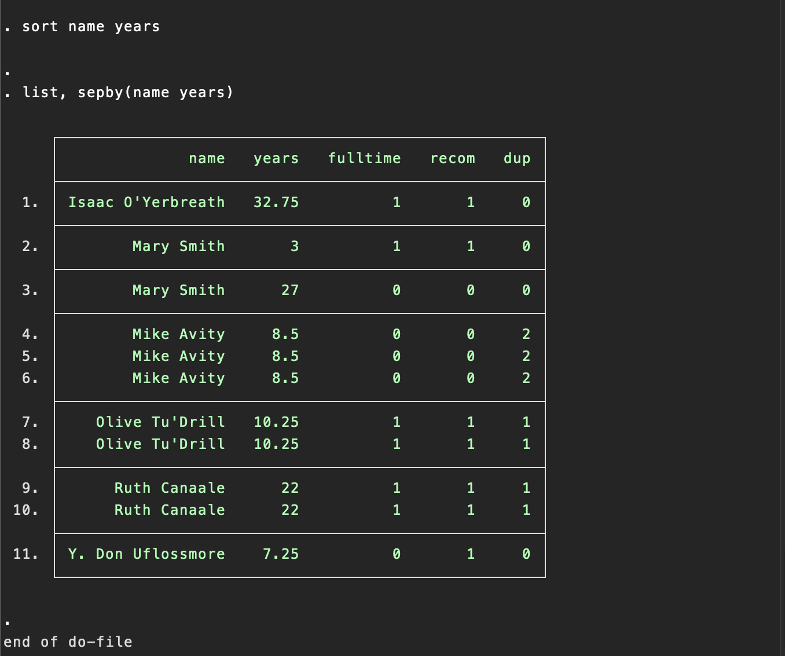

Now, it is easier to understand the `dup` variable. For the observation that were unique (such as Issac or Y. Don) the value of `dup` is `0`.

The value of `dup` is 0 for `Mary Smith` because, even through these `two dentists` share the `same name`, they are not `duplicate observatation`. (For example, they have a different number of years of work experience.)

The observation for `Olive` and `Ruth` are identified as having a value of 1 for `dup` because they each have one duplicate observation.

And `Mike` has a value of `2` for `dup` because he has two duplicate observations.

As you can see, duplicate observations are charactized by having a value of `1` or more for the `dup` variable. We can use this to list just the observation that are `duplicates`, as shown below.

```
list if dup > 0
```

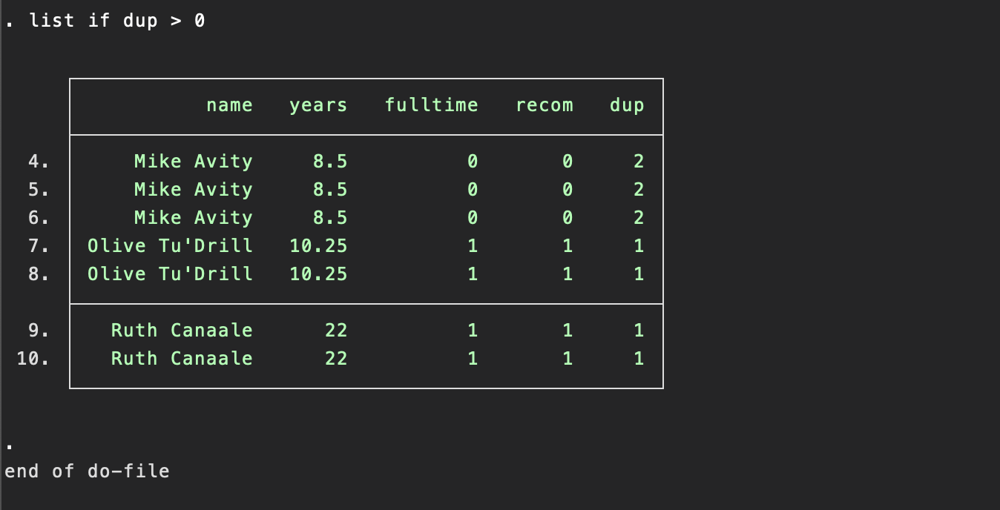

If there were many variables in the dataset, you migh prefer to view the duplicate observations in the Data Editor by using the `browser` command.

```
browse if dup > 0
```

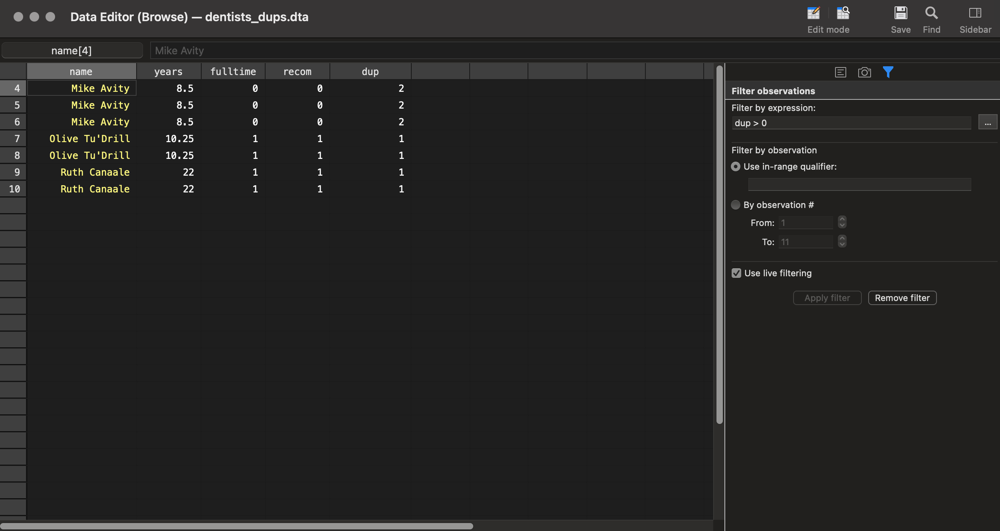

After inspection the observation identified as `duplicates`, I feel confident that these observation are genuine duplicates, and we can safely eliminate them from the dataset. We can use the `dupliates drop` command to eliminate duplicates from the dataset.

```
duplicates drop
```

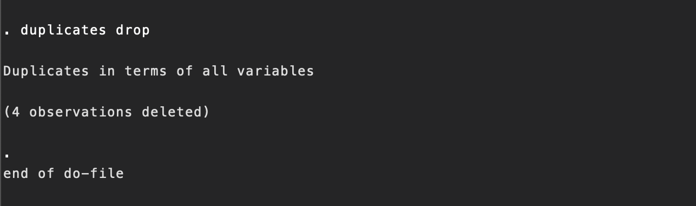

I expected four observation to be eliminated as `duplicates` (one for Olive, one for Ruth, and two for Mike). Indeed, that is the number of observations deleted by the `duplicates drop` command. The listing below confirms that the duplicates observation have been dropped.

```
list
```

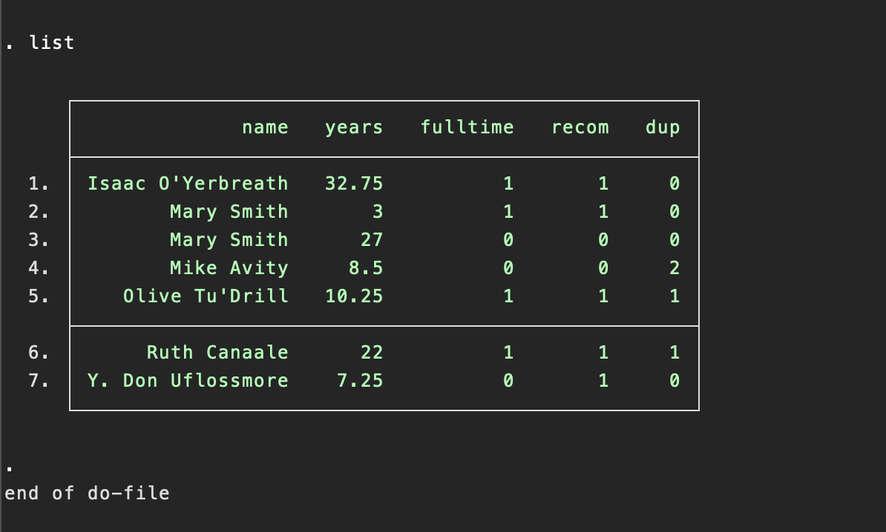

The previous examples using `dentists_dups.dta` were unrealistically small but useful for clearly seeing how these commands work. Now, Let's use `wws.dta` to explore how to identify duplicates in a more realistic example. First, let's read this dataset into memory.

```
use wws
```

This dataset contains a variable, `idcode`, uniquely identifying each observation. The first thing that I would like to do is confirm that this variable truly does uniquely identify each observation. This can be done the `isid` (is this an Id?) command.

```
isid idcode
```

Had there been dupliate values for the variable `idcode`, the `isid` command would have returned an error message. The fact that it gave no output indicates that `idcode` truly does uniquely identify each observation. We could also check this with the command `duplicates list idcode`, which displays duplicates solely based on the variable `idcode`. As expected, this command confirms that there are no duplicates for `idcode`.

```
duplicates list idcode
```

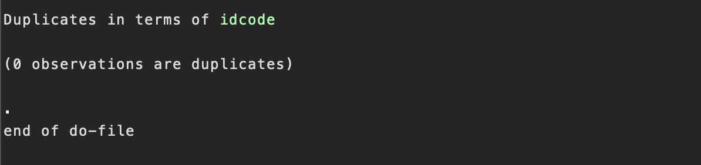

Now, lets see if there are any duplicates in this dataset, including all the variables when checking for duplicates. Using `duplicates list` command, we can see that thid dataset contains `no duplicates`

```
duplicates list
```

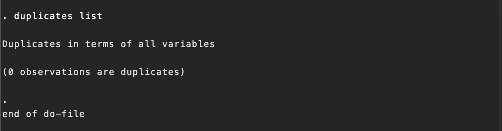

Let's inspect a variant of `wws.dta` names `wws_dups.dta`. As you may suspect, this dataset will give use the opportunity to discover some duplicates. In particular, I want to first search for duplicates based on `idcode` and then search for duplicates based on all the variables in the dataset. Below, we first read this dataset into memory.

```
use wws_dups
```

Let's firs use the `isid` commands to see if, in this dataset, the variable `idcode` uniquely identifies each observation. As we can see below, `idcode` does not uniquely identify the observations.

```
isid idcode
```

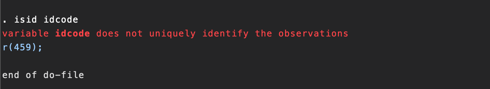

Let's use the `duplicates report` command to determine how many duplicates we have with respect to `idcode`.

```
duplicates report idcode
```


We have a total of six observations in which the `idcode` variable appears twice. We can use the `duplicates list` command to see the observation with duplicate values on `idcode`.

```
duplicates list idcode, sepby(idcode)
```

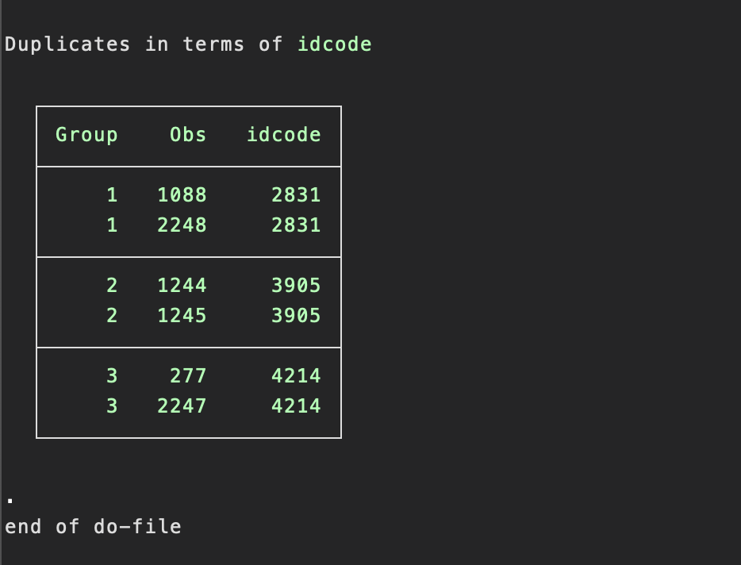

I do not know if these observation are duplicates of all the variables or just duplicates of `idcode`. Let's obtain a report showing us the number of duplicates taking all variable into consideration.

```
duplicates report
```

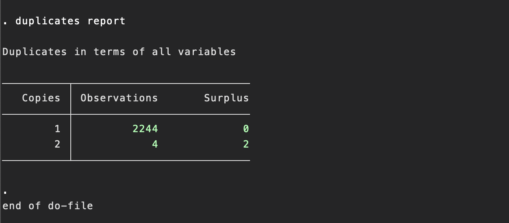

The report above shows that there are four observations that are duplicates when taking all variables into considerations. Previously, we saw that there were six observations that were duplicates just for `idcode`.

Let's use `duplicates tag` command to identify each of these duplicates. Below, the variable `iddup` is created, which identifies duplicates based solely on `idcode`. The variable `alldup` identifies observation that are duplicates when taking all the variables into considerations.

```
duplicates tag idcode, generate(iddup)
```

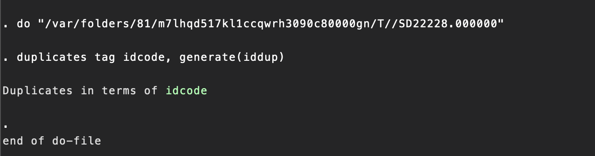

```
duplicates tag, generate(alldup)
```

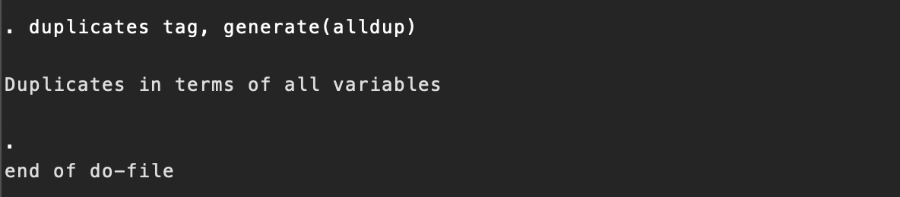

Below, we tabulates these two variables aganist each other. This tables gives a more complete picture of what is going on. There are `four observation` that are duplicates for all variables, there are `two observations` that are duplicates for `idcode` but not for the other variables.

```
tabulate iddup alldup
```

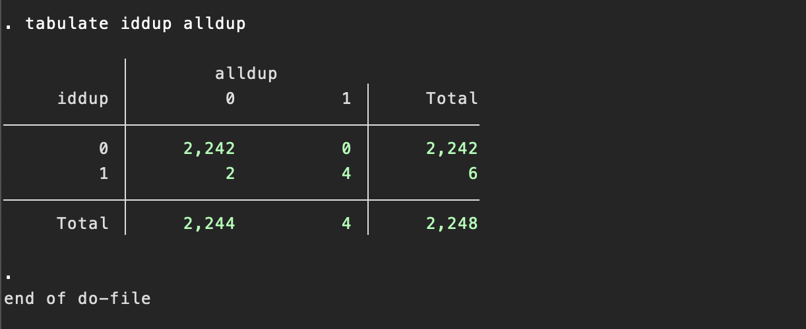

Let's look at the `two observations` that are duplicates for `idcode` but not for the rest of the variables. You could do this using `browse` command, and these observations would disply in the `Data Editor`.

```
browse if iddup == 1 & alldup == 0
```

Or below, the `list` command is used, showing sampling of the variables from the dataset.

```
list idcode age race yrschool occupation wage if iddup == 1 & alldup == 0
```

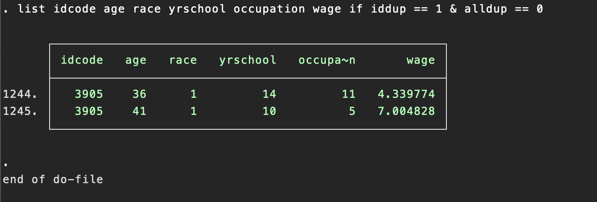

We can clearly seee that these are two women who were accidentalyy assigned the same value of `idcode`. We can remedy this by assigning one of the women a new and unique value for `idcode`. Le't use the `summarize` command to determine the range of value for `idcode` so that we can assign a unique value.

```
summarize idcode
```

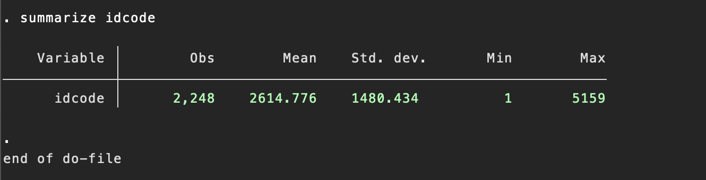

The highest value is `5,159`, so let's assing a value of `5,160` to the woman who had an `idcode of 3,905` and who was `41 years` old.

```
replace idcode = 5160 if idcode == 3905 & age == 41
```

Now, when we use the `duplicates report` command, we see the same number of duplicates for `idcode` and for the entire dataset. In both cases, there are four duplicates observations.

```
duplicates report idcode
```

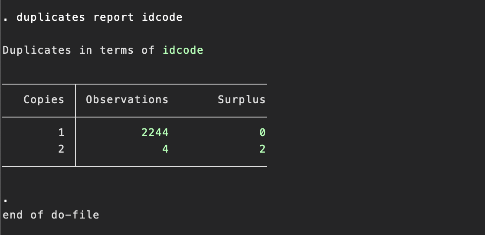

```
duplicates report
```


We could further inspect these duplicates observations. Say that we do this and we determine that we are satisfied that these are genuine duplicates. We can then eliminate them using the `duplicates drop` command, as shown below.

```
duplicates drop
```

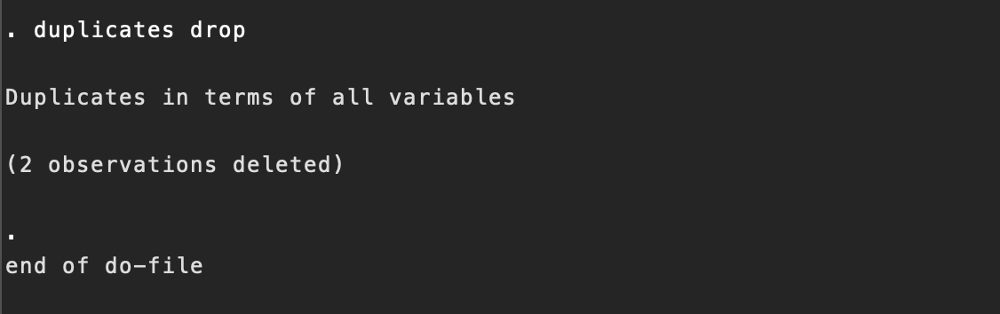

Now, the `duplicates report` command confirms that there are no duplicates in this dataset.

```
duplicates report
```

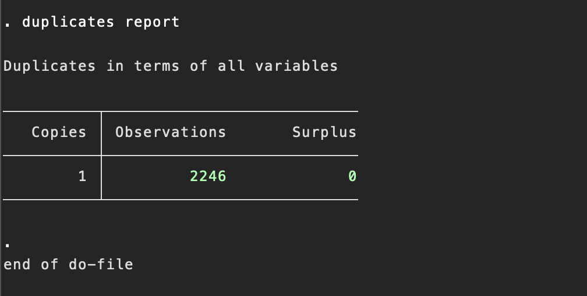

This section has illustrated how you can use the suite of `duplicates` commands to create listings and reports of duplicates as well as how to identify and eliminates duplicates. You can learn more about these commands by typing `help duplicates`.

> Note ! `edit` vs `browse`

The `edit` command allows you to view and edit the data in the Data Editor. The `browse` command permits you to view (but not edit) the data, making it a safter alternative when you simply wish to view the data.

### 4.9 Final thoughts on data cleaning

The previous sections of this chapter have shown how to check your data for `suspicious values` and how to correct values that are found to be in error. After taking these steps, one might be left with the feeling that no more `data cleaning need to be done`. But `data cleaning` is not a `destination` - `it is a process`. Every additional action you take on the dataset has the potential for introductiong errors.

The process of creating and recoding variables provides opportunies for errors to sneak into your data.It is easy to make a mistake when `creating or recoding a variable`.

When you `merge two datasets together`, this might give you the chance to do additional data checking. Say that you merget two datasets, a dataset with husbands and a dataset with wives. Imagine that both datasets had a variable assking how long they have been married. You could use the techniques described in section 4.6 to check the husbands answer against the wife's answer. By `merging ` the husband and wises datasets, more opportunies arise for data checking than lyou had when the datasets were separated.

`Data cleaning` is ideally done using a `do-file`, which gives you the ability to automatically repeat the `data-checking` and `data-correcting steps`.

## Chapter 5 | Labelling datasets

We must be careful not to confuse data witht he abstrations we use to analyze them. --William James

### 5.1 Introduction

This chapter illustrates how to label your datasets. Labeled datasets are easier for others to understand, provide better documentation for yourself, and yield output that is more readable and understandable. Plus, by labelling your datasets so that others can easily understand them, you get the added benefit of making your dataset easier for you to understand at some point in the future when your memories of the data have faded.

The examples in this chapter use a hypothetical survey of eight graduate students.

> Note!!

This chapter describes how to use Stata commands for labelling datasets. If you are interested in using the point and click Variable Manager, you can see section 2.9.

### 5.2 Describing datasets

Let's have a look at an example of a well-labelled dataset. This dataset includes and overall `label for the dataset`, `labels for the variables`, `labels for values of some variables`, `comments (notes) for some variables` and formatting to improve the display of variables.

This section illustrates how such labelling improves the usability of the dataset and explores Stata tools for displaying well-documented dataset.

`survey4.dta` contains the results of hypothetical survey of eight graduate students with information about their gender, race, date of birth, and income.The survey also asks the female students if they have given birth to a child , if so, the name, sex and birthday of their child.

Below, we use the dataset and see that it has a label describing the dataset as a `survey of graduate students`

```
use survey7
```

We can get even more information about this dataset using the `describe` command, as shown below.

```
describe
```

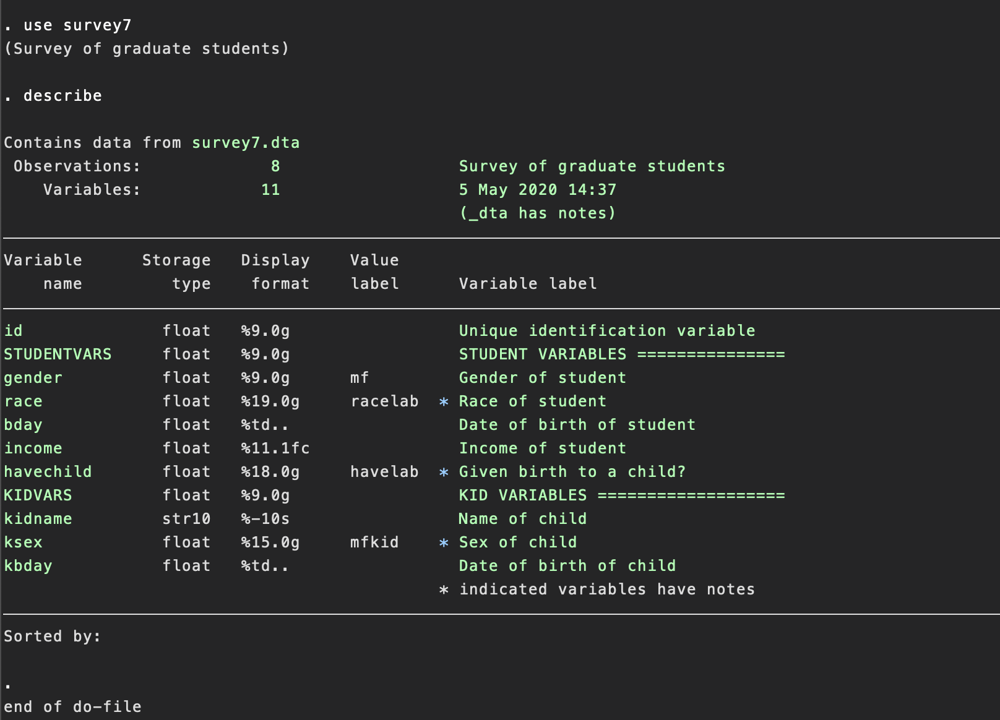

The header portion of the output gives overall information about the dataset and is broken up into two columns(groups) The `first (left) column` tells us the `name of the dataset`, `the number of observations` and `the number of variables`.

`The second (right)` column shows the `label for the dataset`, `displays the last time it was saved` and `mentions that the overall dataset has notes associated with it`.

The body of the output shows the `name of each variabes`, how the `variables is stored`, the `format for displaying the variable`, the `value label used for displaying the values` and a `variable label that describes the variable`. Variables with asterisks have notes associated with them.

With the `short` option, we can see just the header information. This is useful if you just need to know general information about the dataset, such as the `number of variables and observation it contains`.

```
describe, short
```

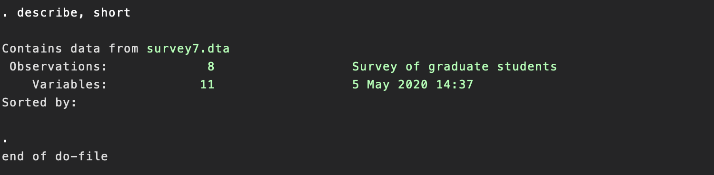

Specifying a list of variables shows just the body of the output (withoug the header). Below, we see information for the variables id, gender, and race

```
describe id gender race
```

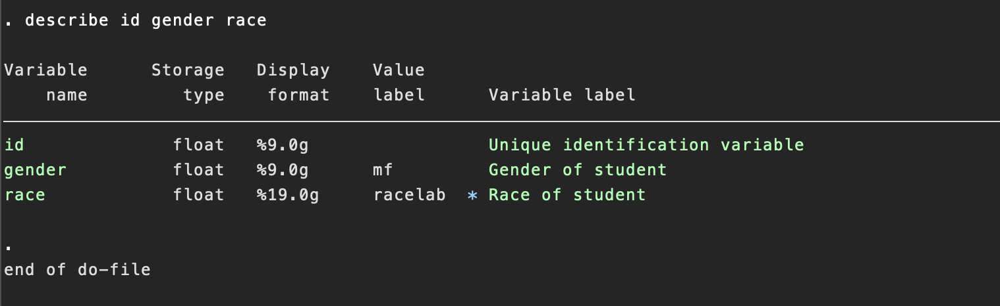

The `codebook` commands allows you to more deeply inspect the dataset, producing an electronic codebook for your dataset. You can type `codebook`, and it provides such information for all the variables in the dataset.

```
codebook
```

> (output omitted)

If you specify one or more variabes, the codebook information is limited to just the variables you specify. For example, the `codebook` command below shows codebook information for the `race` variable. This output shows us that the race ranges from `1 to 5`, it has five unique value, and none of its value are missing. The ouput also shows a tabulation of the values of `race` and the `labels associated with those values(that is, value labels)`

```
codebook race
```

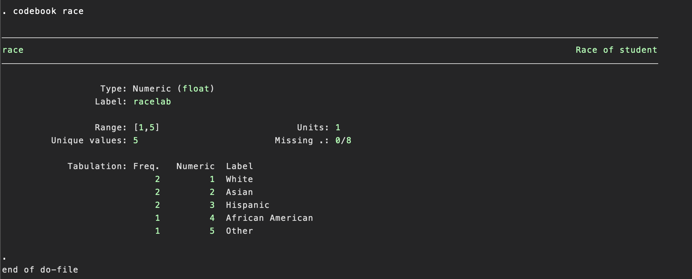

Adding the `notes` option to the codebook command show notes associated with a variable, as shown below. The variable `havechild` has three notes (comments) attached to it.

```
codebook havechild, notes
```

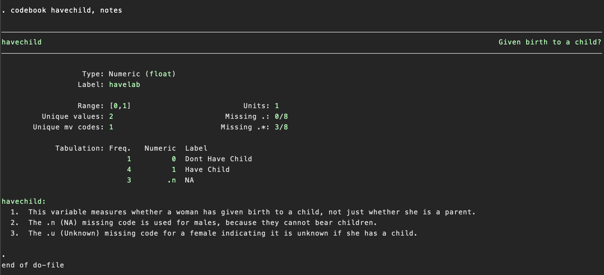

The `mv`(missing values) options shows information about whether the missing values on a particular variable are always associated with missingness on other variables.

The notation at the bottom of the output below indicates that whenever `havechild` is missing, the variable `ksex` is also always missing. Likewise whenever `kbday` is missing `ksex` is also missing.

This is useful for understanding patterns of missing values within you datase.

```
codebook ksex, mv
```

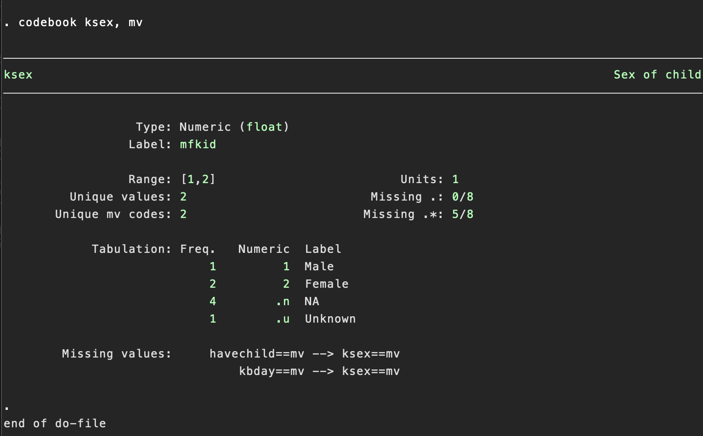

So far, all the information in the variable labels and value labels has appeared in English. Stata supports labels in multiple languanges. As the `label language` command shows, this dataset contains labels in two languaes: `en(English) and de(German)`

```
label language
```

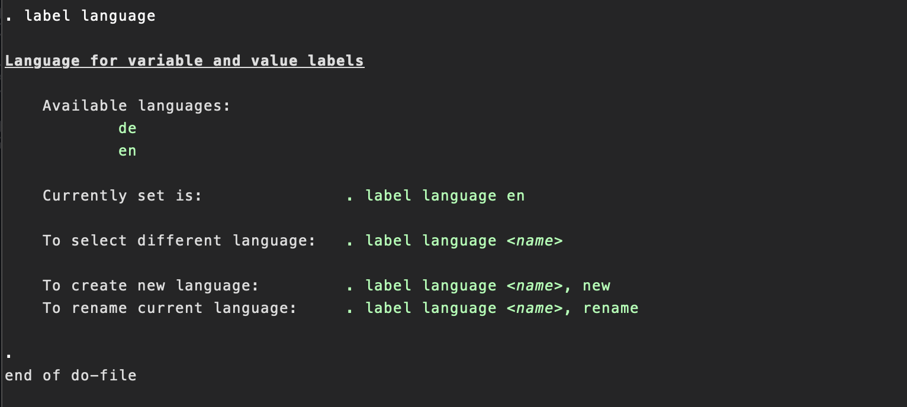

After using the `label language de` command, variable labels and value labels are then displayed using German, as illustrated using the `codebook` command.

```
label language de
codebook ksex
```

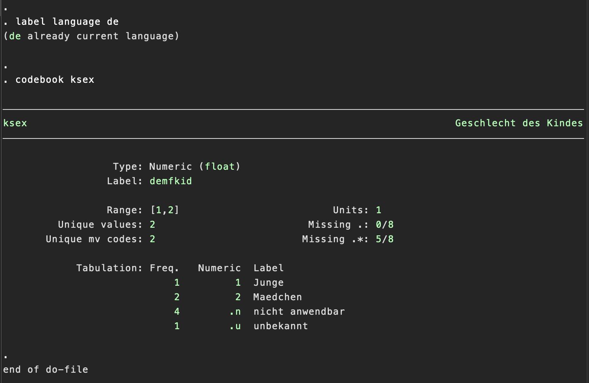

The `label language en` command returns us to English labels

```
label language en
```

The `lookfor` command allows us to search the current dataset for keywords. Pretend that our dataset is very large and we want to find the variable designating the birthday of the student.

The `lookfor birth` commandasks Stata to search the variables names and labels for any instance of the word `birth`.

Note that the searches are case insensitive, so the prior search would match, for example, `Birth or BIRTH`

```
lookfor birth
```


In this case, it found three variables, each of which included `birth` in the variable label. Had there been a variable named `birthday` or `dateofbirth`, such variables would have also been included in the list.

We can also search comments(notes) within the dataset using the `notes search` command

```
notes search birth
```

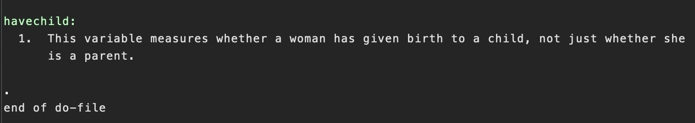

This command found a note associated with `havechild` that had the word `birth` in it.

This seaction has illustrated what a labelled dataset looks like and some of the benefits of having such a labeled dataset.

The rest of this chapter shows how to actually create a labelled dataset.

The following sections illustrates how to label the variables, label the values, label the values with different languages, add notes to the dataset, and format the display of variables.

### 5.3 Labelling variables

This section shows how you can assign `labels to your variables` and assign a `label to the overall dataset`.

We will start with a completely unlabelled version of the student survey dataset named `survey1.dta`.

```
use survey1
```

Using the `describe` command shows that this dataset has no labels, including no labels for the variables

```
describe
```

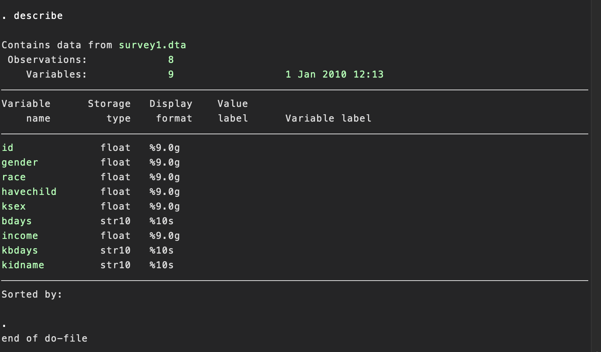

The `label variable` command can be used to assign labels to variabes. This command also provide more descriptive information about each variable. Below, we add variable labels for the variable `id` and gender.

```
label variable id "Identification variable"
label variable gender "Gender of student"
```

The `describe` command shows us the these variables indeed have the labels we assigned to them.

```
describe id gender
```

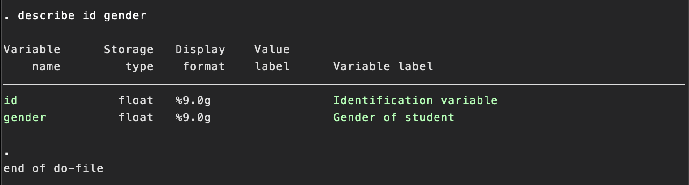

Let's apply to the rest of the variables, as shown below

```
label variable race "Race of student"
label variable havechild "Given birth to a child"
label variable ksex "Sex of child"
label variable bdays "Birthday of student"
label variable income "Income of student"
label variable kbdays "Birthday of child"
label variable kidname "Name of child"
```

Now, all the variables in this dataset are labelled

The `label variable` command can also be used to change a label. Below, we change the label for the `id` variable and show the results.

```
label variable id "Unique Identification variable"

describe id

```

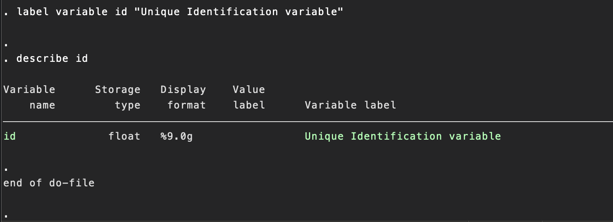

Finally, you can assign a label for the overall dataset with the `label data` command. This label will appear whenever you `use` the dataset

```
label data "Survey of graduate students"
```

We now save the dataset `survey2.dta` for use in the next section

```
save survey2, replace
```

For more information about labelling variables, see `help label`. The next section illustrates how to create and apply value labels to the variables

### 5.4 Labelling values

This section shows how we can assign labels to the values of our variables. Sometimes, variables are coded with values that have no intrinsic meaning, such as `1 meaning male` and `2 meaning female`.

Withoutany labels, we would not know what the meaning of a 1 or a 2 is. Below, we create a label named `mf` (male or female) that associates the value of `1` with `male` and the value of `2` with female.

Once that label is created, we then associate the gender variable with the value label `mf`.

```
use survey2.dta, clear
label define mf 1 'Male' 2 'Female'
label value gender mf
```

The `codebook` shows us that we successfully associate the `gender` variable with the value label `mf`. We can see that 1 is associate with "Male" and 2 is associated with "Female".

```
codebook gender
```

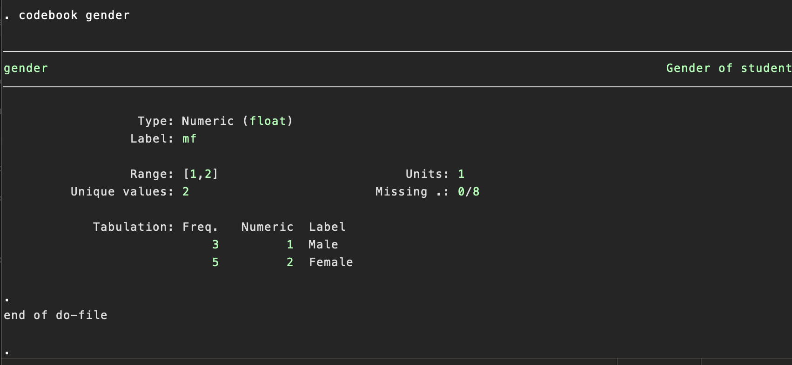

We can use the same strategy to assign labels for the variable `race`. Note how this is two step process. We first create the values label named `racelab` using the `label define` command, and then we use `label values` command, and then we use the `label values` command to say that `race` should use the value label named `racelab` to the values.

```
label define racelab 1 "White" 2 "Asian" 3 "Hispanic" 4 "Black"
label value race racelab
```

The Value 5 is not labeled for `race`. That should labeled "Other". Using the `add` option, we add the label for this value below.

```
label define racelab 5 "Other", add
codebook race
```

Say that we would prefer to label category 4 as "African American". We cn use `modify` option to modify an existing label.

```
label define racelab 4 "African Amerian", modify
codebook
```

Let's have a look at the output produced by the `tabulate race` command
tabulate race

```
tabulate race
```

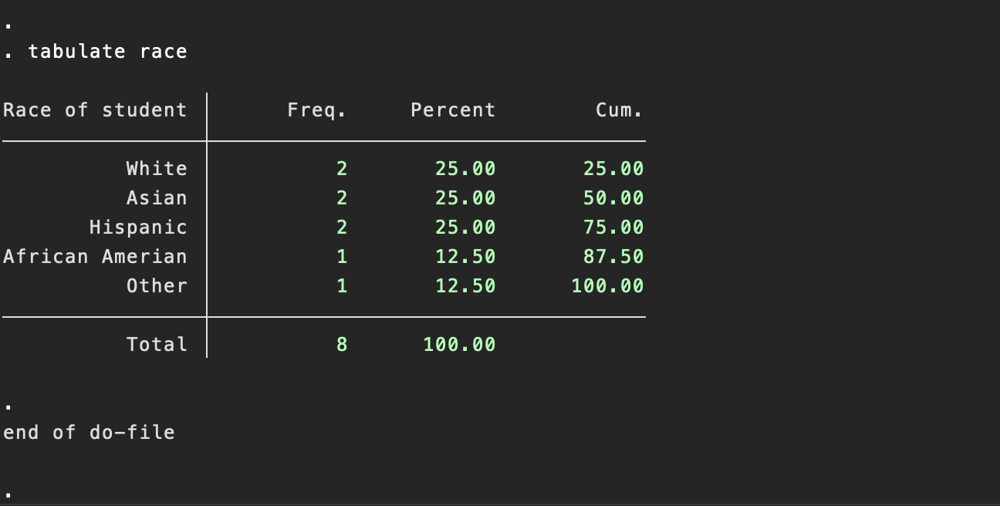

The `tabulate` command shows only the labels (but not the value) of `race`. Earlier in this section, we labeled the `race` variable using the value label `racelab`. We can disply the values and labels for `racelab` using the `label list` command.

```
label list racelab
```

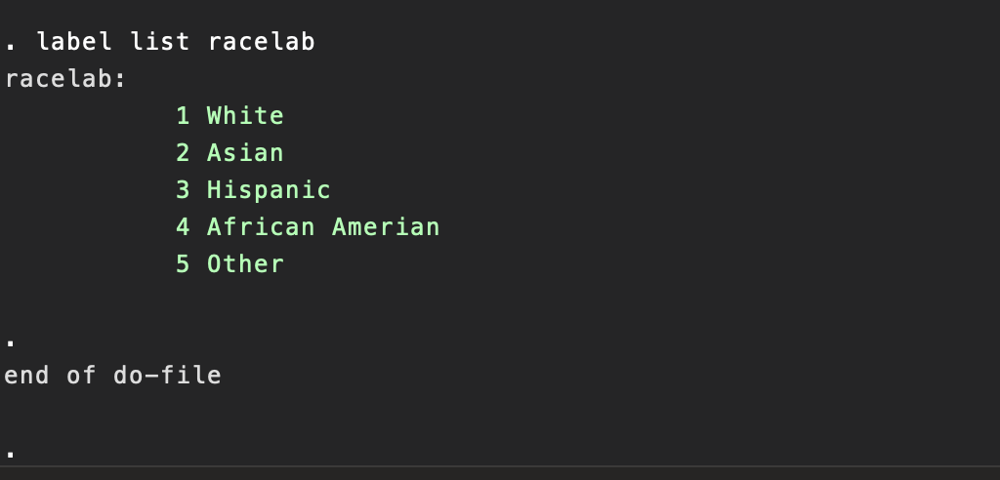

We could manually alter these labels to insert the numeric value as a prefix in front of each label(for example, 1. White, 2. Asian). Stata offers a convenience command called `numlabel` to insert these numeric values. The `numlabel` command below takes the value label `racelab` and adds the numeric value infront of each of the labels.

```
numlabel racelab, add
label list racelab
```

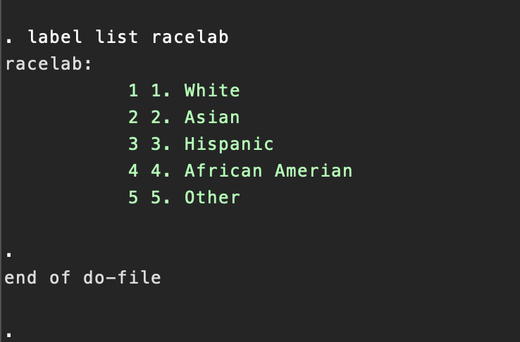

Now when we issue the `tabulate race` command, the values and labels are shown for each level of race

```
tabulate race
```

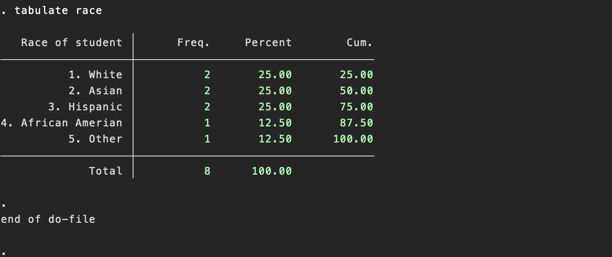

This also applies to the `list` command. Below, we see that the values and labels for `race` are displayed.list race

```
list race
```

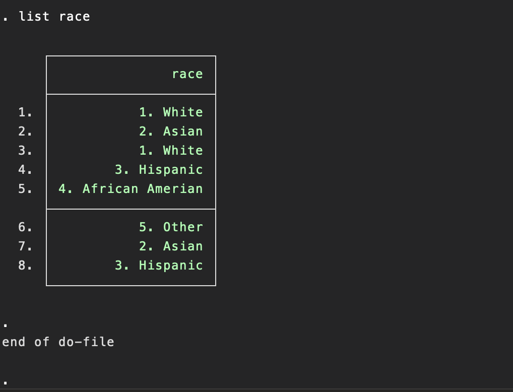

We can remove the numeric prefix from `racelab` with the `numlabel` command with the `remove` option, as shown below. Then, the `label list` command shows the numeric values have been removed from the labels defind by `racelab`

```
numlabel racelab, remove
labe list racelab
```

We use the `mask("#=")` option below to specify a mask for combining the values and the labels for variables labeled by `mf`.Note how this impacts the tabulation of `gender`.

```
numlabel mf, add mask("#=")
tabulate gender
```

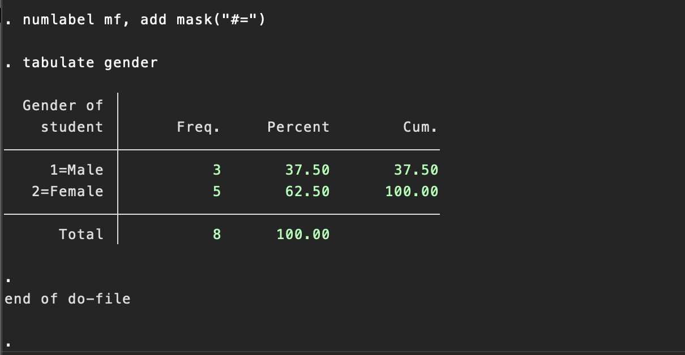

We can remove the mask in much the same way that we added it but by specifying the `remove` option, as shown below.

```
numlabel mf, remove mask("#=")
tabulate gender
```

Let's add a different mask but apply this to all the value labels in the dataset. Because no specific value labe was specified in the `numlabel` command below, it applies the command to all the value labels in the current dataset

```
numlabel, add mask("# ")
```

Now, all the variables with value labels shows the numberic value followed by a close parenthesis and then the label (for example, `1 Male`). We can see this by tabulating all the variables that have values labels, namely, gender, reace, havechild, and ksex.

```
tab1 gender race
```

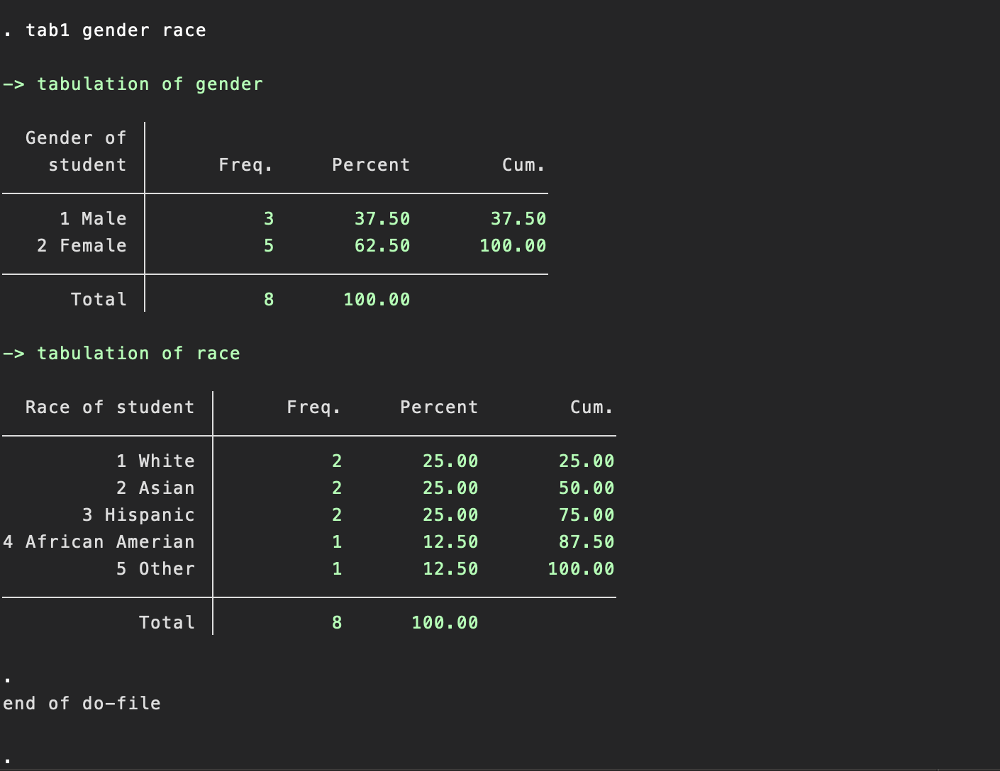

We now save the dataset as `survey3.dta` for use in the next section.

```
save survey3,replace
```

### 5.5 Labelling utilities

Having created some value labels, let's explore some of the utility programs that Stata have for managing them.

Using `survey3.dta`, we use the `label dir` command to show a list of the value labels defined in that dataset.

This shows us the four value labels we created in the previous section.

```
use survey3, clear
label dir
```

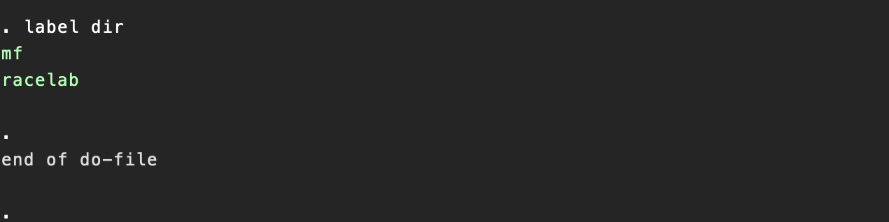

The `label list` command can be used to inspect a value label. Below, we see the labels and values for the value label `mf`.

```
label list mf
```

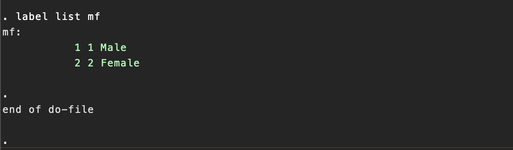

We can list mulitple value labels at once, as shown below:

```
label list havelab recelab
```

If no variables are specified, then all values labels will be listed

```
label list
```

The `label save` command takes the value labels defind in the working dataset and writes a Stata do-file with the `label define` statements to create those value labels.

This can be useful if you have a dataset with value labels that you would like to apply to a different dataset but you do not have the original `label define` commands to create the labels.

```
label save mf racelab using surverylabs
```

The `surverylabs` file will be generated on the same directory of the dofile.

The `labelbook` command provides information about the value labels in th working dataset. The `labelbook` command below shows information about the value label `racelab`. (if we had issued the labelbook command alone, it would have provide information about all the labels in the working dataset)

```
labelbook racelab
```


Notice how three groups of information are in the output, corresponding to the headins `values`, `labels` and `definition`.

The value section tells us that the values range from 1 to 5, with a total of five labels that have no gaps and no missing value.

The label section tell us that the lengths of the labels range from 8 to 19 characters wide, are all unique, and are still unique if truncated to 12 charecters.

By default, the definition section lists all values and labels, but you can use the `list()` option to restrict how many values are listed.

```
labelbook racelab mf, list(0)
```

The value and labels sections are tying to alert you to potential problems in your labels.

If you have many labels, you may tire of reading this detailed output. The `problems` option can be used with labelbook command to summarize the problems found with the labels. In this case, the labels were in good share and there were no problems to report

```
labelbook, problems
```

We can ask for detailed information about the problems found using `detail problems` option

```
labelbook mf2, detail problems
```

Which can use `codebook` command to inspect where the problem begins, to see what happed on the label value example `racelab`

```
codebook race
```

This concludes our exploration of labelling utilities. For more information. see `help label list` and `help labelbook`.

### 5.6 Labelling variables and values in different languages.

Stata supports variables labels and value labels in different languages. We can use the `label language` command to see what languages the dataset currently contains.

```
use survey3, clear
label language
```

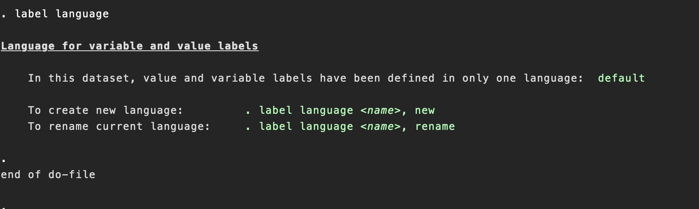

Currently the only language defined is `default`. Let's rename the current language to be `en` English

```
label language en, rename
```

Let's now add German (de) as the new language. This not only creates this new language but also selects it.

```
label language de, new
```

As the `describe` command shows, the variable labels and value labels are empty for this langauge (however, the variable and value labels for the language `en` still exist)

```
describe
```

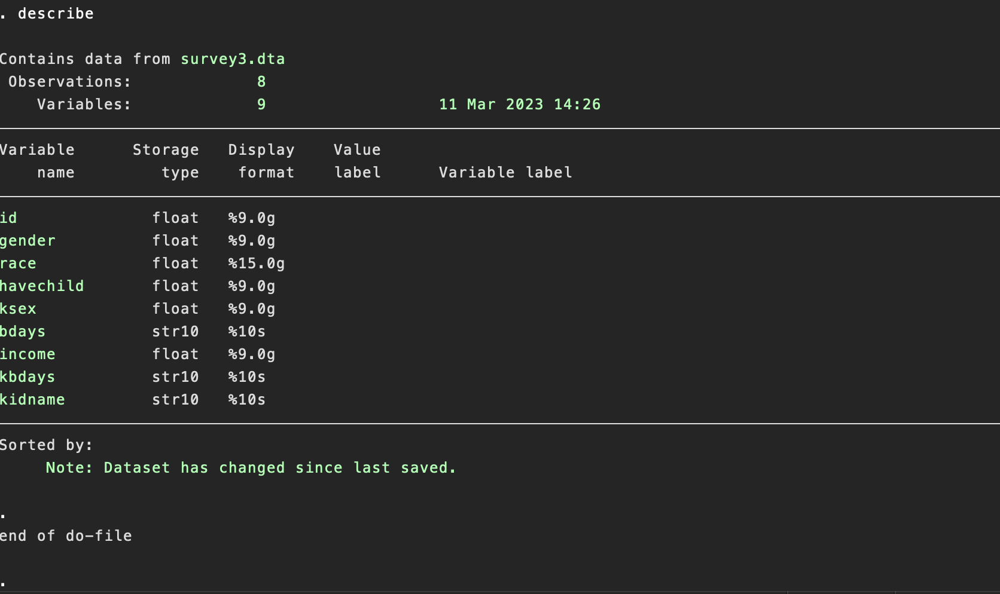

Let's now add German variable labels

```
label variable id "identifikationsvariable"
label variable gender "Geschlecht"
```

The `describe` command shows us that these variables were successfully assigned.

Now, we assign German value labels for the variable `gender`, `race`, `havechild`, and `ksex`.

```
label define def 1 "Mann" 2 "Frau"
label value gender demf
```

The `codebook` command shows us that this was successful.

Below, we make `en` the selected language. We can see that the English language labels are still intact.

```
label language en
describe
```

Let's make a third language named `en` for Spanish

```
label language es, new
```

We are now using `es` language. The `describe` command below shows that in this new language, we have no variable lables or value labels. So we can label the variable and value labels.

Let's switch back to English labels and then delete the Spanish labels from this dataset.

```
label language en
label language es, delete
```

Now, let's save the dataset as `survey4.dta` for ue in the next section. The selected language will be English, but the dataset also includes German.

```
save survey4
```

For more information, see `help label language`.

### 5.7 Adding Comments to your dataset using notes

This section shows how you can add notes to your dataset. We will use `survey4.dta`, which was saved at the end of the previous section.

You can add an overall note to your dataset with the `note` command.

```
use survey4
note: This was based on the dataset called survey1.txt
```

The `notes` command displays notes that are contained in the dataset

```
notes
```

You can use the `note` command to add notes for specific variable as well. This is illustrated below for the variable race.

```
note race: The other category includes people who specified multiple races
```

Now, the `notes` command shows the notes for the overall dataset as well as the notes associated with specific variables.

```
notes
```

We can see just notes for `race` via the `notes race` command

```
notes race
```

Now, the `notes` command shows the notes for the overall dataset as well as the notes associated with specific variables.

We can view the notes for `havechild` and `ksex` like this:

```
notes havechild ksex
```

We can view just the notes for the overall dataset with the `notes _dta` command,

```
notes _dta
```

The second note for `havechild` is not useful, so we remove it with the `notes drop` command. We use the `notes` command to confirm this note was indeed dropped:

```
notes drop havechild in 2
notes havechild
```

We use the `notes renumber` command below to renumber the notes for `havechild`, eliminating the gap in the numbering.

```
notes renumber havechild
notes havechild
```

The `notes search` command allows you to search the contents of the notes. We use it below to show all the notes that contain the text .u.

```
notes search .u
```

We now save the dataset as `survey5.dta` for use in the next section

```
save survey5
```

For more information about `notes`, see `help note`.

### 5.8 Formatting the display of variables

Formats give you control over how variables are displayed. Let's illustrate this using `suvery5.dta`, which we saved at the end of the last section.

The impact of formats is most evident when using the `list` command. Below, we list the variable `income` for the first five observations fo this dataset.

```
use survey5, clear
list id income in 1/5

```

By using the `describe` command, we can see that the `income` variable is currently displayed using the `%9.0g` format. Without going into too many details, this is a general format that displays incomes using a width of nine and decides for us the best way to display the values of `income` within that width.

```
describe income
```

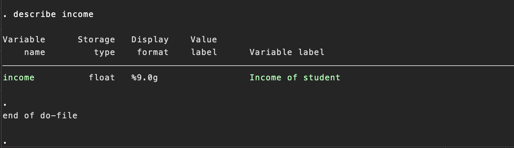

Other formats, such as fixed format, give us more control over the display format. For example, below we use the `%12.2f` format, which display incomes using a fixed format with a maximum width of `12 characters` including the `decimal point`.

Note how observations 3, 4, and 5 now display `income` using 2 descimal places.

```
format income %12.2f
list id income in 1/5
```

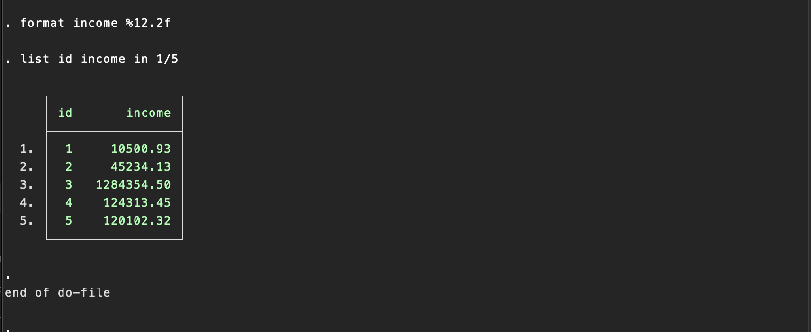

If we format using `%7.0f`, we can view incomes up to a million dollars (seven-digit incomes), and incomes will be rounded to the nearest dollar.

```
format income %7.0f
list id income in 1/5
```

We could disply the income to the nearest dime by specifying a `%9.1f`. Compared with the prior example, we need to increase the width of this format from 7 to 9 (not 7 to 8) to accommodate the decimal point.

```
format income %9.1f
list id income in 1/5
```

For large numbers, it can help to see commas separating each group of three numbers. By adding a `c` to the format, we request that commas be displayed as well. Compared with the prior example, we expanded the overall width from 9 to 11 to accomodate the two commas that are inserted for observation 3.

```
format income %11.1fc
list id income in 1/5
```

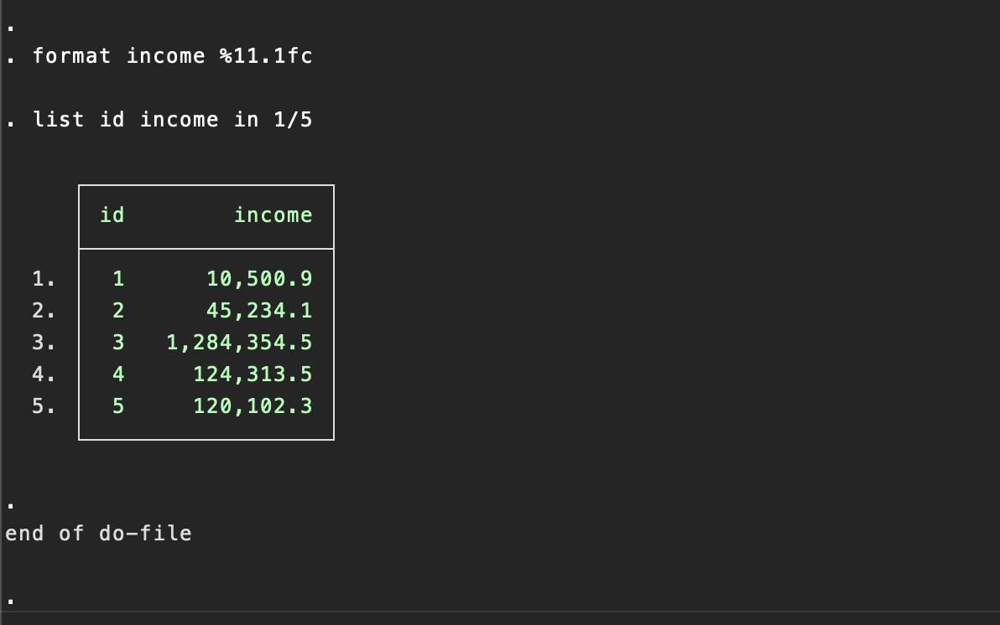

Let's turn our attention to how to control the display of string variables, such as the variable `kidname`. As we see below, the display format for `kidname is %10s`, meaning that it is a string variable displayed with a width of 10.

```
describe kidname
```

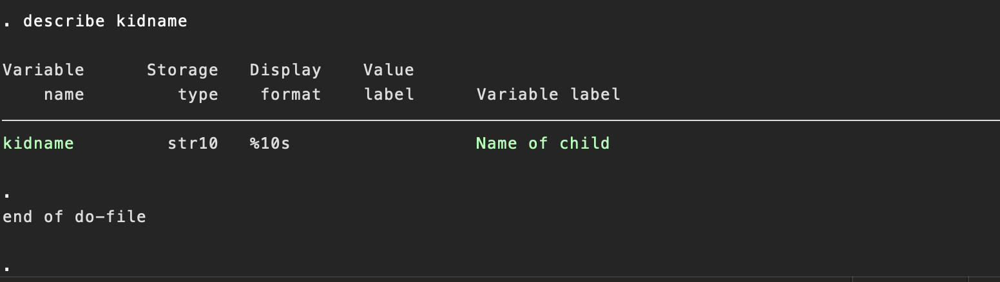

The listing below illustrates that this format displays the names as right-justied

```
list id kidname in 1/5
```

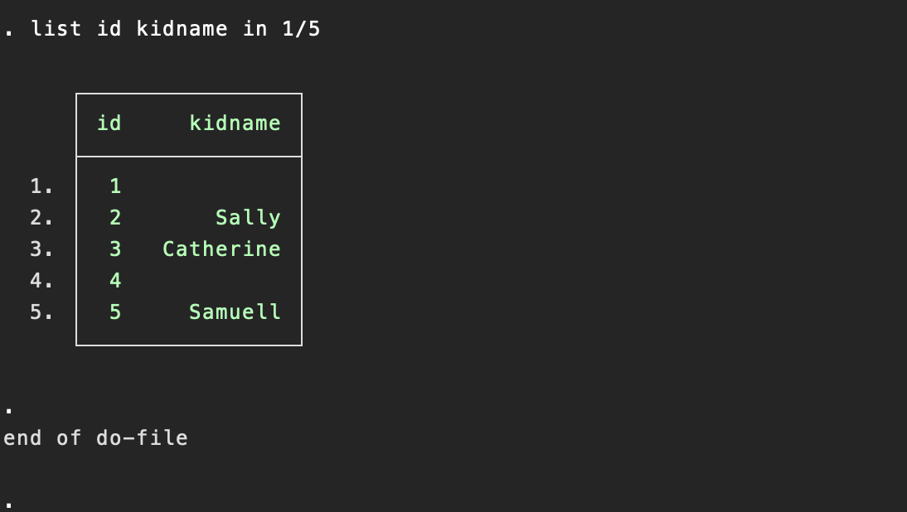

To specify that the variable should be shown as left-justified, you precede the width with a dash. Below, we change the display format for `kidname` to have a width of 10 and to be `left-justified`.

```
format kidname %-10s
describe kidname
list id kidname in 1/5
```

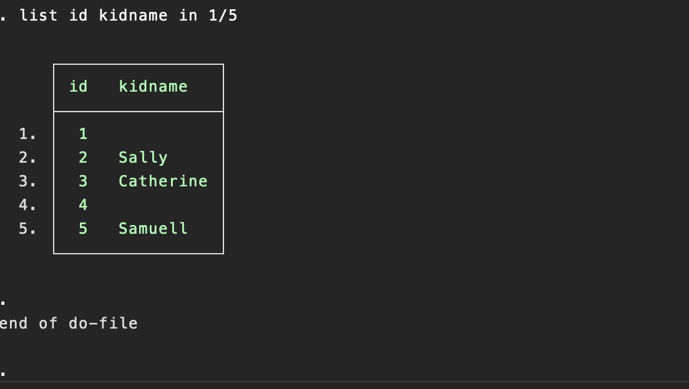

There are many options for the display of date variables. In this dataset, the variables `bdays` and `kbdays` contain the birth date of the mother and the child, but they are currently stored as string variables.

First, we need to convert these variables into date variabale, as shown below.

generate bday = date(bdays,"MDY")
generate kbday = date(kbdays, "MDY")

list id bdays bday kbdays kbday in 1/5

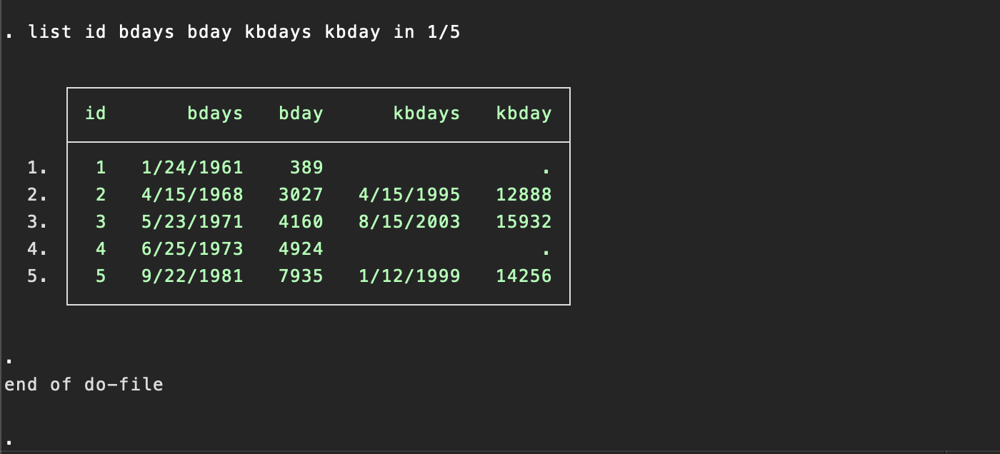

The conversion would appear faulty because the values for `bday` and `kbday` do not appear correct, but they are.

Date variables are stored as and, by default, are displayed as the number of days since January 1, 1960.

Below, we request that the dates be displayed using a general date format named `%td`. Now, the dates appear as we would expect.

```
format bday kbday %td
list id bdays bday kbdays kbday in 1/5

```


Stata supports many customs ways to display dates. For example, below we specify that `bday` should be displayed with the format `%tdNN/DD/YY`.

This format displays the variable as a date with the numeric month followed by as slash, then the numberic day followed by a slash, and then the two digit year. This yields, for example, `01/24/61`

```
format bday %tdNN/DD/YY
list id bdays bday in 1/5
```

Below, we change the display format of `kbday` to `%tdMonth_DD, CCYY`.

This format displays the name of the month followed by a space (indicated with the underscore), then the numeric day followed by a comma, and then the two-digit century (for example, 19 or 20) followed by the two-digit year. This yields for example, `Augus 22, 1983`.

```
format kbday %tdMonth_DD, CCYY
list id kbdays kbday in 1/5
```

The example in this section focused on how the `format` command can be used to control the display of variables with the `list` command.

Note that the `format` command can be also be used to control the exported value of variable when exporting delimited dataset via the `export delimited` command

This concludes this section on formating variable. For more information, see `help format`.

### 5.9 Changing the order of variables in a dataset

`survey6.dta` is well labelled, but the variable are unordered.

If you look at the output of the `describe` command below, you can see that the information about the graduate student being surveyed is intermixed with information about that student's child.

```
use survey6, clear
describe
```

Datasets often have natural groupings of variables. The clarity of the dataset is improved when related variables are positioned next to each other in the dataset. The `order` command below specifies the order in which we want the variables to appear in the dataset.

The command indicates that the variable `id` should be first, followed by `gender`, `race`, `bday`, `income` and then `havechild`. Any remaining variables (which happen to be the child variables) will follow `havechild` in the order in which they currently appear in the dataset.

```
order id gender race bday income havechild
describe
```

> The variable will be ordered as specified order.

This ordering is pretty good, except that it would be nice for the list of child variable to start with `kidname` insted of `ksex`. The `order` command below is used to move `kidname` before `ksex`. (we could get the same result by specifyng after (havechild) instead of before (ksex))

```
order kidname, before(ksex)
describe
```

Now, the variables are organized in a more natural fashion, and it is pretty easy to see this natural ordering. However, with datasets containing more variables, it can be harder to see the groupings of the variables. In such cases, I like to create variable that act as headers to introduce each new grouping of variable.

Below, the variable `STUDENTVARS` and `KIDVARS` are created, and then the `order` command positions them at the begining of their group of variables. Then, I use the `label variable` command to label each variable.

```
generate STUDENTVARS = .
geneerate KIDVARS = .
order STUDENTVARS, before(gender)
order KIDVARS, before (kidname)
label variabe STUDENTVARS "STUDENT VARIABLES ================"
label variable KIDVARS "KID VARIABLES ============"
```

> Tip! generate and order in one step

The `generate` command offers options for specifiying the position of the variable in the dataset. For example, the `generate` command shown below create the variable `STUDENTVARS` and uses the `before(gender)` option to position that variable before gender

```
generate STUDENTVARS = ., before(gender)
```

You can instead use the `after()` option. For example, the `generate` command shown below creates the variable `KIDVARS` and uses the `after(havechild)` option to position that variable after `havechild`.

generate KIDVARS = ., after(havechild)

### Chapter 6 | Creating Variables

> Not everything that can be counted counts, and not everything that counts can be counted. - Albert Einstein

### 6.1 Introduction

This chapter covers many ways that you can create variables in Stata. Start by introducting `generate` and `replace` commands for creating new variables and changing the contents of existing variable (section 6.2)

The next two sections describes how you can use `numeric expressions` and `functions` when creating variables (section 6.3) and how you can use `string expressions` and `functions` when creating variables (see section 6.4). Section 6.5 illustrates tools to `recode variables`.

Tools for coding missing values are illustrated in secton 6.6, which followed by a discussion of dummy variables and the broader issue of factor variable (see section 6.7). Section 6.8 covers creating and using date variables, and section 6.9 covers creating and using date and time variables.

The next three section illustrate the use of `egen` command for computations across variables within each observations (section 6.10), for computations across observations (section 6.11) and for additional functions (section 6.12)

`Methods for converting string variables` to `numeric variables` are illustrated in section 6.13, and section 6.14 shows how `numeric variable` can be converted to `string variables`.

The chapter concluedes with section 6.15, which illustrates how to `rename` and `order` variables.

### 6.2 Creating and changing variables

The two most common commands used for creating and modifying variables are the `generate` and `replace` commands.

These commands, are identical except that `generate` creates a new variable, while `replace` alters the value of an existing variable.

I illustrate these two commands using `wws2.dta`, which contains demographic and labor force information regarding 2,246 women.

Consider the variable `wage`, which contains the woman's hourly wages. This variables is summarized below. It has two missing values (the N = 2244)

```
use ww2
summarize wage
```

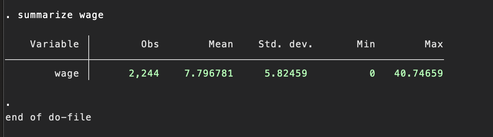

Say that we want to compute a weekly wage for these women based on 40-hour work week. We use the `generate` command to create the new variable, called `wageweek`, which contain the value of `wage` multiplied by 40.

```
generate wageweek = wage *
//output: 2 missing values generated
```

```
summarize wageweek
```

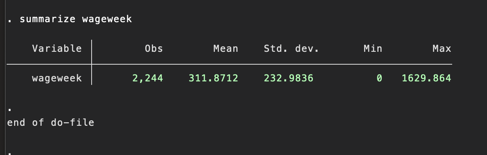

This dataset also contains a variable named `hours`, which is the typical number of hours the woman works per week. Let's create `wageweek` again but use `hours`in place of 40. Because `wageweek` already exists, we must use the `replace` command to indicates that we want to replace the contents of exisiting variable. Note that bacause hours has 4 missing observations, the `wageweek` variable now has 4 additional mission observations, having only `2,240` valid observations instead of `2,244`.

```
replace wageweek = wage * hours
//output: 1,152 real changes made, 4 to missing
```

```
summarize wageweek
```

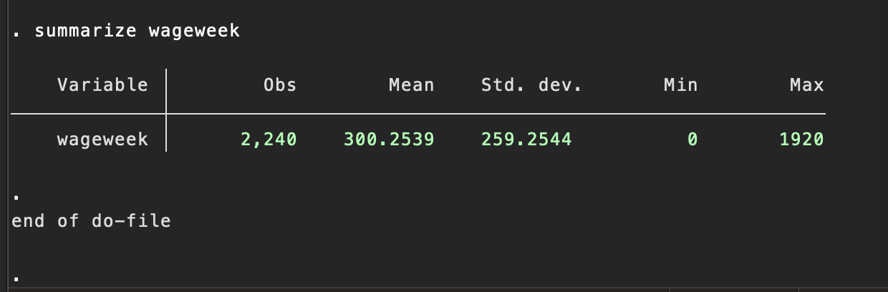

> Tip ! Ordering variables with the generate command

When creating a new variable using the `generate` command, you can use the `before()` or `after()` option to specify where the new variable will be positioned withing the dataset. For example, we could have used the `generate` command as follows to create `wageweek`, positioning it after the variable wage:

```
generate wageweek = wage * 40, after(wage)
```

The `generate` and `replace` commands can be used together when a variable takes multiple steps to create. Consider the variable `married` (which is 1 if the woman is currently married and 0 otherwise) and `nevermarried` (which is 1 if she was never married and 0 if she married or was previously married). We can place the women into three groups based on the cross tabulation of these two variables

```
tabulate married nevermarried
```


Say that we want to create a variable that reflects whether a woman is 1) single and nevermarried (`n=234`), 2) currently married (`n=1440`) or 3) single but previously married (`n=570`).

Those who are (nonsensically) currently married and have never been married (`n=2`) will be assigned a value of missing. This can be done as shown below.

The first `generate` command creates the variable `smd` (for single, married or divorced or widowed) and assigns a value of 1 if the woman meets the criteria for being single (and never married)

```
generate smd = 1 if (married == 0) & (nevermarried == 1)
//output: (2,012 missing values generated)
```

The `replace` command assigns a value of 2 if the woman meets the criteria for being currently married.

```
replace smd = 2 if (married == 1) & (nevermarried == 0)
//output:(1,440 real changes made)
```

The second `replace` command assigns a value of 3 if the woman meets the criteria for being divorced or windowed.

```
replace smd = 3 if (married == 0) & (nevermarried == 0)
//output: (570 real changes made)
```

The third `replace` command is superfluos but clearly shows that `smd` is missing for those nonsense cases where the woman is currently married and has never been married. (For more information about tthe use of `if` see stion A.8)

```
replace smd = . if (married == 1) & (nevermarried == 1)
//output: (0 real changes made)
```

The below means, hours not missing `!missing(hours). Withous the second qualifier, people who had missing data on hours would be treated as through they had worked over 40 hours (because missing values are treated as positive infinity)

```
replace over40hours = 1 if (hours > 40) & !missing(hours)
```

### 6.3 Numeric expressions and functions.

In the previous section, we used the `generate` and `replace` commands on simple expression, such as creating new variable that equal `wage*40`. This section illustrates more complex expression and some useful functions that can be used with the `generate` and `replace` command.

Stata supports the standard mathematical operators of addition(+), substration(-), multiplication(\*), division(/), and exponentional (^) using the standard rules of the order of operators.

Parentheses can be used to override the standard order of operators or to provide clarity. I illustrate these operators below to create a nonsense variable named `nonsense` using ww2.dta

```
use wws2, clear
generate nonsense = (age*2 + 10)^2  - (grade/10)
//output: (4 missing values generated)
```

Stata also has many mathematical functions that you can include in your `generate` and `replace` commands. The example below illustrate `int()` function (which removes any value after the decimal place), `round()` function (which rounds a number to the desired number of decimal places), the `ln()` function (which yield the natural log), the `log10()` function (which computes the base-10 logarithm), the `sqrt()` (which computes the square root).

```
. generate intwage = int(wage)
//(2 missing values generated)

. generate rndwage = round(wage,1)
//(2 missing values generated)

. generate lnwage = ln(wage)
(3 missing values generated)

. generate logwage = log10(wage)
//(3 missing values generated)

. generate sqrtwage = sqrt(wage)
//(2 missing values generated)

. list wage intwage rndwage lnwage logwage sqrtwage in 1/5

```

Stata has many functions for creating random variable. For example, you can use the `runiform()` (random uniform) function to create a variable with a random number ranging from 0 to 1.

Below , I set the see of the random function generator to a number picked from thin air, and then I use the `generate` command to create a new variable, `r`, that a random number between 0 and 1

```
set seed 83271
generate r = runiform()
summarize r
```

The `rnormal()` (random normal) function allow us to drwa random value from a normal distribution with a mean of 0 and a standard deviation of 1, as illustrated below with the variable `randz`. The variable `randiq` is created, drown form a normal distribution with a mean of 100 and standard deviation of 15 (which is the same distribution as some IQ tests).

```
generate randz = rnormal()
generate randiq = rnormal(100,15)
summarize randz randiq
```

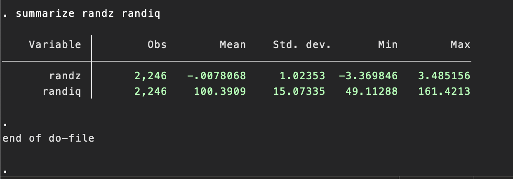

You can even use `rchi2` (random chi-square) function to create a variable represention a random value from a chi-squared distribution. For example, below I create `randchi2`, which draws random values from a chi-squared distribution with 5 degree of freedom.

```
generate randchi2 = rchi2(5)
summarize randchi2
```

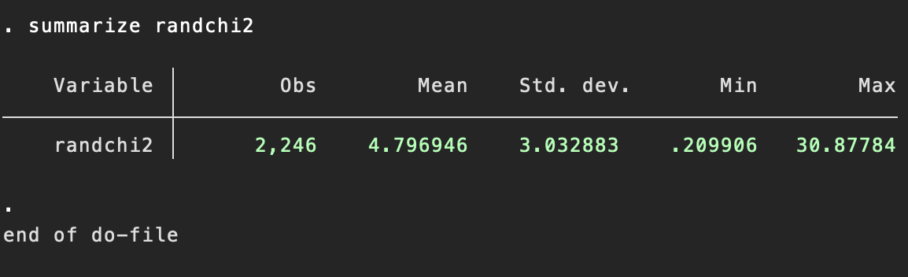

This section has illustrated just a handful of the numeric function that are available in Stata.

> Setting the seed guarantees that we get the same series of random numbers every time we run the commands, making result that use roandom numbers reproducible.

### 6.4 String expression and functions

The previous section focused on numeric expressions and functions, while this section focuses on string expressions and functions.

We will use `authors.dta` to illustrate string functions (shown below)

```
use authors
format name %-17s
list
```

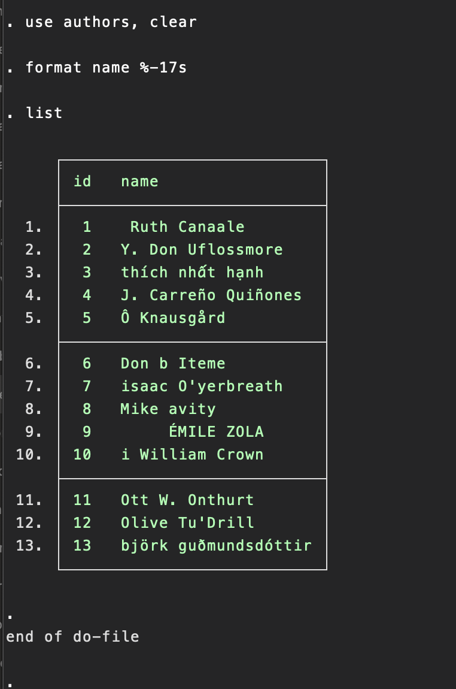

Note how the names have some errors and inconsistencies; for example, there is an extra space before Ruth's name. Sometimes, the first letter or inital is in lowercase, and sometimes, periods are omitted after intials.

By cleaning up these names, we can see how to work with string expression and function in Stata.

There are inconsistencies in the capitalization of the author's names. Below, I use the `ustrtitle() function` to `titlecase` the names (that is, make the first letter of each word in uppercase).

This uses Unicode definitions of what constitues a word. I use the `ustrlower()` and `ustrupper()` functions to convert the names into all lowercase and all uppercase, respectively, according to unicode rules of capitalization.

```
generate name2 = ustrtitle(name)
generate lowname = ustrlower(name)
generate upname = ustrupper(name)
format name2 lowname upname %-23s
list name2 lowname upname
```

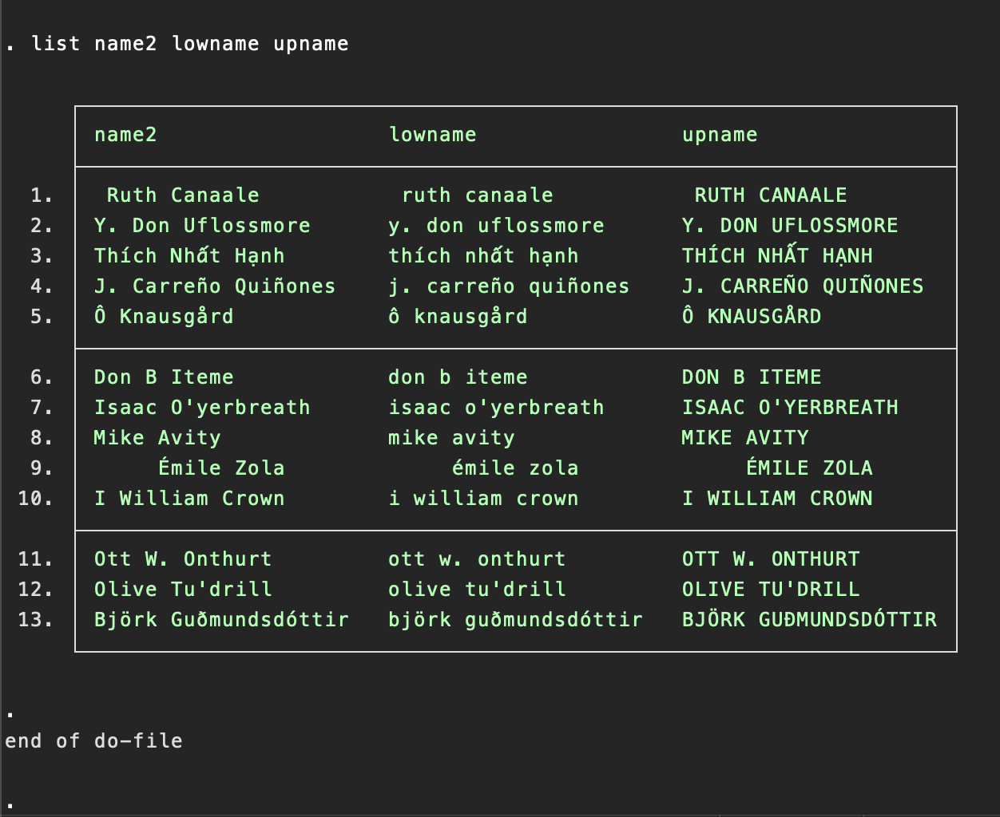

We can trim off the leading blanks, like the one in front of Ruth's name, using ustrltrim() function, like this:

```
generate name3 = ustrltrim(name2)
```

To see the result of `ustrltrim() function`, we need to left-justify name2 and name3 before we list results

```
format name2 name3 %-17s
list name name2 name3
```

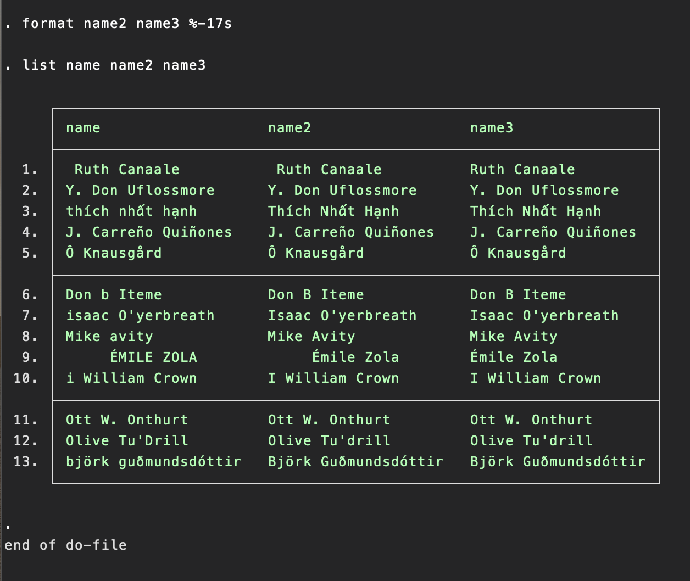

Let's identify the names that start with an initial rather than with a full first name. When you look at those names, their second character is either a period or space.

We need a way to extract a piece of name, starting with the second character and extracting that one character. The `usubstr() function` used with the `generate` command below does exactly this, creating the variable `secondchar`. Then, the value of `firstinit` gets the value of the logical expression that tests if `secondchar` is a space or a period, yielding a `1` if this expression is true and `0` if false.

```
generate secondchar = usubstr(name3,2,2)
generate firstinit = (secondchar == " " | secondchar = ".") if !missing(seconchar)
list name3 secondchar firstinit, abb(20)
```

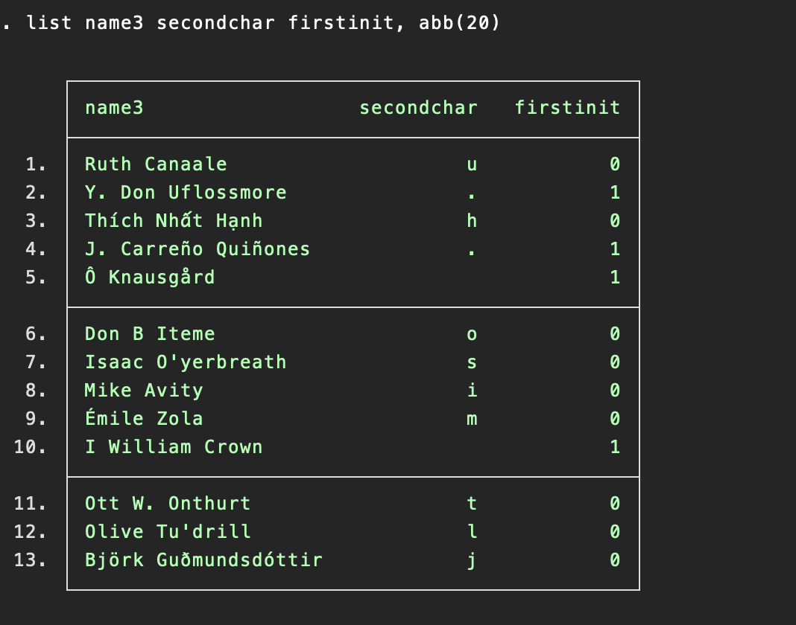

We might want to take the full name and break it up into first, middle, and last names. Because some of the authors have only two names, we first need to count the number of names. The Unicode-aware version of this function is called `ustrwordcount()`. This is used to count the nuber of names, using the word boundary rules of Unicode strings.

```
generate namecnt = ustrwordcount(name3)
list name3 namecnt
```

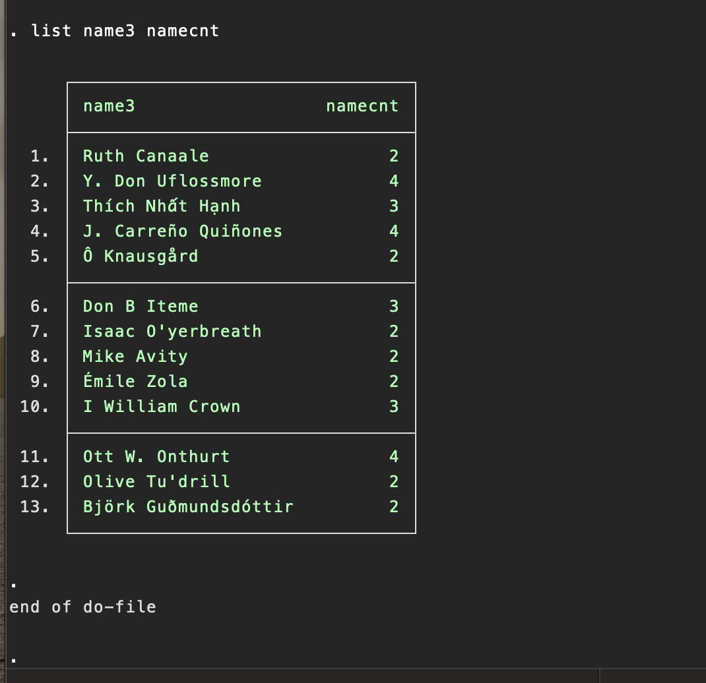

Note how the `ustrwordcount()` function reports four word in the name of the second author. To help understand this better, I use the `ustrword()` function to extract the first, second, third and fourth word from name. These are called `uname1`, `uname2`, `uname3` and `uname4`. The `list` command then shows the full name along with the first, second, third and fourth word of the name.

```
generate uname1 = ustrword(name3,1)
generate uname2 = ustrword(name3,2)
generate uname3 = ustrword(name3,3)
generate uname4 = ustrword(name3,4)

list name3 uname1 uname2 uname3 uname4
```

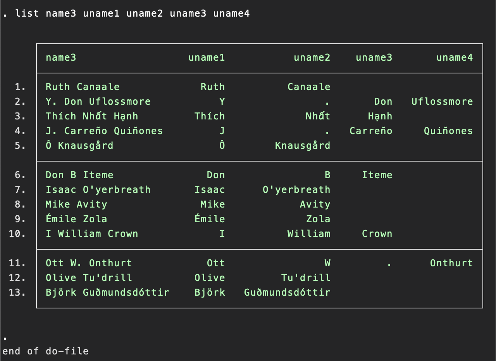

Now, it is clear why author 2 is counted as having four words in the name. According to the Unicode word-boundary rules, the single period is being counted as a separate word.

To handle this, I am going to create a new variable named `name4`, where the `.` has been removed from `name3`. The output of the `list` command below confirms that `name4` is the same as `name3` except for the removal of the period from the name.

```
generate name4 = usubinstr(name3, ".","",.)
list name 3 name4
```

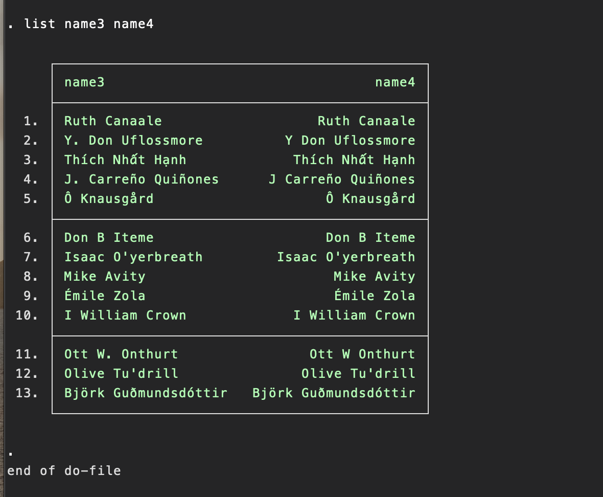

Now, I am going to use the `replace` command to create a new version of `namecnt` that counts the number of words in this new version of name, `name4`

```
replace namecnt = ustrwordcount(name4)
list name4 namecnt
```

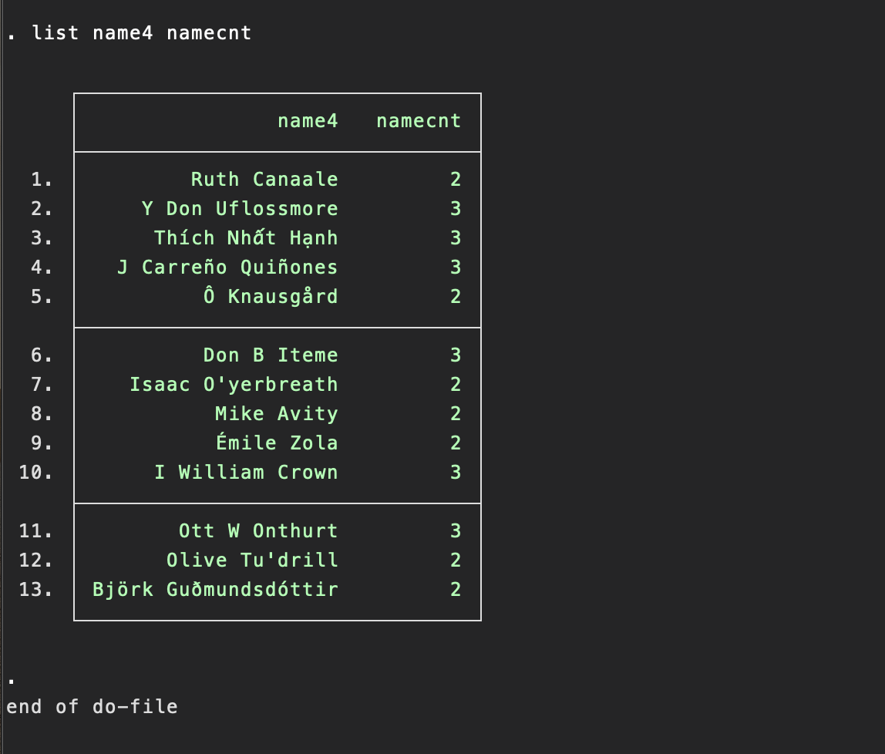

The count of the number of names matches what I would expect.

Now, we can splict `name4` into first, middle, and last names using the `ustrword()` function. The first name is the first word shown in `name4` (that is, `ustrword(name4,1)`). The second name is the second word if there are three words in `name4` (that is, `ustrword(name4,2) if namecnt == 3`). The last name is based on the number of names the dentist has (that is, `ustrword(name4,namecnt)`)

```
generate fname = ustrword(name4,1)
generate mname = ustrword(name4,2) if namecnt == 3
generate lname = ustrword(name4,namecnt)
```

Now, I format the first, middle, and last names using a width of 15 with left-justification and then list the first, middle, and last names:

```
format fname mname lname %-15s
list name4 fname mname lname
```

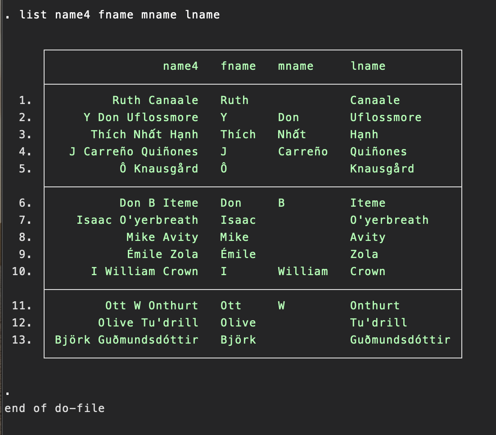

If you look at the values of `fname` and `mname` above, you can see that some of the names are composed of one initial. In every instance, the initial does not have a period after it(because we removed it).

Let's make all the initial have a period after them. In the first `replace` command below, the `ustrlen()` function is used to identify observation where the first name is one character. In such instances, the `fname` variable is replaced with the `fname` with a period appended to it (showing that the plus sign can be used to combine strings together). The same strategy is applied to the middle names in the next `replace` command.

```
replace fname = fname + "." if ustrlen(fname) == 1
replace mname = mname + "." if ustrlen(mname) == 1
```

Below, we see that the first and middle names always have a period after them if they are one initial.

```
list fname mname
```

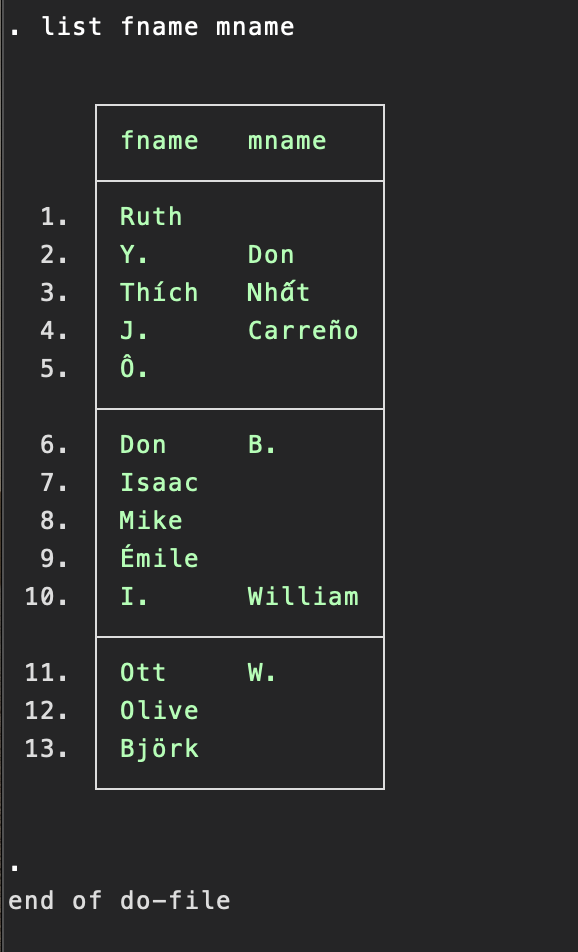

Now that we have repaired the first and middle names, we can join the first, middle, and last names together to form a full name. I then use the `format` command to left-justify the full name.

```
generate fullname = fname + " " + lname if namecnt == 2
replace fullname = fname + " " + mname + " " + lname if namecnt == 3
format fullname %-30s
```

The output of the `list` command below displays the first, middle and last names as well as the full name

```
list fname mname lname fullname
```


The output of the `list` command below shows only the original name and the version of the name we cleaned up.

```
list name fullname
```

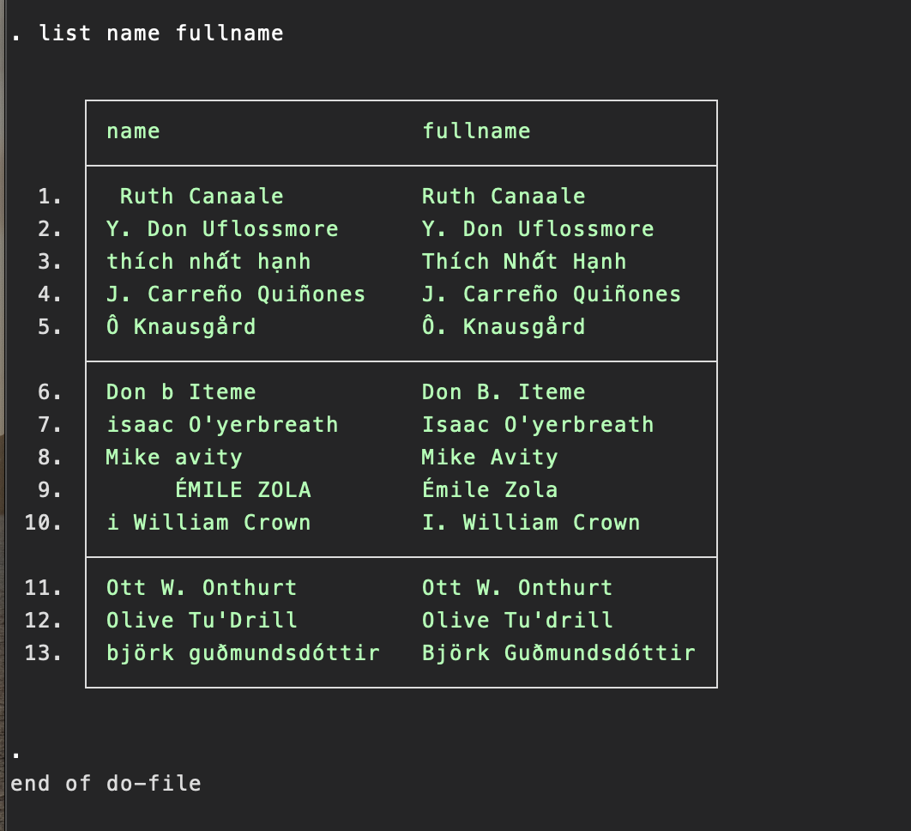

> For more information about string functions and unicode

```
help string functions
help unicode
```

> Tip ! Long strings
> Do you work with datasets with long strings? Stata has a special string variable type called `strL` (pronounced `sturl`). This variable type can be more frugal than a standard string variable, and it can hold large strings, up to 2-billion bytes.

### 6.5 Recoding

Sometimes you want to recode the values of an existing variable to make a new variable, mapping the existing values for the existing variable to new values for new variable. For example consider the variable `occupation` from `ww2lab.dta`.

```
use ww2lab
codebook occupaton, tabulate(20)
```

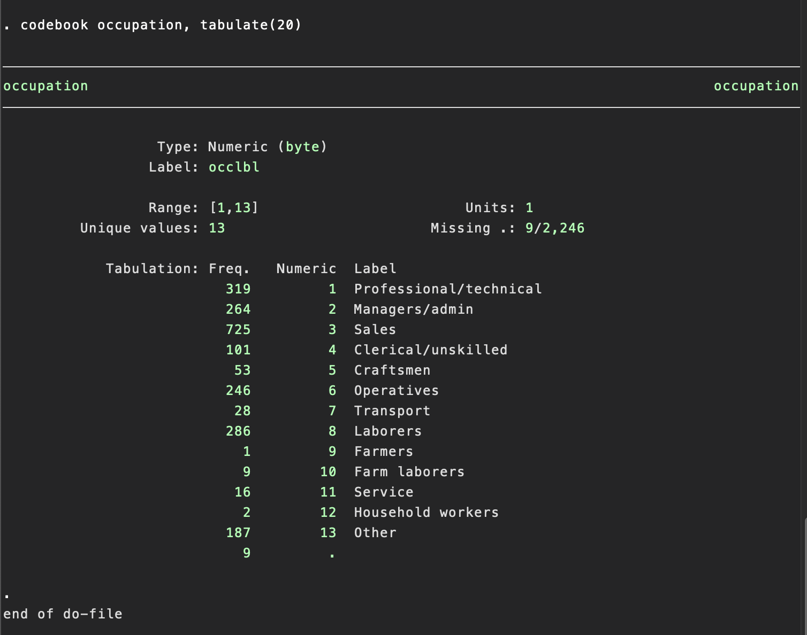

Let's recode `occupation` into three categories: white collar, blue collar and other. Say that we decide that occupations 1-3 will be whilte collar, 5-8 will be blue collar, and 4 and 9-13 will be other. We recode the variable below, creating a new variable called `occ3`.

```
recode occupation (1/3=1) (5/8=2) (4 9/13=3), generate(occ3)
//Expected output: (1918 differences between occupation and occ3)
```

We use the `table` command to double check that the variable `occ` was properly recoded into `occ3`

```
table occupation occ3
```

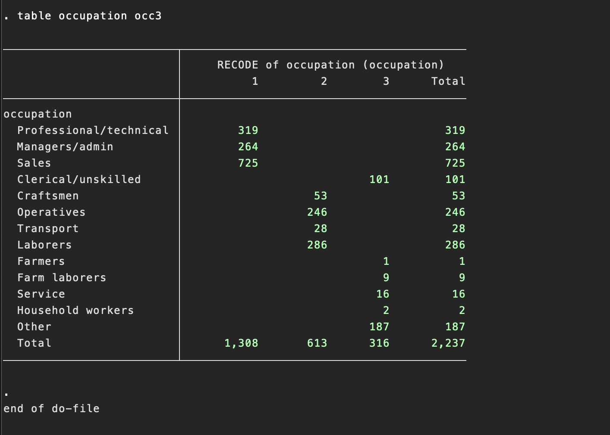

This is pretty handy, but it would be nice if the values of `occ3` were labelled. Although we could use the `label define` and `label values` commands to label the values of `occ3` ( as illustrated in section 5.4), the example below shows a shortcut that labels the valus as part of the recoding process. Value labels are given after the new values in the `recode` command. (Continuation comments are used to make this long command more readable; see section A.4 for more information)

```
drop occ3
recode occupation (1/3=1 "White Collar") (5/8=2 "Blue Collar") (4 9/13=3 "Other"), generate(occ3)
labe variable occ3 "Occupation in 3 groups"
table occupation occ3

```

The `recode` command can also be useful when applied to continuous variable. Say that we wanted to recode the woman's hourly (wage) into four categories using the following rules: `0 up to 10` would be coded 1, `over 10 to 20` would be coded 2, `over 20 to 30` would be coded 3, and `over 30` would be coded 4. We can do this as shown below. When you specify `recode #1/#2`, all values between `#1 and #2`, including the boundaries `#1 and #2` are included. So when we specify `recode wage (0/10=1) (10/20=2)`, 10 is included in both of these rules. In such cases, the first rule encountered takes precedence, so 10 is recoded to having a value of 1

```
recode wage (0/10=1 "0 t0 10") (10/20=2 ">10 to 20") (20/30=3 ">20 t0 30") (30/max= 4 ">30 and up"), generate(wage4)
```

We can check this using `tabstat` command below (see section 4.5). The result confirm that `wage4` was created correctly.

For example, for category 2 (over 10 up to 20), minimum is slightly larger than 10 and the maximu is 20

```
tabstat wage, by(wage4) stat(min max)
```

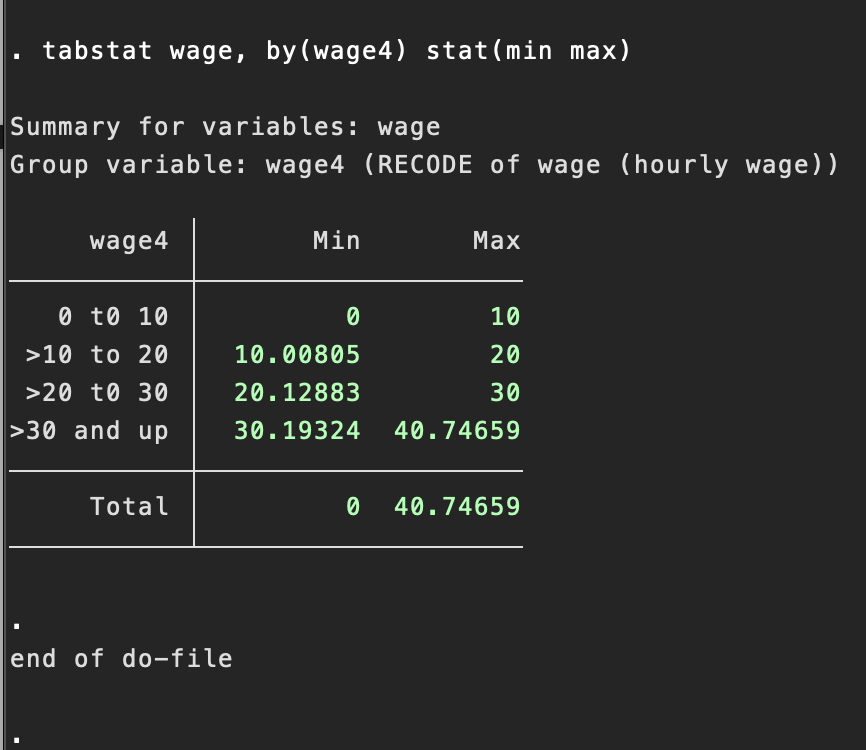
