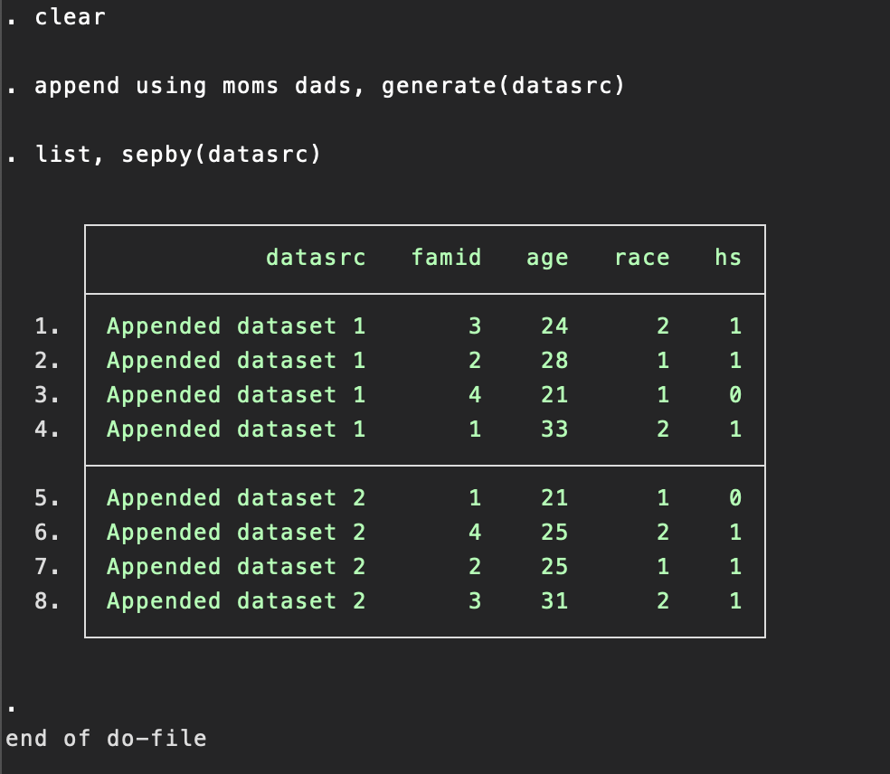
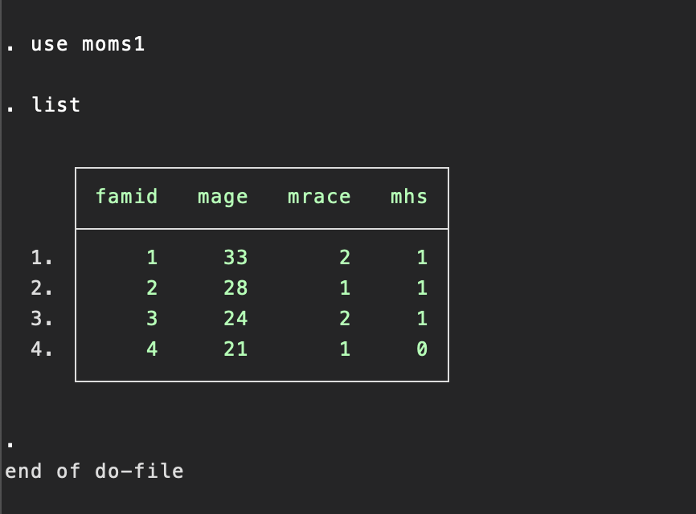
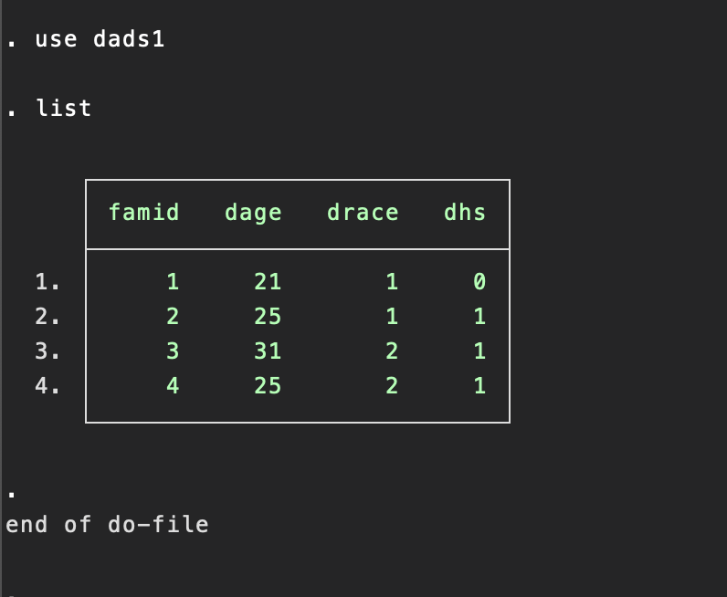
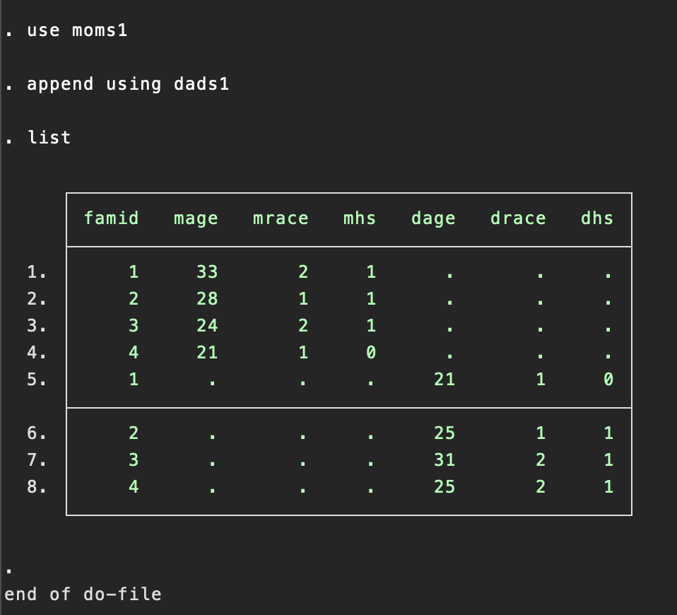

## Topic

In this section we are going to study Combining datasets

> This chapter describes how to combine datasets using Stata. It also covers problems that can arise when combining datasets.

This chapter covers four generals methods of combining datasets: appending, mergining, joining and crossing.

> Tip
> Tasks that involves working with multiple datasets, like appending or merging datasets, can be aided by the use of frames.

## Keywords & Points

## 7.2 Appending: Appending datasets

> Consider 'moms.dta' and 'dads.dta', presented below.

Each dataset has four obseraations: `moms.dta` about four mons and `dads.dta` about four dads. Each dataset contains a `family ID`, `the age of the person`, `his or her race` and whether he or she is a high school graduate.

```
use moms
list

use dads
list
```

Suppose that we wanted to stack these datasets on top of each other that we would have a total of eight oberstation in the combined dataset. The `append` command is used to combining datasets like this, as illustrated below. First, we clear any data from memory. Then, after the `append` command, we list all the datasets we want to append together. Although we specified only two datasets, we could have specified more than two datasets on the `append` commmand.

```
clear
append using moms dads
list
```

The list command below shows us that these two files were appended successfully.


Suppose that you aleread had `moms.dta` loaded in memory, as shown below.

```
use moms
```

At this point, you can append `dads.dta` like this;

```
append using dads
list
```

> Tip! Appending jargon
> In this last example, we call `moms.dta` the master dataset because it is the dataset in memory when the append is initiated. `dads.dta` is called the using dataset because it is specified after the `using` keyword.

However we `append` these datasets, the combined file does not identify the source of the data. We cannot tell whether an observation originated from `moms.dta` or from `dads.dta`. To solve this, we can add the `generate()` option, which will create a new variable that tell us which dataset each observation came. 

You can name this varibla anything you like; I called `datasrc`

```
clear
append using moms dads, generate(datasrc)
list, sepby(datasrc)
```


Let's use the `append` command to combine all three datasets together. In doing so, we will use the generate() option to create a variable named `rev` that indicates the source of the data(that is, the reviewer)

```
clear 
append using br_clarence br_isaac br_sally, generate(rev)
list,sebby(rev)
```

The value of `rev` is 1,2 or 3 for the observations that came from br_clarence, br_isaac, or br_sally, respectively.

## 7.3 Appending Problems
This section describes five problems that can arise when appending datasets: differing variable names across datasets, conflicting variable labels, conflicting value labels, inconsistent variable coding, and mixing variable types across datasets. I discuss these one at a time below

### Differing variable names across datasets.
Consider `moms1.dta` and `dads.dta` shown below. Even through the two datasets contain variables measuring the same idea(age, race and whether one graduated high school), they are named differently in the two datasets.

```
use moms1
list
```



```
use dads1
list
```


Because the variables with the `mons` information are named diffently from the variable with the dads information. Stata cannot knonw how to put similar variables together when appending the datasets.

If we append these two datasets together with the `append` command, the resulting datasets contains different variables for the moms and for the dads, as shown below


## Summary
