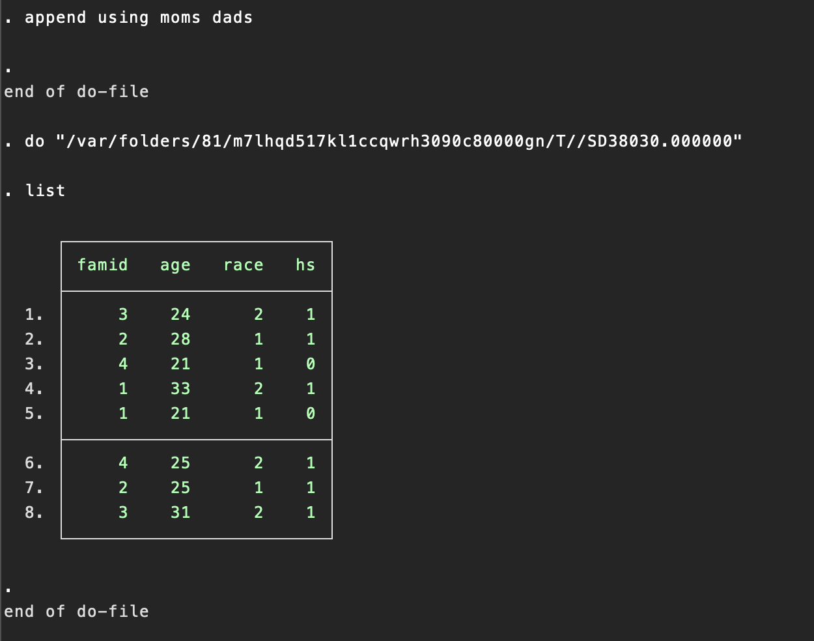

## Topic

In this section we are going to study Combining datasets

> This chapter describes how to combine datasets using Stata. It also covers problems that can arise when combining datasets.

This chapter covers four generals methods of combining datasets: appending, mergining, joining and crossing.

> Tip
> Tasks that involves working with multiple datasets, like appending or merging datasets, can be aided by the use of frames.

## Keywords & Points

## 7.2 Appending: Appending datasets

> Consider 'moms.dta' and 'dads.dta', presented below.

Each dataset has four obseraations: `moms.dta` about four mons and `dads.dta` about four dads. Each dataset contains a `family ID`, `the age of the person`, `his or her race` and whether he or she is a high school graduate.

```
use moms
list

use dads
list
```

Suppose that we wanted to stack these datasets on top of each other that we would have a total of eight oberstation in the combined dataset. The `append` command is used to combining datasets like this, as illustrated below. First, we clear any data from memory. Then, after the `append` command, we list all the datasets we want to append together. Although we specified only two datasets, we could have specified more than two datasets on the `append` commmand.

```
clear
append using moms dads
list
```

The list command below shows us that these two files were appended successfully.


Suppose that you aleread had `moms.dta` loaded in memory, as shown below.

```
use moms
```

At this point, you can append `dads.dta` like this;

```
append using dads
list
```

> Tip! Appending jargon
> In this last example, we call `moms.dta` the master dataset because it is the dataset in memory when the append is initiated. `dads.dta` is called the using dataset because it is specified after the `using` keyword.

## Summary
