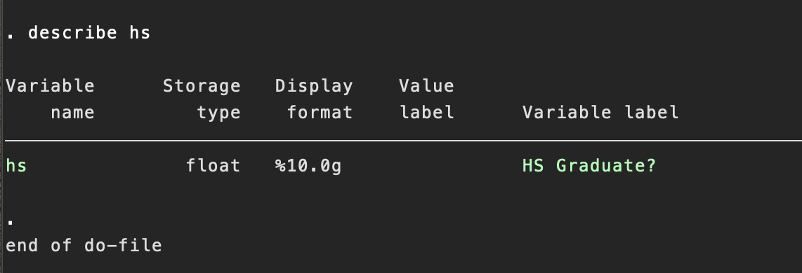
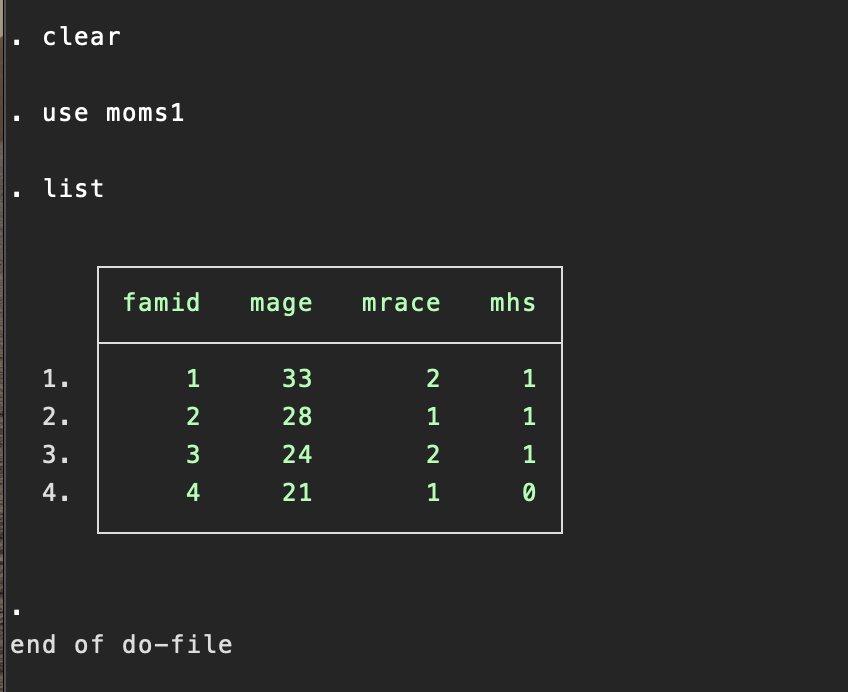
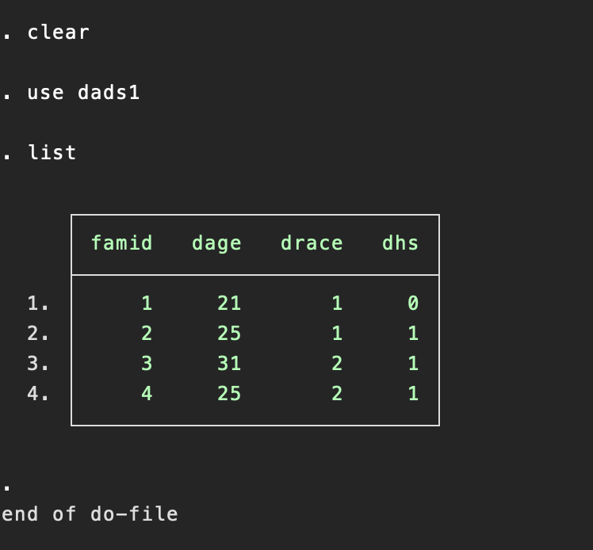
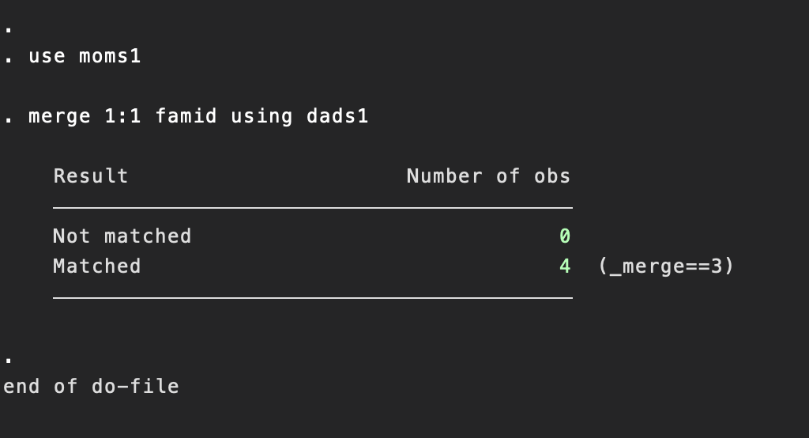
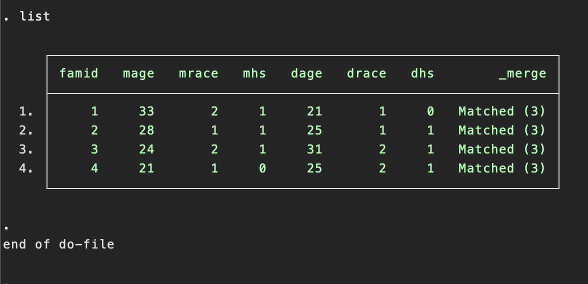
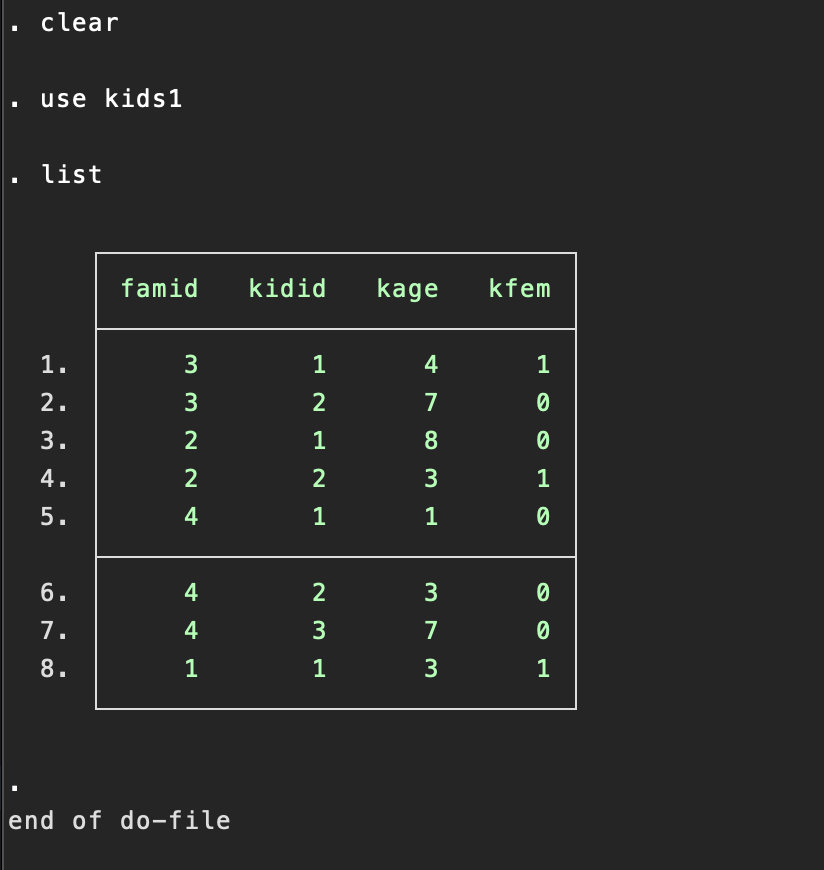
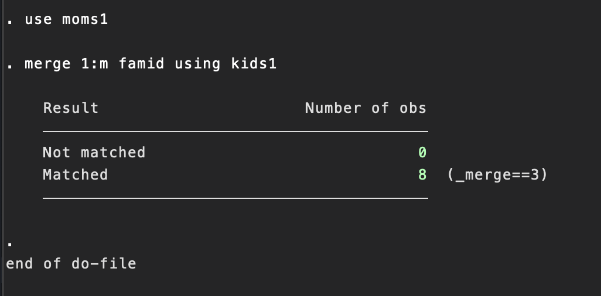
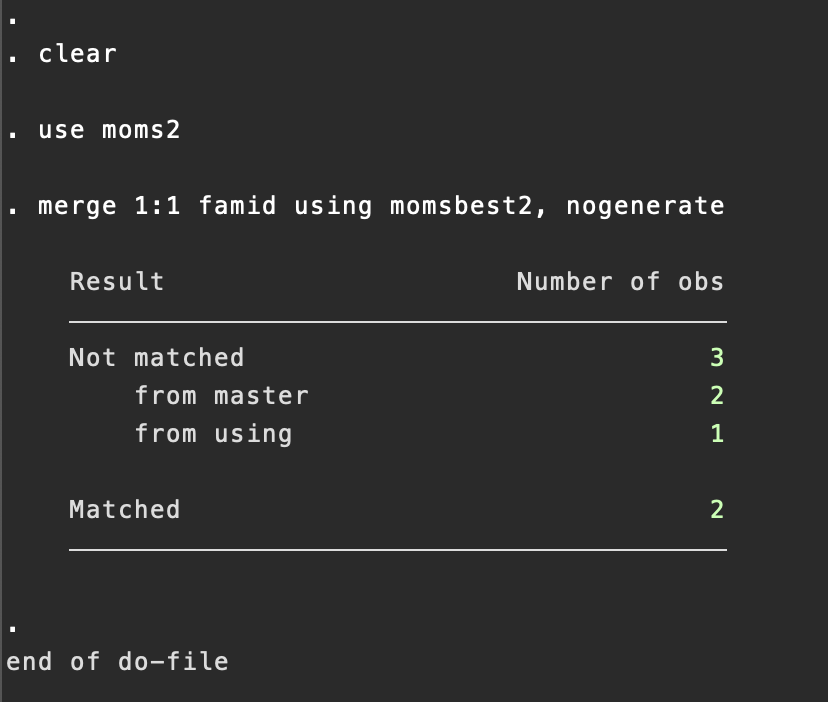
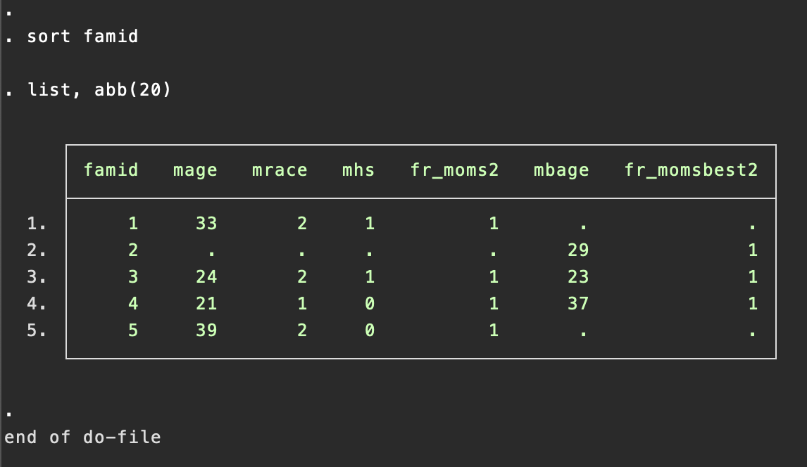

## Topic

In this section we are going to study Combining datasets

> This chapter describes how to combine datasets using Stata. It also covers problems that can arise when combining datasets.

This chapter covers four generals methods of combining datasets: appending, mergining, joining and crossing.

> Tip
> Tasks that involves working with multiple datasets, like appending or merging datasets, can be aided by the use of frames.

## Keywords & Points

## 7.2 Appending: Appending datasets

> Consider 'moms.dta' and 'dads.dta', presented below.

Each dataset has four obseraations: `moms.dta` about four mons and `dads.dta` about four dads. Each dataset contains a `family ID`, `the age of the person`, `his or her race` and whether he or she is a high school graduate.

```
use moms
list

use dads
list
```

Suppose that we wanted to stack these datasets on top of each other that we would have a total of eight oberstation in the combined dataset. The `append` command is used to combining datasets like this, as illustrated below. First, we clear any data from memory. Then, after the `append` command, we list all the datasets we want to append together. Although we specified only two datasets, we could have specified more than two datasets on the `append` commmand.

```
clear
append using moms dads
list
```

The list command below shows us that these two files were appended successfully.


Suppose that you aleread had `moms.dta` loaded in memory, as shown below.

```
use moms
```

At this point, you can append `dads.dta` like this;

```
append using dads
list
```

> Tip! Appending jargon
> In this last example, we call `moms.dta` the master dataset because it is the dataset in memory when the append is initiated. `dads.dta` is called the using dataset because it is specified after the `using` keyword.

However we `append` these datasets, the combined file does not identify the source of the data. We cannot tell whether an observation originated from `moms.dta` or from `dads.dta`. To solve this, we can add the `generate()` option, which will create a new variable that tell us which dataset each observation came.

You can name this varibla anything you like; I called `datasrc`

```
clear
append using moms dads, generate(datasrc)
list, sepby(datasrc)
```


Let's use the `append` command to combine all three datasets together. In doing so, we will use the generate() option to create a variable named `rev` that indicates the source of the data(that is, the reviewer)

```
clear
append using br_clarence br_isaac br_sally, generate(rev)
list,sebby(rev)
```

The value of `rev` is 1,2 or 3 for the observations that came from br_clarence, br_isaac, or br_sally, respectively.

## 7.3 Appending Problems

This section describes five problems that can arise when appending datasets: differing variable names across datasets, conflicting variable labels, conflicting value labels, inconsistent variable coding, and mixing variable types across datasets. I discuss these one at a time below

### Differing variable names across datasets.

Consider `moms1.dta` and `dads.dta` shown below. Even through the two datasets contain variables measuring the same idea(age, race and whether one graduated high school), they are named differently in the two datasets.

```
use moms1
list
```


```
use dads1
list
```


Because the variables with the `mons` information are named diffently from the variable with the dads information. Stata cannot knonw how to put similar variables together when appending the datasets.

If we append these two datasets together with the `append` command, the resulting datasets contains different variables for the moms and for the dads, as shown below


We neeed to make the variable names the same between the two datasets before appending them. We first rename the variable for `moms.dta` and then save it as `moms1temp.dta`

```
use moms1
rename mage age
rename mrace race
rename mhs hs
save moms1temp
```

We then do the same remaining for `dads1.dta` and save it as `dads1temp.dta`

```
use dads1
rename dage age
rename drace race
rename dhs hs
save dads1temp
```

Becase `moms1temp.dta` shares the same variable names with `dads1temp` we can successfully append these datasets

```
clear
append using moms1temp dads1temp
list
```


### Conflicting variable labels

Consider `momslab.dta` and `dadslab.dta`. These datasets are described below.

Let say `momslab.dta` variable labels reflects mom while `dadslab.dta` variable labels reflects Dads. This means their variable labels are different from each other.

if you append this two datasets

```
clear
append using momslab dadslab
```

The output of append datasets, the variable labels are based on the labels specified in `momslab.dta` (master). The labels from `momslab.dta` were used because that file was specified earlier on the `append` command. The labels that made so much sense when labelling the moms no longer make as much sense when applied to the combined file.

The solution is either to select more neutral labels in the original datasets or use the `variable label` command to change the labels after appending the datasets.

### Conflicting value labels

When you combine datasets with different value labels, variables are labelled using the value labels from the master datasets. This also applied to the definition of the value label.

This would not be such a problem if the labels from the master are written in a general way that could apply to both datasets. But as written, the labels are misleading. They imply that all of the observation come from the master (mom)

We can either go back and chang the labels in master before merging the datasets or simply change the labels afterward. It is probably just as easy to change the labels afterward.

### Inconsistent variable coding

Suppose that you append two datasets, each of which uses different coding for the same variable. This can be hard to detect becauce each dataset is internally consistent but the coding is not consistent between the datasets.

Let's illustrate this by appending a variable of `moms.dta`, named `momshs.dta` with the dads dataset named `dads.dta`

```
use momshs
list
```


Then, let's look at `dads.dta`

```
use dads
list
```


Note the difference in the coding of `hs` in these two dataset. In `momshs.dta` is coded using a `1=no` and `2=yes` coding scheme, pretend we did not yet notice this problem and observer the consequence of appending these two file together, as shown below.

```
use momshs
append using dads
list
```

The `append` command was succesful and did not produce any errors. We can list the observations from the combined file and there are no obvious errors.


Let's look at a tabulation of the variable `hs`. This is a yes or no variable indicating whether the person graduated high school, so it should only have two level. But as we see below, this variable has three levels. This is often the first clue when you have appended two datasets that use a different coding scheme for the same variable.

```
tabulate hs
```


`The solution`, of course, is to ensure that the `hs` variable uses the same coding before appending the two datasets. Below, we repeat the appending process, but we first recode `hs` in `momshs.dta` to use dummy coding (thus making it commensurate with the coding of hs in `dads.dta`)

```
use momshs
recode hs (1=0) (2=1)
append using dads
```

With `hs` coded the same way in both datasets, the `hs` variable now has two levels. We can see in the combined dataset that three parents did not graduate high school and five parents did graduate high school.

```
tabulate hs
```


### Mixing variable types across datasets

Let's see what happend when you append datasets in which the variables have different data types.

Stata variables fall into two general data types: string and numeric. Let's start by examining what happens if we try to append two datasets in which one of the variable is stored as a numeric type and the other is stored as a string type.

In `moms.dta`, the variable `hs` is stored as a numeric (float) variable, but in `dadstr.dta`, `hs` is stored as a string(`str3`) variable.

Below, we can see what happens when we try to append these two datasets.

```
use moms
append using dadstr
```


As the error message indicates, the variable `hs` is stored as a `str3` (a string with lengh 3) in the using dataset. Stata cannot reconcile this with `hs` in `moms.dta` because here is a numeric (`float`), So `merge` reports an error message. We need to make `hs` either numeric in both datasets or string in both dataset. Let's convert `hs` to numeric in `dadstr.dta` and then append that with `moms.dta` as shown below.

```
use dadstr
destring hs, replace
append using moms
```


As we can see below, the combined dataset reflects the values for `hs` from each dataset and is stored as a numeric (float) data type.


```
describe hs
```



## 7.4 Merging: One to one match merging

A match merge combine two datasets using one (or more) key variables to link observations between the two datasets.

In a one-to-one match merge, the key variable or variable `uniquely identify each observation in each dataset`. Consider the `moms1.dta` and `dads1.dta` datasets, shown below. The key variable, `famid`, uniquely identifies each observation in each dataset and can be used to link the observations from `moms.dta` with the observations from `dads.dta` based on `famid`

```
use moms1
list
```



```
use dads1
list
```



```
use moms1
merge 1:1 famid using dads1
```



The output from the `merge` commands confirms our expectations that each observation from `moms.dta` has a matched observation in `dads.dta` (and vice versa). We can see this for ourselves by listing the merged dataset.



The listing shows the `famid` variable followed by the variables from `moms.dta` and then variable from `dads.dta`. The last variable, `_merge`, was created by the `merge` command to show the matching status for each observation. In this example, every observation shows `matched(3)`, indication that a match was found between the master and using dataset for every observation.

> Tip! Merging jargon
> In this example, `moms1.dta` is the master dataset because it is the dataset in memory when the `merge` command is issued. `dads1.dta` is called the using dataset because it is specified after the `using` keyword. The variable `famid` is called the key variable because it hold the key to linking the master and using files.

If you want to merge two dataset with the unique variable that uniquely identify all this two variables, but there is no corresponding observation in the other variable. These observation will not be matched. When we merge these files, Stata will tell us about these nonmatched observations and help us track them.

You can also merge two dataset using two variable which uniquely identify this two dataset.

For example, below
```
use kids1
sort famid kidid

Use kidname
sort famid kidid

use kids1
merge 1:1 famid kidid using kiname
```
> Tip! A Cautionary Tale
>When you have unmatched observations, sometimes it pays to dig deep into your data to understand why you have unmatched observations. This is illustrated in the Stata Blog entry titled "Merging data, part 2: Multiple-key merges". You can read all about it by typing `search multiple key merges`

## 7.5 Merging: One-to-many match merging
Section `7.4` showed a `1.1` merge that merged moms with dads. This was called `1:1` merge because the key variable or variable uniquely identified each observation within each dataset. By contrast, when matching moms to kids, a moms could match with more than one kid ( a one to many merge).

The moms dataset is the 1 dataset and the kids dataset is the `m` dataset. Despite this difference, the process of performing a `1:m` merge is virtually identical to the process of performing a `1:1` merge. This is illustrated by merging `moms1.dta` with `kids1.dta`. These two datasets are shown below.

```
use moms1
list
```


```
use kids
list
```


The variable `famid` links the mons with the kids. You can see that the mom in family 1 will match to one child, but the mom in family 4 will match to three children. You can also see that for every mom, there is at least one matched child, and every child has a matching mom. We merge these two dataset below.

```
use moms1
merge 1:m famid using kids1
```



## 7.6 Merging: Merging multiple datasets
This section illustrates how you can merge multiple dataset with a series of pairwise merges.

Let's consider an example where we want to merge four datasets. We have seen two of the dataset before in this chapter: `moms2.dta`, which describes the moms' best friends, and a dataset named `dadsbest2.dta` which describes the dads' best friends.

Let's approach this by merging the moms dataset with the dataset containing moms' best friends and saving the resulting dataset. 

```
use moms2
merge 1:1 famid using momsbest2, nogenerate
```


The table shows us that thee were two matched observation and three nonmatched observation. Normally, we could inspect the `_merge` variable in the merged dataset to identify the umatched observations, but I added the `nongenerate` option to suppress the creation of the `_merge` variable.


I prefer this because when I merge multiple datasets, I prefer to track the origin of the data using variables that I create in each dataset.

The `moms2` dataset has a variable named `fr_mom2` (which contain a 1 for all observations), and `momsbest2` has a variable named `fr_momsbest2` ( which contains a 1 for all observation). Let's look at the listing of all the variables below (after sorting on `famid` to make the listing easier to follow)

```
sort famid
list, abb(20)
```



Looking at these `fr_` variables, we can see that a families 1 and t, there was an observation for the mom but not her best friend. 

And in family 2, there was an observation for the mom's best friend but not one for the mom herself. Let's save this file, naming it `momsandbest.dta`

```
save momsandbest
```


## 7.7 Merging: Update merges

## 7.8 Merging: Additional options when merging datasets

## 7.9 Merging: Problems merging datasets


## 7.10 Joining datasets

```
use parname
joinby famid using kidname
```

Unlike the `merge command`, the `joinby` command default to keeping just the matched observations. But you can control this with the `umatched()` option. Specifying `umatched(both)` retains observations from both the master and the using datasets.

Specifying `umatched(master)` retains observations from only the master dataset, and specifying `umatched(using)` retains observation form only the using dataset

Like the `merge` command, `joinby` permits the `update` and `replace` options, allowing `joinby` to update the master dataset from data contained in the using dataset.